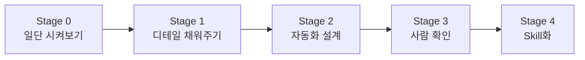

# 전사 AX 프로젝트 — 2주차 실습 가이드

> 비개발자가 AI 코딩 에이전트와 대화하며 업무 자동화를 체험하는 실습 교육 위키입니다.

---

## 실습 구성

이 위키에는 **2개의 실습 과정**이 담겨 있습니다. 각 실습은 Stage 0 → 4의 단계별 구조로 진행됩니다.

| 실습 | 주제 | 핵심 키워드 | 예상 시간 |
|------|------|------------|----------|
| **실습 1** | 모집요강에서 서비스 데이터 추출하기 | PDF 파싱, 표 추출, Excel 자동화 | 약 90분 |
| **실습 2** | 수학 교재 디지털화 작업 | 이미지 처리, 문제 잘라내기, 메타데이터 정리 | 약 85분 |

---

## 공통 실습 흐름

두 실습 모두 동일한 **5단계 프레임워크**를 따릅니다.

| Stage | 핵심 질문 |
|-------|----------|
| 0 | 지금 이 방식으로도 어느 정도 되나? |
| 1 | 어떤 규칙을 설명하면 더 좋아지나? |
| 2 | 왜 안 되는가, 어느 경로로 가야 하는가? |
| 3 | 실제로 맞는가, 반복 오류는 무엇인가? |
| 4 | 다른 입력에도 다시 쓸 수 있는가? |

---

## 실습 전 공통 준비

!!! info "필수 준비물"
    - AI 코딩 에이전트 (Claude Code, Codex, Antigravity 등) 설치 및 기본 사용법 숙지
    - Python 설치 완료
    - 실습 폴더 구조 확인

!!! tip "핵심 관점"
    - 최고 정확도보다 **자동화 프로세스 설계**가 중요합니다
    - 한 번에 완벽한 답을 만드는 것이 아니라, **시도 → 오류 발견 → 수정 → 재검증**을 반복하는 훈련입니다
    - 마지막에는 재사용 가능한 **Skill**로 만들어 둡니다

---

## 바로가기

-   :material-file-document-outline:{ .lg .middle } **실습 1 시작하기**

    ---

    대학 모집요강 PDF에서 핵심 정보를 Excel로 자동 추출하기

    [:octicons-arrow-right-24: 실습 1 개요](practice1/index.md)

-   :material-image-outline:{ .lg .middle } **실습 2 시작하기**

    ---

    수학 문제집 PDF에서 문제를 한 장씩 잘라내고 엑셀로 정리하기

    [:octicons-arrow-right-24: 실습 2 개요](practice2/index.md)

