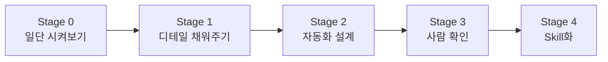
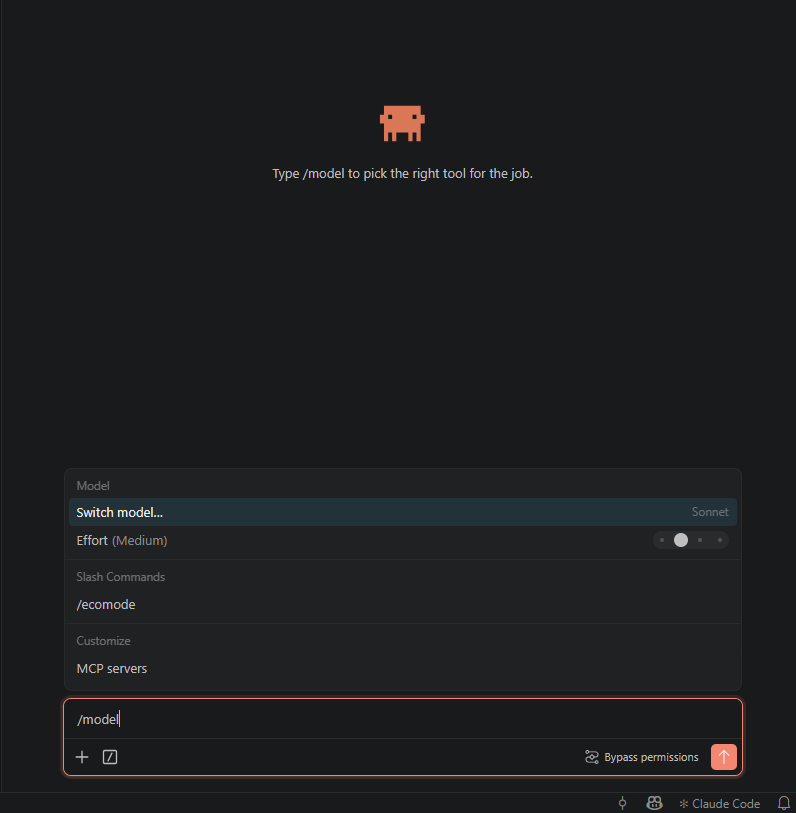
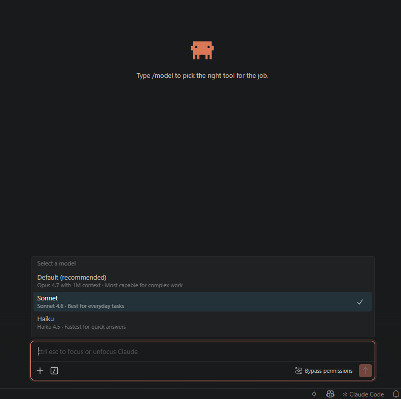
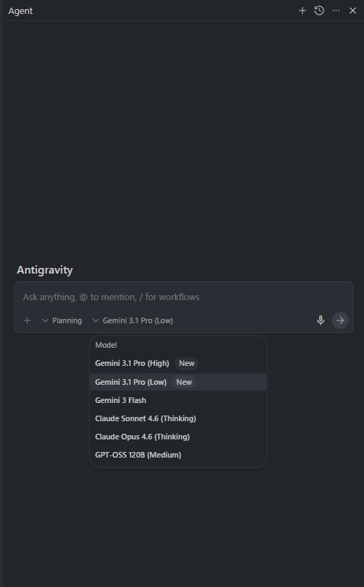
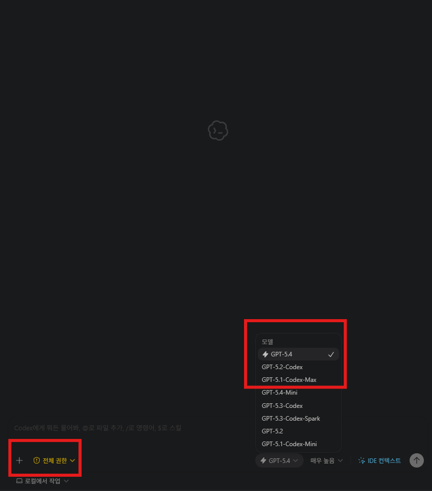

# 비개발자 바이브코딩 교육 — 2주차 실습 가이드

> 비개발자가 AI 코딩 에이전트와 대화하며 업무 자동화를 체험하는 실습 교육 위키입니다.

---

## 실습 구성

이 위키에는 **3개의 실습 과정**이 담겨 있습니다.

| 실습 | 주제 | 핵심 키워드 | 예상 시간 |
|------|------|------------|----------|
| **실습 1** | 모집요강에서 서비스 데이터 추출하기 | PDF 파싱, 표 추출, Excel 자동화 | 약 90분 |
| **실습 2** | 수학 교재 디지털화 작업 | 이미지 처리, 문제 잘라내기, 메타데이터 정리 | 약 85분 |
| **실습 3** | 이미지 공고 → 폼 변환 웹앱 만들기 | 멀티모달 LLM, FastAPI + Next.js, 동작하는 화면 | 약 90분 |

### 왜 3개인가

실습 1에서는 **텍스트 기반 자동화**(PDF 표에서 데이터 뽑기)를 경험합니다. 실습 2에서는 **이미지 기반 자동화**(PDF 페이지에서 문제 잘라내기)로 넘어갑니다. 실습 3에서는 한 칸 더 나아가, 자동화 도구를 **그 자체로 매일 쓰는 작은 웹 화면**까지 만들어봅니다.

데이터 형태는 다르지만, 핵심 루프는 같습니다:

1. 내가 자료를 보고 규칙을 발견합니다 (관찰담)
2. AI에게 규칙을 말로 설명합니다
3. AI가 만든 결과를 눈으로 확인합니다
4. 이상한 부분을 다시 말해줍니다

실습 1에서 이 루프를 텍스트로, 실습 2에서 이미지로 연습한 뒤, 실습 3에서는 같은 루프로 **동작하는 웹앱**을 시연 삼아 만들어봅니다. 실습 1·2가 "내 업무를 직접 자동화"였다면 실습 3은 "이런 형태의 일도 바이브 코딩으로 가능하다"는 체감 실습입니다.

---

## 공통 실습 흐름

실습 1·2는 동일한 **5단계 프레임워크**를 따릅니다. 실습 3은 시연 성격이라 단계를 3개로 압축한 변형 흐름이지만, 자료를 관찰하고 규칙을 말로 설명해 결과를 만든다는 핵심 루프는 같습니다.

| Stage | 핵심 질문 |
|-------|----------|
| 0 | 지금 이 방식으로도 어느 정도 되나? |
| 1 | 어떤 규칙을 설명하면 더 좋아지나? |
| 2 | 왜 안 되는가, 어느 경로로 가야 하는가? |
| 3 | 실제로 맞는가, 반복 오류는 무엇인가? |
| 4 | 다른 입력에도 다시 쓸 수 있는가? |

---

## 오늘 가장 중요한 한 가지: 관찰담

!!! abstract "관찰담이란"
    내가 자료를 직접 보면서 발견한 패턴이나 규칙을, AI에게 자연어로 설명해주는 것.

    - 예: "문제 번호는 본문 글자보다 항상 크더라"
    - 예: "이 표에서 셀이 병합돼 있으면 아래 줄도 같은 값이야"

    코드를 쓸 필요 없습니다. 내가 눈으로 보고, 말로 설명하면, AI가 코드로 바꿔줍니다.

비개발자의 최대 무기는 **도메인 지식**입니다. AI는 코드를 잘 짜지만 "이 숫자가 뭘 의미하는지", "이 빈칸은 오류인지 원래 비어있는 건지"를 모릅니다. 그걸 알려주는 게 관찰담이고, 이 실습 전체에서 가장 많이 쓰게 될 스킬입니다.

---

## 실습 전 공통 준비

!!! info "필수 준비물"
    - AI 코딩 에이전트 (Claude Code, Codex, Antigravity 등) 설치 및 기본 사용법 숙지
    - Python 설치 완료
    - 실습 폴더 구조 확인

### 💡 사용량 절약을 위한 모델 선택 (권장)

각 IDE의 최상위 모델은 구독 요금제의 사용량 한도를 빠르게 소진합니다. 실습 시간 동안 안정적으로 쓰려면 **사용하는 IDE에 맞게 아래처럼 한 단계 가벼운 모델**로 시작하세요.

=== "Claude Code"
    **Opus → Sonnet 으로 전환**

    Opus 4.7은 강력하지만 사용량이 금방 소진됩니다. 기본 설정이 Opus라면 실습 시작 전에 **Sonnet 4.6**으로 바꿔두는 것을 권장합니다.

    1. 프롬프트 창에 `/model` 을 입력합니다.

        

    2. 뜨는 모델 목록에서 **Sonnet**을 선택합니다 (목록 옆에 체크 표시가 이동합니다).

        

=== "Antigravity"
    **Gemini 3.1 Pro (Low) → Gemini 3 Flash → Claude Sonnet 4.6 순서로 전환**

    기본으로 `Gemini 3.1 Pro (Low)`를 사용하다가, 사용량이 소진되면 `Gemini 3 Flash`, 그마저 소진되면 `Claude Sonnet 4.6 (Thinking)`으로 내려가며 실습을 이어가면 됩니다. 프롬프트 창 아래 모델 드롭다운을 클릭해서 바꾸면 됩니다.

    

=== "Codex"
    **기본은 GPT-5.4 — 단 `GPT-5.3-Codex-Spark`가 보이면 그걸 선택**

    ChatGPT Plus의 Codex 기본 사용량이 넉넉해서 `GPT-5.4`를 그대로 써도 큰 무리는 없습니다.

    !!! tip "Spark 모드가 활성화되어 있다면 꼭 선택하세요"
        `GPT-5.3-Codex-Spark`는 **Cerebras** 추론 칩 위에서 돌아가는 변형으로, 일반 모델 대비 **속도가 10배 이상 빠릅니다**. 목록에 보이면 기본값 대신 이걸 고르세요.

    

---

## 바로가기

-   :material-file-document-outline:{ .lg .middle } **실습 1 시작하기**

    ---

    대학 모집요강 PDF에서 핵심 정보를 Excel로 자동 추출하기

    [:octicons-arrow-right-24: 실습 1 개요](practice1/index.md)

-   :material-image-outline:{ .lg .middle } **실습 2 시작하기**

    ---

    수학 문제집 PDF에서 문제를 한 장씩 잘라내고 엑셀로 정리하기

    [:octicons-arrow-right-24: 실습 2 개요](practice2/index.md)

-   :material-web:{ .lg .middle } **실습 3 시작하기**

    ---

    이미지 공고를 폼에 맞춰 변환하는 작은 웹앱을 90분 만에 만들어보기

    [:octicons-arrow-right-24: 실습 3 개요](practice3/index.md)

