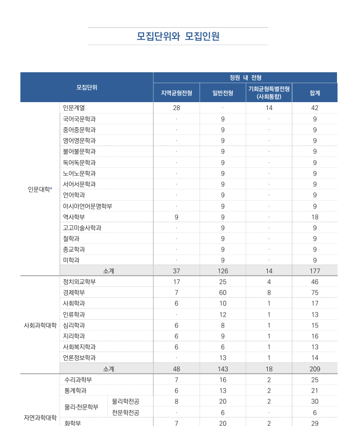
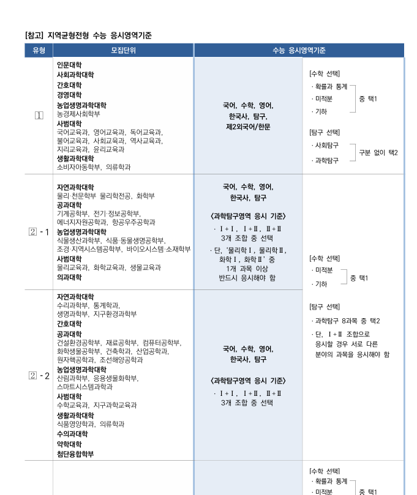
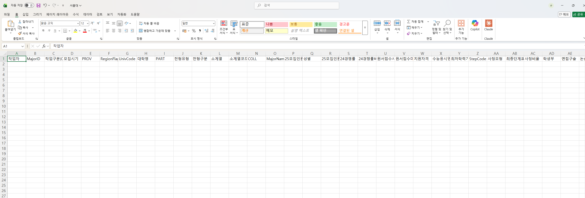
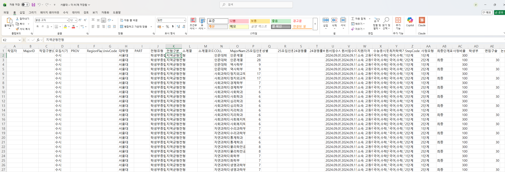
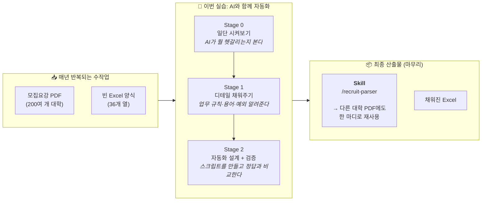

# 🌧️ 실습 교육 1 | 모집요강에서 서비스 데이터 추출하기

> 비개발자가 코딩 에이전트와 대화하며, 대학 모집요강 PDF에서 핵심 정보를 Excel로 자동 추출하는 전 과정을 체험하는 실습 가이드입니다.

!!! success "실습 목표"
    - AI와 대화하며 업무 자동화 도구를 직접 만들어봅니다
    - 큰 업무를 단계별로 쪼개는 방법을 익힙니다
    - 내가 만든 결과가 맞는지 반복해서 확인하는 과정과 대체 경로 설계의 중요성을 이해합니다
    - 마지막에는 재사용 가능한 Skills로 만들어 둡니다

!!! abstract "핵심 관점"
    - 최고 정확도보다 자동화 프로세스 설계가 중요합니다
    - 공통 파이프라인은 일반화하고 대학별 보정은 남깁니다
    - 텍스트 추출 실패 시 OCR, Vision API 같은 대체 경로를 고려합니다
    - 이번 실습은 한 번에 완벽한 답을 만드는 것이 아니라, **시도 → 오류 발견 → 수정 → 재검증을 반복**하는 훈련입니다

---

## 업무 배경

!!! note "배경"
    진학닷컴에서는 매년 **200여 개 대학의 모집요강 PDF**를 읽고, 정해진 Excel 양식에 정보를 채우는 작업을 반복적으로 해왔습니다. 지금까지는 사람이 PDF를 한 페이지씩 넘겨가면서 직접 내용을 채웠습니다.

이 작업의 특징:

- 대학마다 모집요강 형식이 전부 다릅니다 (표 구조, 페이지 배치, 용어 등)
- 한 대학당 수십~수백 행의 데이터를 채워야 합니다
- 셀 병합, 페이지 걸침 표, 다단 헤더 등 복잡한 표 구조가 많습니다
- 매년 반복되는 작업이라 자동화의 가치가 큽니다

**이 실습에서는** 이 작업을 AI 코딩 에이전트와 함께 자동화하는 과정을 체험합니다.

---

## 입력 자료: 대학 모집요강 PDF

실습에서 다루는 **입력 자료**는 대학이 매년 발행하는 **모집요강 PDF**입니다. 수시·정시 모집단위, 모집인원, 전형료, 제출서류 등의 정보가 수십~수백 페이지에 걸쳐 복잡한 표 형태로 담겨 있습니다.





PDF의 주요 특징:

- 표의 열/행 구조가 대학마다 제각각
- 셀 병합, 다단 헤더, 페이지 걸침 표 등 복잡한 레이아웃
- 텍스트가 이미지로 삽입되어 단순 복사·붙여넣기가 안 되는 경우도 존재

---

## 목표 결과물: 정해진 Excel 양식

추출한 정보를 **정해진 열 구조의 Excel 파일**에 채우는 것이 최종 목표입니다. 실습 폴더(`data/univ_parsed/`)에는 열 이름만 있고 내용은 비어있는 양식 파일이 들어 있습니다.

업무 자동화이기 때문에 **해당 업무를 잘 알고 있는 담당자**임을 가정하고 실습을 진행해야 합니다. 따라서 Excel 양식의 각 열이 어떤 의미를 가지는 지를 설명합니다.

!!! tip "실무 팁"
    실제 업무를 자동화할 때는 따로 파일에 정의하고 PDF 파일에서 해당하는 부분이 어떻게 나타나는지, 어떤 반례나 예외 사항들이 있는지 예시를 들어서 사진과 함께 정리하면 AI가 훨씬 잘 동작하는 프로세스를 만듭니다.

### 자동화 대상 데이터 설명

!!! info "이 명세는 실습 폴더에도 들어 있습니다"
    아래 표와 동일한 내용이 `data/columns.md` 파일로 실습 zip에 동봉되어 있습니다. Stage 0부터 프롬프트에 `@data/columns.md` 로 첨부해서 AI가 같은 명세를 그대로 참고하게 합니다.

| 열 이름 | 설명 | PDF 파싱 가능 여부 | 예시 | 비고 |
|---------|------|:------------------:|------|------|
| 작업자 | 작업 담당자 이름 | X | `상현`, `지환`, `지인` | 인간 직접 작성 필요 |
| MajorID | 8자리 숫자 ID | X | `15243651` | 규칙 정하면 자동화 가능 |
| 작업구분(Check) | `모집` | X | `모집` | 사실상 고정값 |
| 모집시기 | `수시` | X | `수시` | 사실상 고정값 |
| PROV | 대학 소재 광역권 묶음 | X | `서울`, `인천경기` | 수동 입력 또는 매핑 필요 |
| RegionFlag | `0/1/2` 코드 | X | `0`, `1`, `2` | 정확한 의미는 파일만으로 확정 어려움 |
| UnivCode | 대학별 고정 4자리 코드 | X | `경희대=1022`, `서울대=1083` | 키-값 매핑 테이블 필요 |
| 대학명 | 대학교 이름 | O | `경희대`, `서울대` | |
| PART | 모집단위 대분류 코드 | O | `1=인문`, `2=자연`, `3=예체능`, `4=자유` | |
| 전형유형 | 상위 전형 카테고리 | O | `교과`, `종합`, `논술`, `실기` | |
| 전형구분 | 대학별 세부 전형 트랙명 | O | `지역균형`, `네오르네상스` | 대학별 명칭 다양 |
| 소계열 | 내부 학문분류명 | X | `국어·국문학`, `컴퓨터·소프트웨어공학` | 키-값 매핑 테이블 필요 |
| 소계열코드 | 소계열 대응 내부 코드 | X | `B1101`, `C1403` | 코드 패턴 확인됨 |
| COLL | 단과대/계열명 | O | `문과대`, `인문대` | 자유전공은 빈값 가능 |
| MajorName | 모집 단위명 | O | `국어국문`, `자율전공학부` | |
| 25모집인원 | 숫자형 모집인원 | O | `12`, `28`, `49` | 다단계 전형은 같은 값 반복 |
| 성별 | `0=공통`, `1=남`, `2=여` | O | `0`, `1`, `2` | 대부분 `0` |
| 25모집인원 비고 | 모집인원 보충 설명 | X | `인문대 전체모집인원 6명` | 대부분 공란 |
| 24경쟁률 | 숫자형 경쟁률 | X | `5.25`, `7`, `14.5` | 키-값 매핑 테이블 필요 |
| 원서접수시작 | 원서접수 시작 일시 | O | `2024-09-09 00:00:00` | datetime 형태 |
| 원서접수마감 | 원서접수 마감 일시 | O | `2024-09-11 00:00:00` | datetime 형태 |
| 지원자격 | 자유서술형 지원자격 문장 | O | `국내·외 고등학교 졸업(예정)자...` | |
| 수능응시영역 | 수능 응시 요구 영역 | O | `국어,수학[확/미/기],영어,사탐/과탐(2),한국사` | |
| 최저학력기준 | 수능 최저 기준 | O | `중 3개영역 등급 합 6 이내` | |
| StepCode | 전형 단계 코드 | O | `0`, `1`, `2`, `10`, `20` | |
| 사정모형 | 단계 표현 방식 | O | `일괄합산`, `1단계`, `2단계` | |
| 최종단계표시 | 최종 단계 여부 | O | `0`, `1` | `0=중간`, `1=최종` |
| 사정비율 | 단계 배수/스케일 값 | O | `100`, `200`, `300` | |
| 학생부 | 학생부 반영 비중 | O | `70`, `100`, `30` | 공란이면 미반영 |
| 면접구술 | 면접/구술 반영 비중 | O | `20`, `30`, `50` | 공란이면 미반영 |
| 논술 | 논술 반영 비중 | O | `70`, `90`, `100` | 공란이면 미반영 |
| 실기 | 실기 반영 비중 | O | `25`, `80`, `90` | 공란이면 미반영 |
| 서류 | 서류 반영 비중 | O | `30`, `50`, `70` | 공란이면 미반영 |
| 기타 | 기타 평가요소 반영 비중 | O | `70`(경기실적) | `비고`와 같이 봐야 함 |
| 전형총점 | 해당 단계 총점 기준값 | O | `100`, `500`, `1000` | 학교/전형별 스케일 다름 |
| 비고 | 평가요소 보충 설명 | O | `기타는 경기실적` | |





이 두 파일 사이의 간극 — **PDF에서 Excel로** — 을 AI가 자동으로 메꾸는 것이 이번 실습의 핵심입니다.

---

## 실습 전 준비

!!! info "준비물"
    - Claude Code 설치 및 기본 사용법 숙지
    - Python 설치 완료
    - 실습 폴더 구조 확인

```
practice_1/
├── data/
│   ├── univ/           ← 실습용 PDF (대학 모집요강)
│   ├── univ_parsed/    ← 추출 결과 저장하는 빈 Excel (열 이름만 있음)
│   └── columns.md      ← 컬럼 명세서 (AI에게 첨부해서 사용)
```

---

## 지금 뭘 하는 건가요? (한눈에 보기)

!!! abstract "실습의 큰 그림"
    **"대학 모집요강 PDF를 읽고 Excel 양식을 채우는 반복 업무"** 를 **AI와 함께 자동화**하고, 그 자동화 과정을 **한 번 더 쓸 수 있는 Skill로 포장**하는 것이 이 실습의 전부입니다.



## Stage별 로드맵

| Stage | 무엇을 하나 | 소요 | 프롬프트 수 |
|:-----:|------------|:---:|:---:|
| 0 | AI에게 바로 시켜보며 어디서 헷갈리는지 봅니다 | 5분 | 1개 |
| 1 | 도메인 지식·용어·예외 규칙을 붙여줍니다 | 12분 | 1~2개 |
| 2 | 파싱 흐름을 설계·구현하고 정답과 자동 비교합니다 | 25분 | 2개 |
| 마무리 | **지금까지의 흐름을 재사용 가능한 Skill로 만듭니다** | 15분 | — |

!!! tip "왜 마무리 단계(Skill화)가 중요한가요?"
    Stage 0~2는 **이번 한 번** PDF를 Excel로 만드는 과정입니다. 마무리 단계에서 이 흐름을 Skill로 포장하면, 다음에는 `/recruit-parser 연세대 PDF` 같은 한 마디로 똑같은 작업을 끝낼 수 있습니다. 자동화의 진짜 가치는 **반복 실행**에서 나옵니다.

---

**다음 →** [Stage 0. 일단 시켜보기](stage0.md)
