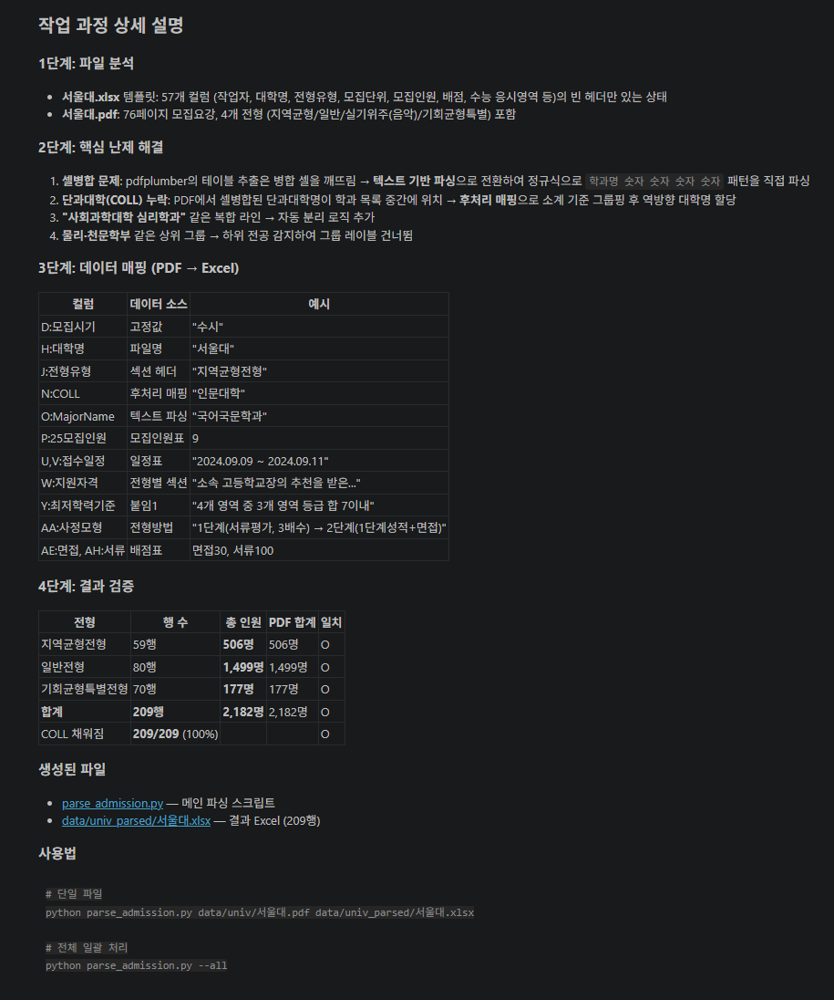
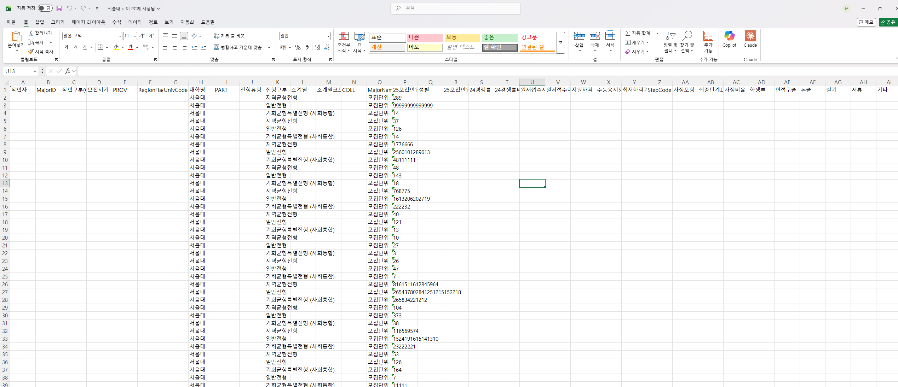

# Stage 0. 일단 시켜보기

<div class="stage-nav" markdown>
**다음 →** [Stage 1. 디테일 채워주기](stage1.md)
</div>

> 요리로 치면 레시피를 다 쓰기 전에 먼저 한 번 만들어보는 단계입니다. 지금 필요한 것은 정답이 아니라, AI가 어디서 헷갈리는지 빠르게 파악하는 것입니다.

| :material-timer-outline: 예상 소요 | :material-chart-line: 기대 산출물 | :material-star-outline: 난이도 |
|:--:|:--:|:--:|
| 10분 | 초기 결과물 + 오류 메모 | 낮음 |

!!! abstract "이번 단계의 목적"
    - AI에게 아무 설명 없이 먼저 시켜봅니다
    - 어느 정도 되는지, 어디서 헷갈리는지 빠르게 파악합니다
    - 다음 Stage에서 줄 피드백 재료를 모읍니다

---

## 지금 할 일

1. PDF 파일과 Excel 템플릿을 준비합니다
2. 아래 프롬프트를 그대로 AI에게 보냅니다
3. 결과를 보고 빠진 값, 이상한 값, 비어 있는 칸을 메모합니다

!!! example "AI에게 이렇게 말해보세요"
    ```text
    @data/univ/서울대.pdf  이 파일은 모집요강 파일이야. 이 파일을 보고 
    @data/univ_parsed/서울대.xlsx 의 컬럼들에 값을 찾아서 넣어줘야해. 
    - 컬럼들의 구성을 자세하게 읽고 pdf 파일에서 어떤 부분에 해당하는 
      정보들이 숨어있는지를 모두 찾아서 깔끔하게 엑셀 파일을 채워줘. 
    - 다른 pdf 파일에도 동일하게 적용하는 자동화 프로세스를 만들고자 
      하는거니깐 이 파일에 특정하게 동작하는 형태로 만들면 절대로 안돼. 
    - 정확도가 가장 중요해. 표에 있는 데이터나 그 표가 다음 페이지까지 
      이어지는 경우가 있으니 반드시 최소 1개의 뒤쪽 페이지까지 봐야해. 
    - 표의 셀병합때문에 깨지는 경우도 있으니깐 너가 눈으로 직접 보고 
      비교분석도 해야해. 
    - 끝나면 과정을 자세히 설명해줘 
    - 도중 결과물들은 깔끔하게 폴더 구조로 정리하면서 하던가 아님 지워줘
    ```

!!! tip "이런 결과가 보이면 정상입니다"
    - 일부 컬럼은 꽤 잘 채워집니다
    - 빠진 행이나 잘못 들어간 용어가 보입니다
    - 비어 있는 칸이 생깁니다
    - 어떤 규칙을 더 알려줘야 할지 감이 잡힙니다

!!! example "여기서부터 관찰담이 시작된다"
    Stage 0의 결과를 보면서 "아, 여기가 이상하네"라고 느낀 것들이 있을 것입니다. 그걸 메모해두면 그게 바로 **관찰담**의 재료입니다.
    
    - "모집인원 숫자가 빠져있네"
    - "전형유형이랑 전형구분이 바뀐 것 같은데"
    - "셀 병합된 부분이 깨졌네"
    
    다음 Stage에서 이 관찰담을 AI에게 전달할 겁니다.

!!! danger "지금 단계에서 하지 않을 것"
    - 처음부터 완벽한 프롬프트를 만들려고 오래 고민하지 않기
    - 한 번의 결과만 보고 성공 또는 실패로 단정하지 않기
    - 정답 Excel을 미리 열어보지 않기

!!! warning "이런 일이 생길 수 있다"

    **시나리오 1: AI가 Excel을 아예 만들지 못하고 에러가 난다**
    
    → 당황하지 말고 에러 메시지를 그대로 복사해서 보내면 됩니다.
    ```
    이런 에러가 났어:
    [에러 메시지 붙여넣기]
    원인이 뭔지 설명해주고 해결해줘.
    ```
    
    **시나리오 2: Excel이 만들어졌는데 행이 5줄밖에 없다**
    
    → PDF의 첫 페이지만 읽었을 가능성이 높습니다.
    ```
    결과가 5줄밖에 없는데, 이 PDF는 수십 페이지야. 
    전체 페이지를 다 읽어서 다시 해줘.
    ```
    
    **시나리오 3: 컬럼이 전부 비어있다**
    
    → 이미지형 PDF일 수 있습니다. 괜찮습니다. 이것도 정보입니다.
    ```
    텍스트가 하나도 안 뽑혔어. 혹시 이 PDF가 이미지형인지 확인해줘.
    이미지형이면 OCR로 읽을 수 있는 방법을 알려줘.
    ```

??? question "왜 이렇게 하나요?"
    처음부터 완벽하게 지시하려고 하면 오히려 시작이 어려워집니다. 먼저 실행해보면 AI가 놓치는 패턴이 보이고, 그다음 피드백이 훨씬 구체적이고 강력해집니다. 이 단계는 정답을 내는 단계가 아니라 **헷갈리는 지점을 발견하는 단계**입니다.

## 결과 예시





---

## 체크포인트

- [ ] AI에게 PDF와 Excel을 주고 바로 파싱을 시켜봤습니다
- [ ] 결과에서 부족한 부분을 확인하고 메모했습니다
- [ ] 다음 Stage에서 보완할 포인트가 보이기 시작했습니다

!!! info ""
    다음 단계에서는 지금 메모한 내용을 바탕으로, AI에게 용어와 규칙과 위치 정보를 붙여주며 결과를 개선합니다.

<div class="stage-nav" markdown>
**다음 →** [Stage 1. 디테일 채워주기](stage1.md)
</div>
