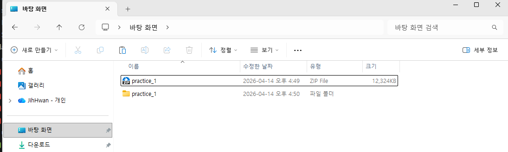
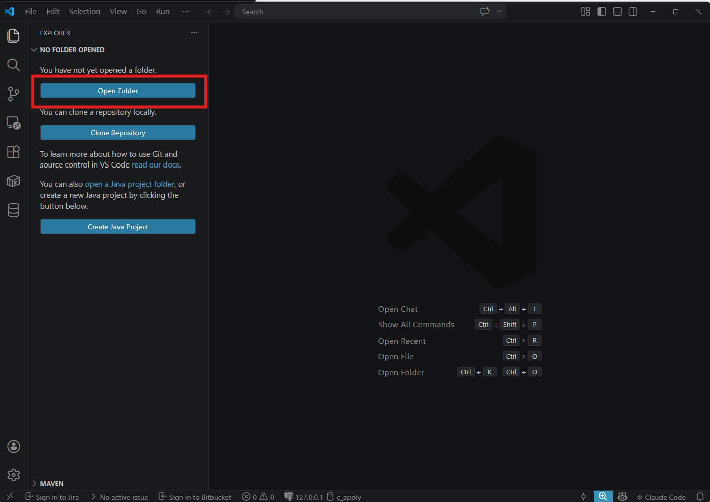
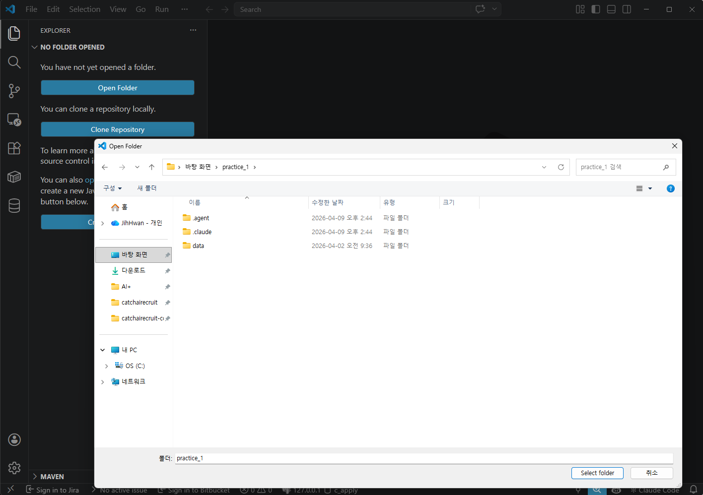
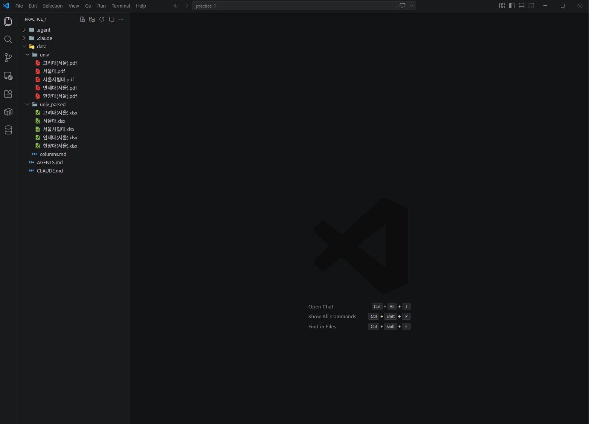

# Stage 0. 일단 시켜보기

<div class="stage-nav" markdown>
**다음 →** [Stage 1. 디테일 채워주기](stage1.md)
</div>

> 요리로 치면 레시피를 다 쓰기 전에 먼저 한 번 만들어보는 단계입니다. 이 단계의 목표는 **정답을 맞추는 것이 아니라**, AI가 어디서 헷갈리는지 빠르게 파악하는 것입니다.

!!! abstract "이번 단계 (약 5분)"
    - 실습 파일 준비 (압축 해제 → VSCode로 열기)
    - 프롬프트 **1개**만 입력하면 됩니다
    - 결과를 보고 "어디가 이상한지" 메모합니다
    - 그 메모가 다음 Stage의 재료가 됩니다

---

## 🗂️ 먼저 실습 파일 준비하기

AI에게 시키기 전에, 실습 자료가 들어있는 폴더를 **VSCode로 열어두어야** 합니다. Claude Code가 이 폴더 안의 파일(PDF, Excel)을 볼 수 있기 때문입니다.

### 1️⃣ `practice_1.zip` 을 바탕화면에서 압축 해제

전달받은 `practice_1.zip` 파일을 **바탕화면에 두고 더블클릭**해서 압축을 풉니다. 아래처럼 zip 파일 옆에 `practice_1` 폴더가 새로 생기면 성공입니다.



!!! tip ""
    압축 해제된 폴더 안에는 `.agent`, `.claude`, `data` 폴더가 들어있습니다. 이 중 `data/univ`가 모집요강 PDF, `data/univ_parsed`가 비어있는 Excel 템플릿입니다.

### 2️⃣ VSCode를 열고 **Open Folder** 클릭

VSCode를 실행하면 아래처럼 시작 화면이 뜹니다. 왼쪽의 파란색 **Open Folder** 버튼을 클릭하세요. (단축키로는 `Ctrl + K` → `Ctrl + O`)



### 3️⃣ 방금 압축 해제한 `practice_1` 폴더 선택

폴더 선택창이 뜨면 **바탕화면 → practice_1** 을 선택하고, 오른쪽 아래 **Select folder** 를 누릅니다.



!!! warning "주의 — `practice_1` 폴더 자체를 선택하세요"
    실수로 `data` 폴더나 바탕화면 자체를 선택하지 않도록 주의하세요. 반드시 `.agent`, `.claude`, `data`가 **안에 보이는** `practice_1` 폴더를 선택해야 합니다.

### 4️⃣ 프로젝트가 열리면 Claude Code 패널 확인

VSCode 왼쪽 탐색기(EXPLORER)에 `data/univ`(PDF 5개)와 `data/univ_parsed`(Excel 5개)가 보이고, 오른쪽에는 **Claude Code** 패널이 있으면 준비 완료입니다. 여기서 이제 프롬프트를 입력하면 됩니다.



!!! tip "Claude Code 패널이 안 보이면"
    단축키 `Ctrl + Alt + I` 를 누르거나, 우측 상단에서 **Claude Code** 탭을 열면 됩니다.

---

!!! info "🚦 AI에게 시키기 전에 — 자동 허가 모드 설정"
    에이전트가 매번 "이 파일 수정해도 될까요?"라고 물으면 실습 흐름이 끊깁니다. 실습 시작 전에 **자동 허가 모드**로 바꿔두세요.

    👉 [**자동 허가 모드 설정 가이드 열기**](autoapprove.md) (Claude Code / Antigravity / Codex)

---

## 딱 한 번만 시켜보기

PDF 파일과 빈 Excel 템플릿을 준비한 뒤, 아래 프롬프트를 **그대로 복사해서** AI에게 보내세요.

!!! example "프롬프트 ①  — 복사해서 그대로 붙여넣기"
    ```text
    @data/univ/서울대.pdf  이 파일은 모집요강 파일이야.
    이 파일을 보고 @data/univ_parsed/서울대.xlsx 의 컬럼들에 
    값을 찾아서 넣어줘야해.
    - 컬럼 구성을 자세히 읽고 PDF에서 해당 정보를 찾아서 깔끔하게 채워줘.
    - 다른 대학 PDF에도 쓸 자동화 프로세스를 만들 거니까
      이 파일에만 특정하게 동작하도록 만들면 안 돼.
    - 표가 다음 페이지까지 이어지는 경우가 있으니
      반드시 최소 1페이지 뒤까지 확인해줘.
    - 셀 병합 때문에 깨지는 경우도 있으니 눈으로 직접 비교도 해줘.
    - 끝나면 과정을 자세히 설명해줘.
    ```

---

## 이런 결과가 나오면 정상입니다

아래는 Stage 0에서 흔히 보게 되는 실제 화면입니다. **지금 시점에서는 틀린 부분이 있어도 괜찮습니다.** 그게 Stage 1에서 쓸 재료예요.


!!! tip "위 화면에서 주목할 점"
    - AI가 스스로 PDF를 여러 페이지 훑으면서 표를 찾고 있습니다
    - "이 컬럼은 이렇게 채웠다"라는 설명을 같이 보여줍니다
    - 일부 칸은 비어 있거나 값이 이상할 수 있습니다 — 그게 정상입니다


!!! tip "결과 Excel을 볼 때 메모할 것"
    - ⭕ 잘 채워진 컬럼은? (예: 대학명, MajorName)
    - ❌ 비어 있거나 어긋난 컬럼은? (예: 전형유형·전형구분이 뒤바뀜)
    - 📄 행 수가 예상의 절반 정도라면 → 구조가 통째로 빠졌을 가능성

이 메모가 **Stage 1에서 AI에게 전달할 "관찰담"** 의 원본입니다.

---

??? warning "혹시 이런 상황이면 (접혀 있음 — 필요할 때만 열어보세요)"
    **에러가 나서 Excel이 아예 안 만들어짐**
    → 에러 메시지를 그대로 복사해서 "이런 에러가 났어. 원인이 뭐야?"라고 보내면 됩니다.

    **Excel에 행이 5줄밖에 없음**
    → "이 PDF는 수십 페이지야. 전체 페이지를 다 읽어서 다시 해줘."

    **컬럼이 전부 비어 있음 (이미지형 PDF)**
    → "텍스트가 하나도 안 뽑혔어. 이미지형인지 확인하고 OCR 경로를 알려줘."

---

## 체크포인트

- [ ] 프롬프트 1개를 AI에게 보냈습니다
- [ ] 결과 Excel에서 ⭕와 ❌를 메모했습니다
- [ ] 다음 Stage에서 보완할 포인트가 손에 잡힙니다

<div class="stage-nav" markdown>
**다음 →** [Stage 1. 디테일 채워주기](stage1.md)
</div>
