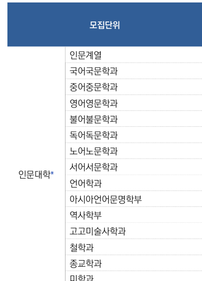
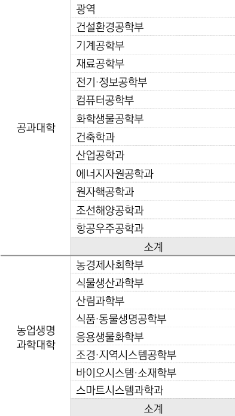
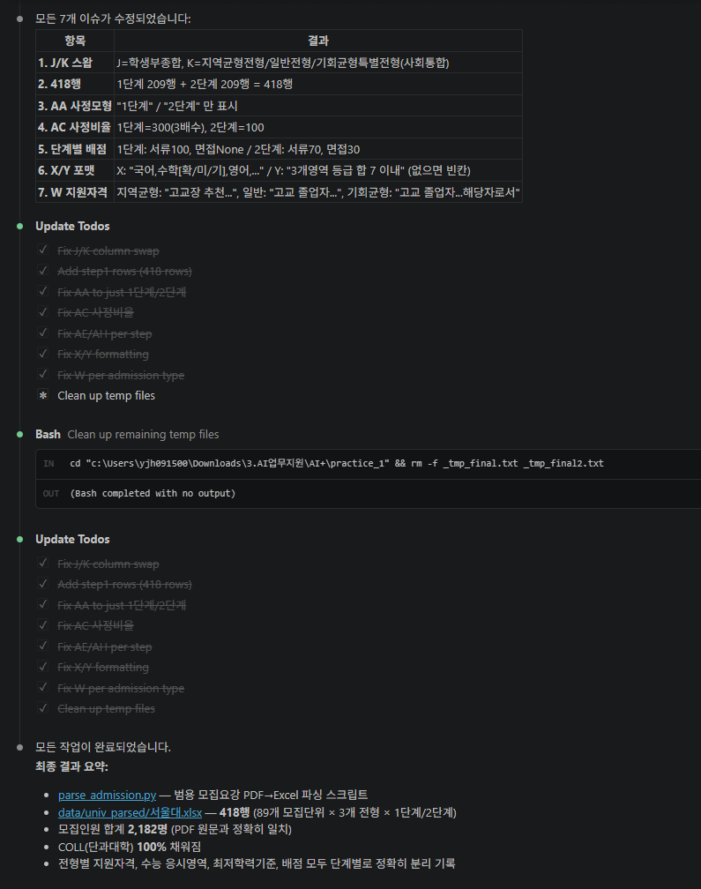
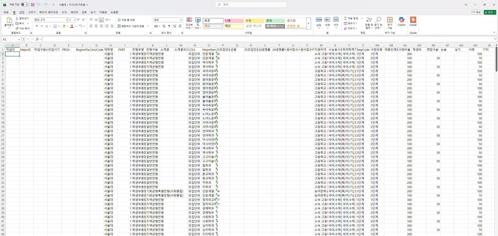

# Stage 1. 디테일 채워주기

<div class="stage-nav" markdown>
**← 이전** [Stage 0. 일단 시켜보기](stage0.md) · **다음 →** [Stage 2. 자동화 설계 + 검증](stage2.md)
</div>

> Stage 0 결과가 완벽하지 않은 이유는 간단합니다 — **AI는 우리 업무 맥락을 모르기 때문입니다.** 이 단계는 내가 아는 것을 AI에게 알려주는 단계입니다.

!!! abstract "이번 단계 (약 12분)"
    - 필수 프롬프트 **1개** (관찰담 전달)
    - 선택 프롬프트 **1개** (PART 분류)
    - 결과가 얼마나 좋아지는지 눈으로 확인

---

## 필수 — 관찰담을 AI에게 전달하기

Stage 0에서 메모한 "어긋난 부분"을 번호 붙여서 한 번에 알려줍니다. 아래 프롬프트는 서울대 예시 기준 **샘플**이며, 본인이 본 오류에 맞게 일부만 바꿔 쓰면 됩니다.

!!! quote "AI에게 이렇게 말해보세요 — 관찰담 전달 (필수)"
    ```text
    아까 결과에서 내가 확인한 문제가 몇 가지 있어. 번호대로 수정해줘.

    1. 전형유형(J)과 전형구분(K)이 서로 뒤바뀌어 있어
       - J = 학생부종합/교과/논술 같은 종류
       - K = 지역균형/일반/사회통합 같은 세부 구분

    2. 행 수가 절반이야 (예상 418, 실제 209)
       → 1단계(서류) / 2단계(면접) 구조를 놓쳐서 모집단위당
         1행만 만들었기 때문이야. 모집단위당 2행이 원칙.

    3. 사정모형(AA)에는 "1단계" "2단계"만 들어가야 해
       → 설명 문장이 들어가면 안 돼.

    4. 사정비율(AC): 1단계면 배수×100 (3배수→300), 2단계면 100

    5. 수능응시영역(X)·최저학력기준(Y)은 정해진 포맷으로 정리해줘
       예: 국어,수학[확/미/기],영어,사탐/과탐(2),한국사
       최저가 없는 전형은 빈칸.

    지금까지 피드백 반영한 결과를 다시 보여주고, 특히
    전형유형/전형구분, 행 수, 빈칸 처리가 제대로 됐는지 확인해줘.
    ```

!!! tip "피드백을 잘 쓰는 3가지 요령"
    1. **번호를 붙입니다** — AI가 하나씩 처리합니다
    2. **"왜 그런지"를 한 줄 붙입니다** — 같은 실수를 덜 반복합니다
    3. **정답 예시를 보여줍니다** — "이런 모양이어야 해" 한 줄이 20줄 설명보다 강력합니다

??? abstract "도움이 될 수 있는 도메인 지식 유형 (접혀 있음)"
    | 종류 | 무엇을 알려주나 | 예시 |
    |------|----------------|------|
    | 용어 교정 | 비슷한 표현 중 어떤 말이 정답인지 | "XX"가 아니라 "YY"가 맞아 |
    | PDF 내 위치 | 몇 페이지, 어떤 표인지 | 이 정보는 [N]페이지 [M]번째 표에 있어 |
    | 표 구조 | 셀 병합, 페이지에 걸친 표 여부 | 이 표는 다음 페이지까지 이어져 |
    | 업무 규칙 | 빈칸 처리, 날짜 형식 | 최저학력기준이 없으면 빈칸 |
    | 예외 상황 | 건너뛰어야 하는 페이지 | 이 페이지는 목차야 |

---

## (선택) — 판단이 필요한 컬럼 채우기

대부분은 위 프롬프트 1개로 충분하지만, PART 컬럼처럼 **판단이 필요한** 컬럼이 있다면 하나만 더 요청합니다.

- `1` = 인문 / `2` = 자연 / `3` = 예체능 / `4` = 자유
- 농업생명과학대학은 대부분 `2` (자연)지만, **농경제사회학부만 `1`(인문)**

!!! quote "AI에게 이렇게 말해보세요 — PART 컬럼 분류 (선택)"
    ```text
    PART 컬럼을 채우려면 판단이 필요해. COLL과 MajorName을 같이 보고
    1,2,3,4 중 하나로 분류해줘. 예: 농업생명과학대학의 대부분 학부는
    자연(2)이지만, 농경제사회학부는 인문(1)이야.
    ```

아래는 AI가 실제로 PART 컬럼을 판단하면서 보여주는 화면입니다.





---

## 결과 확인 — 얼마나 좋아졌는지

피드백 1번이 반영되면 Excel이 이렇게 바뀝니다. Stage 0 결과와 나란히 열어두고 비교해보세요.





!!! success "이런 변화가 보이면 성공입니다"
    - **전형유형 / 전형구분 자리가 맞게 들어갔다**
    - **행 수가 예상치에 가까워졌다** (예: 209 → 418)
    - **사정모형·사정비율의 포맷이 정돈됐다**

아직 어긋난 부분이 보여도 괜찮습니다 — Stage 2에서 자동화 스크립트로 정리합니다.

---

??? warning "잘 안 될 때 (접혀 있음)"
    - 표 추출이 계속 부정확하면 `pdfplumber`, `PyMuPDF` 등 PDF 라이브러리를 바꿔볼 수 있습니다
    - 텍스트가 거의 안 뽑히면 이미지형 PDF일 수 있으므로 Stage 2 설계에 OCR이나 Vision API 경로를 넣습니다

---

## 체크포인트

- [ ] 관찰담 프롬프트 1개를 보냈습니다
- [ ] (선택) PART 분류 프롬프트를 추가로 보냈습니다
- [ ] Stage 0 대비 결과가 눈에 띄게 개선됐습니다

<div class="stage-nav" markdown>
**← 이전** [Stage 0. 일단 시켜보기](stage0.md) · **다음 →** [Stage 2. 자동화 설계 + 검증](stage2.md)
</div>
