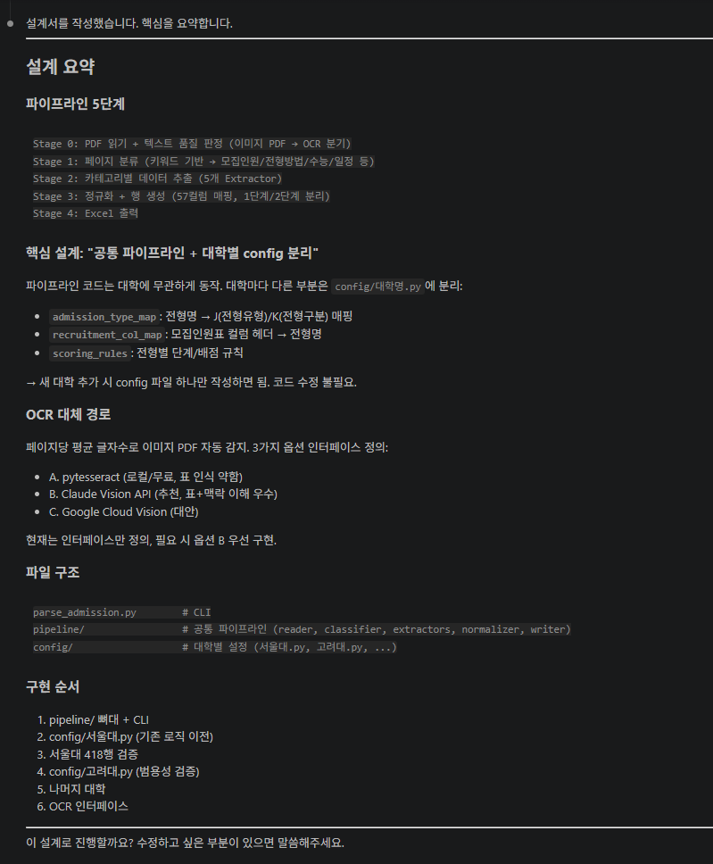
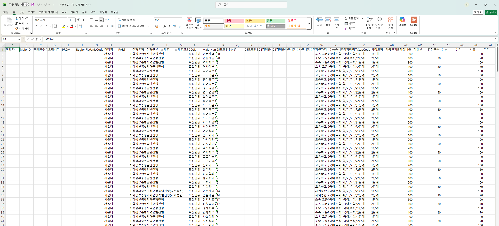

# Stage 2. 자동화 설계 + 검증

<div class="stage-nav" markdown>
**← 이전** [Stage 1. 디테일 채워주기](stage1.md) · **다음 →** [Stage 4. Skill화](stage4.md)
</div>

> Stage 1까지는 "이 PDF 하나"를 잘 채우는 과정이었습니다. 이제는 **다른 대학 PDF에도 돌릴 수 있는 자동화 스크립트**를 만들고, AI가 직접 교차 검증하도록 합니다.

!!! abstract "이번 단계 (약 25분)"
    - 프롬프트 **①** 자동화 설계 + 구현 요청
    - 프롬프트 **②** AI 교차 검증 + 정답 Excel 비교
    - 사람 확인은 간단한 10분 프로토콜로

!!! danger "가장 중요한 조건"
    - **지금 PDF 하나에만 맞는 코드로 만들면 안 됩니다**
    - 페이지 번호 고정이 아니라, 제목·표 의미 같은 **구조적 신호**로 동작해야 합니다

---

## 2-1. 자동화 설계 + 구현

하나의 프롬프트로 설계부터 구현까지 한 번에 요청합니다. AI는 설계를 먼저 보여주고 확인을 기다립니다.

!!! example "프롬프트 ①  — 설계 + 구현 요청"
    ```text
    이제 본격적으로 파싱 도구를 만들어줘. 중요 조건:

    1. 이 도구는 다른 대학 모집요강 PDF에도 쓸 거야.
       - 공통 파이프라인은 일반화하고,
       - 대학별 미세조정이 필요한 부분은 따로 드러나게 설계해줘.
       - "page 3" 같은 페이지 번호 하드코딩은 금지. 
         제목/소제목/표 의미 같은 구조적 신호로 찾아줘.

    2. 이 순서로 만들어줘:
       ① PDF 전체를 훑어 우리가 원하는 정보가 있는 페이지를 자동으로 찾기
       ② 해당 페이지에서 표·텍스트 추출
       ③ 정해진 컬럼 형식으로 정리
       ④ Excel 저장

    3. 텍스트가 거의 안 뽑히면 이미지형 PDF일 수 있으니
       OCR/Vision API 대체 경로도 설계에 포함해줘.

    먼저 전체 설계를 보여주고, 내가 확인한 뒤에 코드를 작성해줘.
    ```

설계가 나오면 이렇게 짧게 답하면 됩니다:

> "좋아, 그 방식으로 진행해줘. 코드를 완성한 뒤 작동 원리를 간단히 설명해줘. **실행은 아직 하지 마.**"

---

## 2-2. AI 교차 검증 + 정답 Excel 비교

스크립트가 만들어졌으면 **실행 → 검증 → 정답 비교**를 한 프롬프트로 묶어 요청합니다.

!!! example "프롬프트 ②  — 실행 + 자체 검증 + 정답 비교"
    ```text
    서울대 PDF로만 스크립트를 실행해서 결과를 보여줘. 그리고:

    1. [AI 자체 검증] 원본 PDF를 직접 열어서 추출 결과와 나란히 비교해줘.
       - 페이지 걸친 표, 셀 병합이 제대로 처리됐는지
       - 비어야 하지 않을 칸이 비어 있지는 않은지
       - 숫자 칸에 이상한 글자가 없는지
       - 행 수가 원본 데이터 수와 맞는지

    2. [정답 비교] 정답 파일도 줄게 → @data/answer/서울대_정답.xlsx
       내가 만든 결과와 자동으로 비교해서 다음을 리포트로 보여줘:
       ① 전체 정답률  
       ② 컬럼별 정답률  
       ③ 틀린 칸 목록 (몇 행·어떤 컬럼·내 값·정답 값)  
       ④ 빠진 행 / 추가로 생긴 행

    3. 틀린 부분이 보이면 왜 틀렸는지, 서울대에만 맞춘 수정이 아닌지도 
       설명해줘.
    ```

---

## 이런 결과물이 나옵니다

AI가 스크립트를 돌리고 스스로 검증하면서 보여주는 실제 화면입니다.



!!! tip "위 화면에서 주목할 점"
    - 구조 탐색 → 표 추출 → 컬럼 정리 → 저장 순서가 단계별로 보입니다
    - 각 단계에서 몇 개의 레코드가 처리됐는지 숫자가 뜹니다
    - 문제가 있으면 "여기서 N개 행이 누락된 것 같습니다"처럼 AI가 스스로 지적합니다



!!! success "이런 리포트가 나오면 성공입니다"
    - **전체 정답률** 이 한눈에 보임
    - **컬럼별 정답률**로 약한 컬럼이 드러남 (예: "수능응시영역만 60%")
    - **틀린 칸 목록**이 있어서 바로 다음 피드백을 만들 수 있음

정답률은 점수표가 아니라 **진단표**입니다. 어떤 규칙/컬럼에서 반복적으로 틀리는지 설명할 수 있게 되는 것이 목표입니다.

---

## (선택) 사람이 10분만 눈으로 확인하기

자동 비교만으로 부족할 때 쓰는 3단계 프로토콜입니다.

!!! tip "효율적인 사람 확인 (약 10분)"
    1. **처음 10행 전수 확인** (3분) — 반복 오류 패턴을 찾음
    2. **패턴 점검** (2분) — 그 패턴이 나머지 행에도 있나 필터링
    3. **랜덤 5건 확인** (2분) — 중간·끝쪽에서 샘플링해 새로운 오류 유형 확인
    
    사람이 특히 잘 잡는 오류: 모집인원 오독, 학과 누락, 셀 병합 해석 실패, 날짜 형식 불일치

---

??? warning "이런 일이 생길 수 있다 (접혀 있음)"
    **"일반화했다"는데 페이지 번호가 하드코딩돼 있음**
    → "`page 3` 같은 고정 숫자가 보여. 구조적으로 찾는 방식으로 바꿔줘."
    
    **스크립트가 10분 넘게 돌아감**
    → "지금 어디까지 진행됐는지 알려주고 진행률을 보여줘."
    
    **결과가 Stage 1보다 오히려 나빠짐**
    → "Stage 1 결과보다 빈칸이 늘었어. 뭐가 달라졌는지 비교해서 보여줘."
    
    **왜 틀리는지 감이 안 옴**
    → "추측하지 말고 원본 PDF를 페이지별로 열어서 추출 결과와 나란히 비교해줘."

---

## 체크포인트

- [ ] AI가 일반화 가능한 파싱 흐름을 설계·구현했습니다
- [ ] 스크립트를 실행하고 AI 자체 검증을 받았습니다
- [ ] 정답 Excel과 자동 비교해 정답률 리포트를 받았습니다
- [ ] 반복 오류 패턴이 무엇인지 한두 줄로 말할 수 있습니다

<div class="stage-nav" markdown>
**← 이전** [Stage 1. 디테일 채워주기](stage1.md) · **다음 →** [Stage 4. Skill화](stage4.md)
</div>
