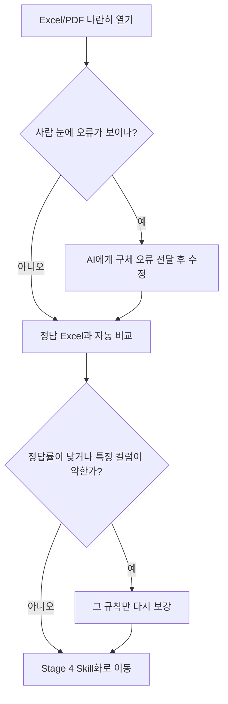

# Stage 3. 사람 확인 및 정답 비교

<div class="stage-nav" markdown>
**← 이전** [Stage 2. AI 자동화 워크플로우 설계](stage2.md) · **다음 →** [Stage 4. Skill화](stage4.md)
</div>

> AI 검증이 끝났다고 바로 믿지 않습니다. 이 단계에서는 **사람 눈으로 확인**하고, 이어서 **정답 Excel과 비교**해 정량적으로 진단합니다.
> **하지만 이번 실습에서는 가볍게 이 페이지만 읽어보고 넘어갑니다.**

| :material-timer-outline: 예상 소요 | :material-account-outline: 핵심 산출물 | :material-star-outline: 난이도 |
|:--:|:--:|:--:|
| 5분 | 사람 피드백 + 정답률 분석 | 보통 |



!!! danger "사람 확인은 필수입니다"
    AI가 패턴은 잘 찾지만, 의미가 미묘하게 다른 값이나 실제 업무상 중요한 차이는 사람이 더 잘 잡습니다.

---

## 3-1. 사람 눈으로 직접 비교하기

1. Excel 파일을 열어둡니다
2. PDF 파일을 나란히 열어둡니다
3. 행 단위로 비교하면서 틀린 부분을 메모합니다

!!! tip "사람이 특히 잘 잡는 오류"
    - 모집인원 숫자 오독
    - 누락된 학과나 전형
    - 셀 병합 해석 실패
    - 날짜 형식 불일치
    - 표가 다음 페이지로 넘어가며 잘린 케이스

!!! tip "효율적인 사람 확인 프로토콜"

    **1단계: 처음 10행 전수 확인 (3분)**
    
    - Excel의 1~10행을 PDF와 한 줄씩 대조합니다
    - 반복되는 오류 패턴이 있는지 봅니다
    - 예: "전형유형이 계속 빈칸이네" → 규칙 누락
    
    **2단계: 패턴 기반 점검 (2분)**
    
    - 1단계에서 발견한 패턴이 나머지 행에서도 반복되는지 확인
    - 특정 컬럼만 필터링해서 빈칸 비율 확인
    - 숫자 컬럼의 최대/최소가 상식적인지 확인
    
    **3단계: 랜덤 샘플 5건 확인 (2분)**
    
    - 중간쯤, 끝쪽에서 랜덤으로 5행을 골라 PDF와 대조
    - 1단계에서 못 잡은 새로운 유형의 오류가 있는지 확인
    
    이 방법이면 전수 확인 없이도 주요 오류 패턴을 잡을 수 있습니다.

!!! example "수정 요청 프롬프트 (예시)"
    ```text
    내가 직접 확인해보니 이런 문제들이 있어:

    1. 3번째 줄의 "모집인원"이 15명인데 20으로 추출됐어
    2. "교육학과"가 아예 빠져있어
    3. 10번째 줄 이후로 "전형유형"이 전부 빈칸이야
       (아마 셀 병합 처리가 안 된 것 같아)

    이 문제들을 수정해줘.
    그리고 이 수정이 서울대 PDF에만 맞춘 수정이 아닌지도 확인해줘.
    ```

---

## 3-2. 왜 틀렸는지 애매할 때

!!! danger "원인을 모르겠으면 이렇게 시키세요"
    ```text
    지금은 왜 틀렸는지 감으로 고치지 말고,
    PDF 원본과 Excel 결과를 줄 단위로 직접 대조해줘.
    특히 내가 의심한 행이 PDF의 어느 위치에서 왔는지 근거를 같이 보여줘.
    ```

!!! tip ""
    AI가 "맞는 것 같다"고 말해도 찝찝하면, **해당 행의 PDF 출처를 같이 대라**고 하면 훨씬 정확해집니다.

---

## 3-3. 정답 Excel과 비교하기

!!! example "자동 비교 프롬프트 (예시)"
    ```text
    정답 파일을 줄게.
    → [정답 Excel 파일 경로]

    이 정답 파일과 내가 만든 파싱 결과 파일을 자동으로 비교하는 
    프로그램을 만들어서 실행해줘.

    이런 결과를 보여줘:
    1. 전체 정답률 (맞은 칸 수 / 전체 칸 수)
    2. 컬럼별 정답률
    3. 틀린 칸 목록 (몇 번째 줄, 어떤 컬럼, 내 값, 정답 값)
    4. 아예 빠진 줄 목록
    5. 원래 없어야 하는데 추가로 생긴 줄 목록
    ```

### 진단할 때 볼 것

| 항목 | 왜 보나 |
|------|--------|
| 전체 정답률 | 현재 결과의 전체 수준 확인 |
| 컬럼별 정답률 | 특정 컬럼이 약한지 확인 |
| 빠진 줄 목록 | 누락 패턴 확인 |
| 추가 줄 목록 | 오탐 패턴 확인 |
| 오류 유형 분석 | 다음 수정 우선순위 설정 |

!!! abstract ""
    정답률은 성적표라기보다 **진단표**입니다. 중요한 것은 점수보다도, 어떤 규칙과 컬럼에서 반복적으로 틀리는지 설명할 수 있게 되는 것입니다.

---

## 체크포인트

- [ ] 사람 눈으로 PDF와 Excel을 직접 대조했습니다
- [ ] 발견한 오류를 AI에게 전달해 수정했습니다
- [ ] 정답 Excel과 자동 비교했습니다
- [ ] 반복 오류 패턴과 개선 우선순위를 정리했습니다

<div class="stage-nav" markdown>
**← 이전** [Stage 2. AI 자동화 워크플로우 설계](stage2.md) · **다음 →** [Stage 4. Skill화](stage4.md)
</div>
