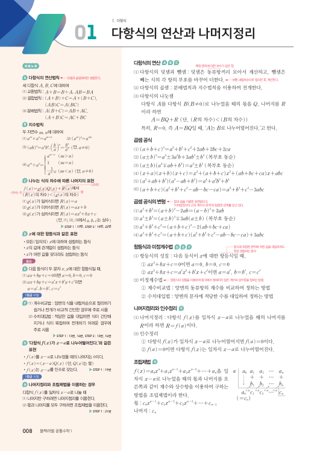
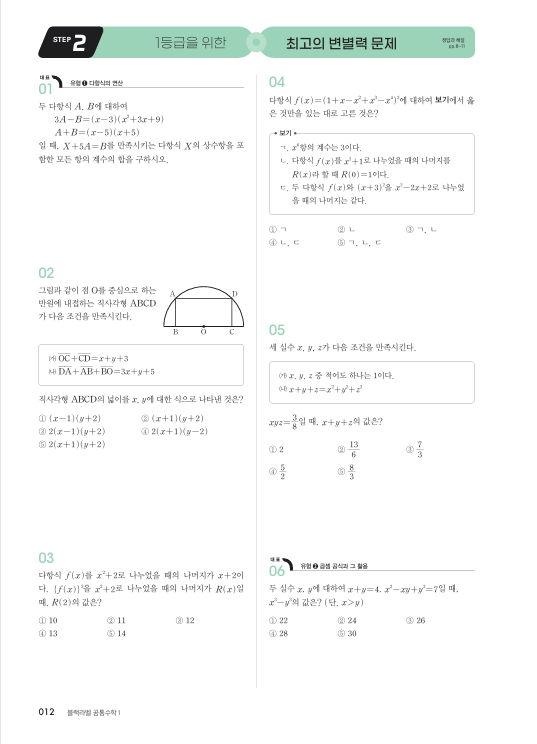
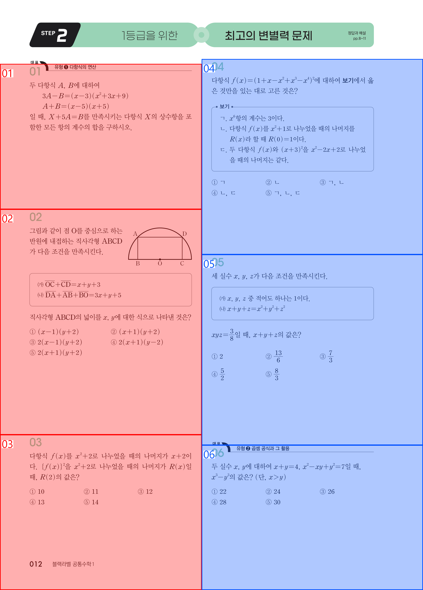
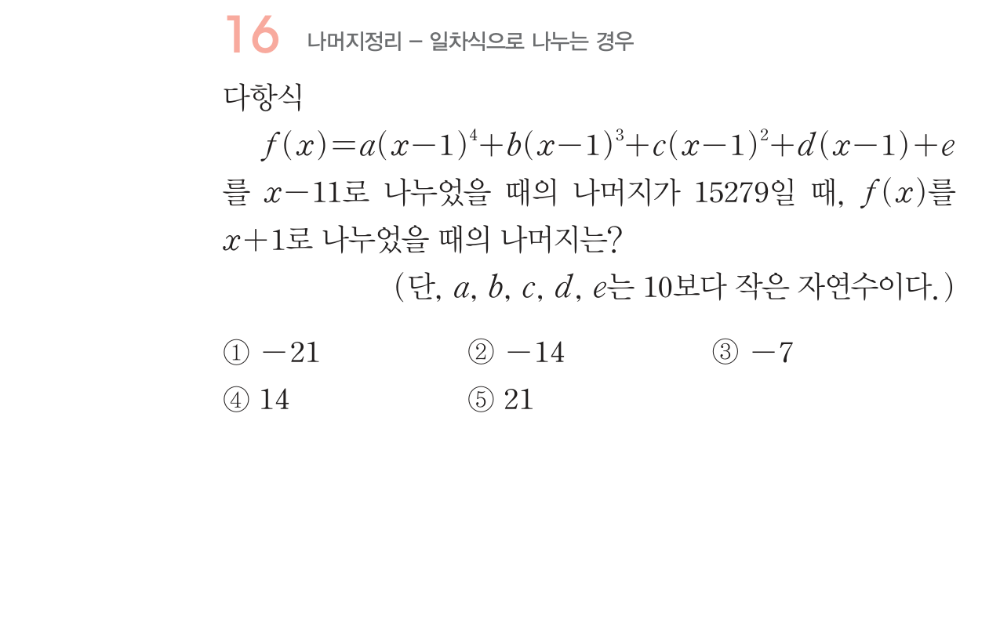
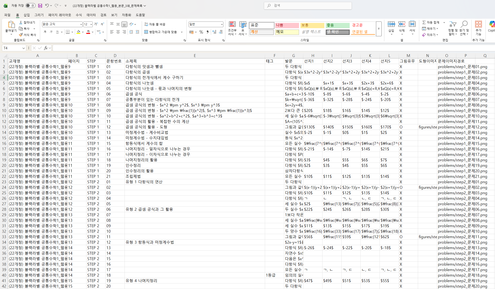
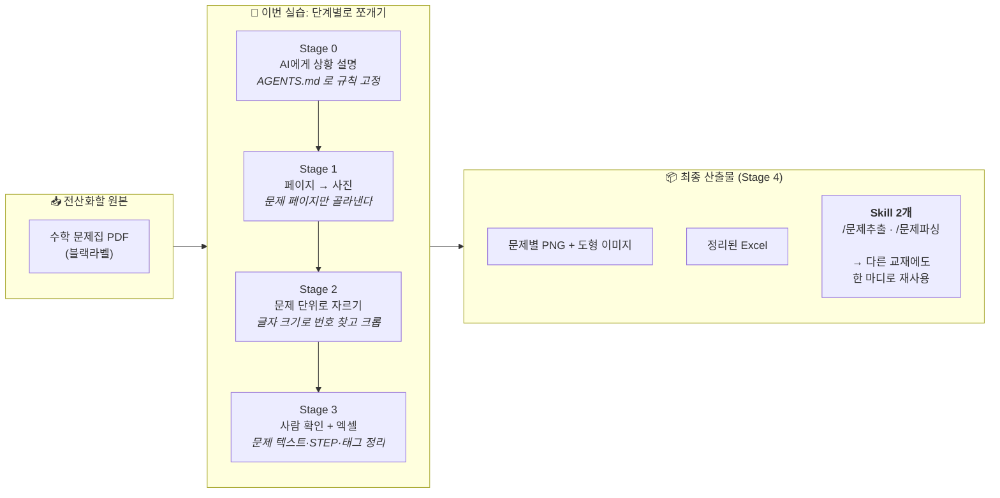

# 실습 교육 2 | 수학 교재 디지털화 작업

> 비개발자가 AI와 대화하며, 수학 문제집 PDF에서 문제를 한 장씩 잘라내고 엑셀로 정리하는 전 과정을 체험하는 실습 가이드입니다.

!!! abstract "실습 1에서 가져오는 것"
    실습 1에서 이미 경험한 세 가지를 여기서 다시 씁니다:
    
    - **관찰담**: 내가 발견한 규칙을 AI에게 말로 설명하기
    - **검증 루프**: 결과 확인 → 피드백 → 수정 반복하기
    - **Skill화**: 작업 과정을 재사용 가능하게 포장하기
    
    다른 건 하나도 같지 않습니다. 데이터가 다르고, 도구가 다르고, 결과물이 다릅니다. 하지만 AI와 협업하는 방식은 똑같습니다.

---

## 업무 배경

!!! info "프로젝트 배경"
    수학 교재를 디지털 문제 DB로 만드는 프로젝트가 있습니다. 요구사항은 이렇습니다:

    - 블랙라벨 문제집 파일을 전산화
    - 도형이나 그래프가 있는 건 이미지로 따로 저장
    - 각 문제의 STEP, 문항번호, 소제목, 태그를 엑셀로 정리

ChatGPT한테 PDF 통째로 줘봤더니 19분 걸려서 결과를 냈지만, 문제를 통째로 빼먹거나 STEP을 잘못 분류하는 등 다양한 오류가 있었습니다.

원인은 간단합니다. **AI한테 한꺼번에 너무 많은 걸 시켰기 때문입니다.** PDF 한 권이 아니라, 한 문제씩 잘라서 던지면 정확도가 완전히 달라집니다. 그래서 이 실습의 핵심은:

> **"AI가 잘 소화할 수 있는 크기로 입력을 먼저 쪼개는 프로그램"을 만드는 것**입니다.

---

## AI는 이미지를 어떻게 볼까?

실습 1에서 AI에게 PDF를 줬더니 표를 읽어줬습니다. 실습 2에서는 한 단계 더 나갑니다: AI에게 **사진**을 보여주고 작업을 시킵니다.

여기서 알아두면 좋은 것:

**AI에게 사진은 "픽셀의 격자"입니다.** 사람은 사진을 보면 즉시 "아 여기 문제 번호가 있네"라고 인식하지만, AI에게 사진은 숫자(픽셀 값)의 나열일 뿐입니다.

**그래서 우리가 해줄 일:** AI가 문제를 찾으려면, 우리가 "문제 번호는 글자가 크다"같은 **규칙(관찰담)**을 알려줘야 합니다. 그러면 AI는 글자 크기를 숫자로 비교하는 코드를 만듭니다.

**코드를 이해할 필요는 없습니다.** 우리는 결과 사진(디버그 이미지)을 보고 "여기가 이상해"라고 말해주면 됩니다. 실습 1에서 한 것과 완전히 같은 방식입니다.

---

## 입력 자료: 수학 문제집 PDF

실습에서 다루는 입력 자료는 **블랙라벨 수학 문제집 PDF**입니다. 각 단원별로 문제가 나열되어 있으며, 문제마다 STEP 구분·문항 번호·도형/그래프 이미지 등이 포함되어 있습니다.





PDF의 주요 특징:

- 한 페이지에 여러 문제가 혼재
- STEP(필수예제, 유제, 연습문제 등) 구분이 시각적 레이아웃으로만 표현됨
- 도형·그래프·수식 이미지가 텍스트와 혼합
- 페이지마다 문제 시작/끝 경계가 명확하지 않음

PDF 한 권을 통째로 AI에게 던지고 문제를 추출하게 시키는 대신, **문제 단위로 먼저 쪼개서** 정확도를 높이고 대용량의 처리를 가능하게 하는 것이 이번 실습의 핵심입니다. 또한 이를 원클릭 자동화 프로세스로 만들어 다른 책에도 활용할 수 있게 할 예정입니다.

---

## 목표 결과물

최종적으로 두 가지 결과물을 만듭니다:

**① 문제별 이미지 파일** — 각 문제를 한 장씩 잘라낸 사진 (도형은 별도 추출)

**② 엑셀 정리 파일** — STEP, 문항번호, 소제목, 태그 메타데이터







---

## 실습 전 준비

!!! note "준비물"
    - AI 코딩 에이전트(Claude Code, Codex, Antigravity 등) 준비
    - Python 설치 완료
    - 실습 폴더 구조 확인

```text
practice_2/
├── data/           ← PDF 문제집을 여기에 넣음
├── output/         ← 결과물이 저장될 폴더
├── AGENTS.md       ← AI가 자동으로 읽는 작업 지침서
└── CLAUDE.md       ← Claude Code용 안내 파일
```

!!! tip "AGENTS.md가 뭐예요?"
    AI 코딩 에이전트가 프로젝트 폴더를 열 때 자동으로 읽는 "작업 지침서"입니다. "사용자는 비개발자다", "매 단계 끝에 5줄로 보고해라" 같은 규칙이 적혀 있어서 AI가 알아서 따릅니다.

---

## 지금 뭘 하는 건가요? (한눈에 보기)

!!! abstract "실습의 큰 그림"
    **"수학 문제집 PDF를 문제별 이미지 + 엑셀 메타데이터로 전산화하는 작업"** 을 AI와 함께 자동화하고, 그 자동화 과정을 **한 번 더 쓸 수 있는 Skill로 포장**하는 것이 이 실습의 전부입니다.



---

## Stage별 로드맵

| Stage | 무엇을 하나 | 핵심 질문 | 예상 시간 |
|:-----:|-------------|-----------|:---------:|
| 0 | AI에게 프로젝트 배경과 작업 방식을 설명합니다 | AI가 내 의도를 이해했나? | 5분 |
| 1 | PDF를 페이지별 사진으로 만들고, 진짜 문제 페이지만 골라냅니다 | 문제 페이지가 정확히 걸러졌나? | 15분 |
| 2 | 문제 영역을 찾아 잘라내고, 디버그 사진과 도형 추출까지 합니다 | 각 문제가 정확히 한 장씩 잘렸나? | 20분 |
| 2b | 도형이 있는 문제에서 도형만 따로 잘라 저장합니다 (선택) | 도형이 정확히 잘렸나? | 15분 |
| 3 | 잘라낸 문제를 텍스트로 읽어서 엑셀에 정리합니다 | 문제 텍스트와 메타데이터가 맞나? | 20분 |
| 4 | 지금까지의 과정을 Skill로 만들어 재사용 가능하게 포장합니다 | 다른 교재에도 다시 쓸 수 있는가? | 15분 |

---

## 최종 산출물

```text
output/
  └─ 책이름/
      ├─ pages/              ← Stage 1 결과 (페이지별 사진)
      ├─ problems/           ← Stage 2 결과 (문제별 사진)
      ├─ figures/            ← Stage 2 결과 (도형 이미지)
      ├─ debug/              ← Stage 2 결과 (확인용 디버그 사진)
      ├─ report.txt          ← Stage 1 결과 (페이지 판정 리포트)
      └─ 책이름_export.xlsx  ← Stage 3 결과 (최종 엑셀)
```

---

<div class="stage-nav" markdown>
**다음 →** [Stage 0. AI에게 상황 설명하기](stage0.md)
</div>
