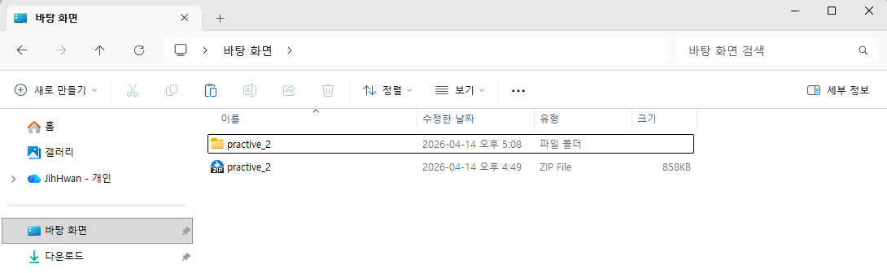
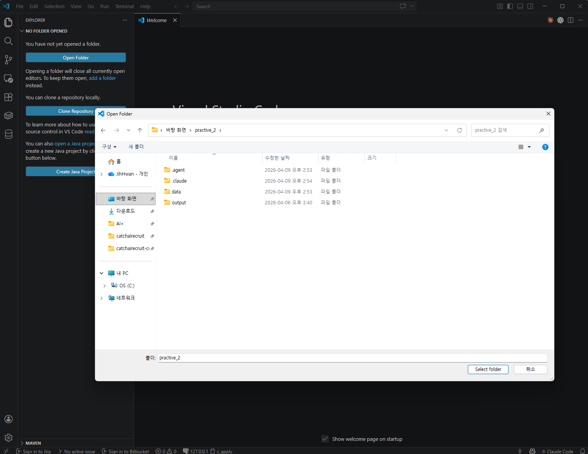
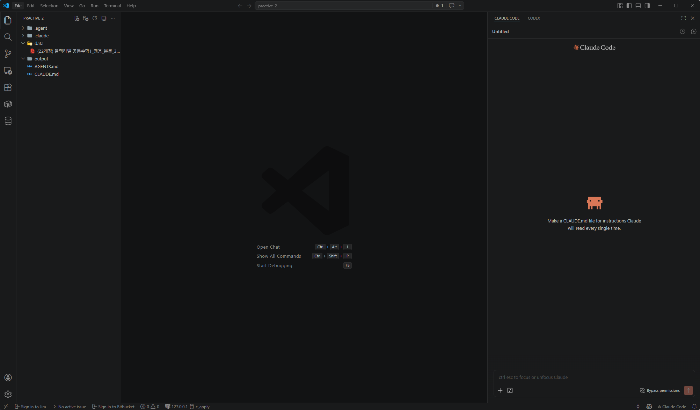

# Stage 0. AI에게 상황 설명하기

<div class="stage-nav" markdown>
**← 이전:** [개요](index.md) &nbsp; | &nbsp; **다음 →** [Stage 1. PDF → 사진 변환 & 문제 페이지 골라내기](stage1.md)
</div>

> 요리로 치면 레시피를 다 쓰기 전에, 재료와 조리도구를 테이블에 놓고 "나 이거 만들거야"라고 말해주는 단계입니다.


!!! abstract "이번 단계의 목적"
    - 실습 파일 준비 (압축 해제 → VSCode로 열기)
    - AI에게 내가 누구인지, 무엇을 만들고 싶은지 알려줍니다
    - 단계별로 진행할 것이고, 매번 눈으로 확인할 결과물을 달라고 요청합니다
    - AI가 내 의도를 이해했는지 확인합니다

---

## 🗂️ 먼저 실습 파일 준비하기

AI에게 시키기 전에, 실습 자료가 들어있는 폴더를 **VSCode로 열어두어야** 합니다. Claude Code가 이 폴더 안의 파일(PDF, 결과 이미지)을 볼 수 있기 때문입니다.

### 1️⃣ `practice_2.zip` 을 바탕화면에서 압축 해제

전달받은 `practice_2.zip` 파일을 **바탕화면에 두고 더블클릭**해서 압축을 풉니다. zip 파일 옆에 `practice_2` 폴더가 새로 생기면 성공입니다.



!!! tip ""
    압축 해제된 폴더 안에는 `.agent`, `.claude`, `data`, `output` 폴더가 들어있습니다. `data`에 수학 교재 PDF가, `output`은 비어있는 결과 저장용 폴더입니다.

### 2️⃣ VSCode를 열고 **Open Folder** 클릭

VSCode를 실행하면 시작 화면이 뜹니다. 왼쪽의 파란색 **Open Folder** 버튼을 클릭하세요. (단축키 `Ctrl + K` → `Ctrl + O`)


### 3️⃣ 방금 압축 해제한 `practice_2` 폴더 선택

폴더 선택창이 뜨면 **바탕화면 → practice_2** 를 선택하고, 오른쪽 아래 **Select folder** 를 누릅니다.



!!! warning "주의 — `practice_2` 폴더 자체를 선택하세요"
    실수로 `data` 폴더나 바탕화면 자체를 선택하지 않도록 주의하세요. 반드시 `.agent`, `.claude`, `data`, `output`이 **안에 보이는** `practice_2` 폴더를 선택해야 합니다.

### 4️⃣ 프로젝트가 열리면 Claude Code 패널 확인

VSCode 왼쪽 탐색기(EXPLORER)에 `data`와 `output` 폴더가 보이고, 오른쪽에는 **Claude Code** 패널이 있으면 준비 완료입니다.



!!! tip "Claude Code 패널이 안 보이면"
    단축키 `Ctrl + Alt + I` 를 누르거나, 우측 상단에서 **Claude Code** 탭을 열면 됩니다.

---

!!! info "🚦 AI에게 시키기 전에 — 자동 허가 모드 설정"
    에이전트가 매번 "이 파일 수정해도 될까요?"라고 물으면 실습 흐름이 끊깁니다. 실습 시작 전에 **자동 허가 모드**로 바꿔두세요.

    👉 [**자동 허가 모드 설정 가이드 열기**](autoapprove.md) (Claude Code / Antigravity / Codex)

---

## 지금 할 일

1. AI 코딩 에이전트를 열고 아래 프롬프트를 그대로 보냅니다
2. AI가 "준비됐다"고 답하면 다음 Stage로 넘어갑니다

!!! quote "AI에게 이렇게 말해보세요"
    ```text
    나는 코딩을 잘 몰라. 수학 문제집 PDF를 한 문제씩 잘라서 이미지로 저장하는 프로그램을 너랑 같이 만들고 싶어.

    한 번에 다 만들지 말고, 내가 단계별로 부탁할 거야. 각 단계마다 **내가 눈으로 결과를 확인할 수 있는 그림을 꼭 같이 저장**해줘. 내가 그 그림을 보고 "어 이상해" 하면 같이 고쳐나가자.

    `data/` 폴더에 PDF가 있고, 결과는 `output/` 폴더에 저장할 거야. 파이썬으로 만들어. 준비됐으면 시작할게.
    ```

!!! example "실습 1에서 익힌 관찰담, 여기서도 쓴다"
    실습 1에서 "이상한 점을 말로 설명해주면 AI가 고쳐준다"는 걸 경험했습니다. 실습 2에서도 똑같습니다. 다만 이번엔 표가 아니라 **이미지 안의 패턴**을 관찰해서 전달하게 됩니다.
    
    예를 들어: "문제 번호는 본문 글자보다 항상 크더라" — 이런 관찰이 Stage 2에서 핵심 역할을 합니다.

!!! success "이런 결과가 보이면 정상입니다"
    - AI가 "준비됐다", "시작하자" 등으로 답합니다
    - 프로젝트 구조를 이해했다는 응답이 나옵니다
    - AGENTS.md를 읽었다면 보고 형식을 알고 있습니다

!!! danger "지금 단계에서 하지 않을 것"
    - 처음부터 완벽한 프롬프트를 만들려고 오래 고민하지 않기
    - 코드를 직접 쓰려고 하지 않기
    - AI의 답을 너무 길게 읽으려고 하지 않기

??? question "왜 이렇게 하나요?"
    AI 코딩 에이전트는 AGENTS.md를 자동으로 읽지만, 프로젝트의 전체 맥락까지 이해하는 건 아닙니다. "나는 비개발자야", "단계별로 해줄 거야", "눈으로 볼 수 있는 결과를 달라" — 이 세 가지를 먼저 알려주면 이후 대화가 훨씬 매끄럽습니다.

---

## 체크포인트

- [ ] AI 에이전트를 열고 위 프롬프트를 보냈습니다
- [ ] AI가 의도를 이해하고 준비됐다고 답했습니다
- [ ] 다음 Stage로 넘어갈 준비가 되었습니다

!!! info ""
    **다음 단계에서는** PDF를 페이지별 사진으로 만들고, 진짜 문제 페이지만 골라내는 작업을 합니다.

<div class="stage-nav" markdown>
**← 이전:** [개요](index.md) &nbsp; | &nbsp; **다음 →** [Stage 1. PDF → 사진 변환 & 문제 페이지 골라내기](stage1.md)
</div>
