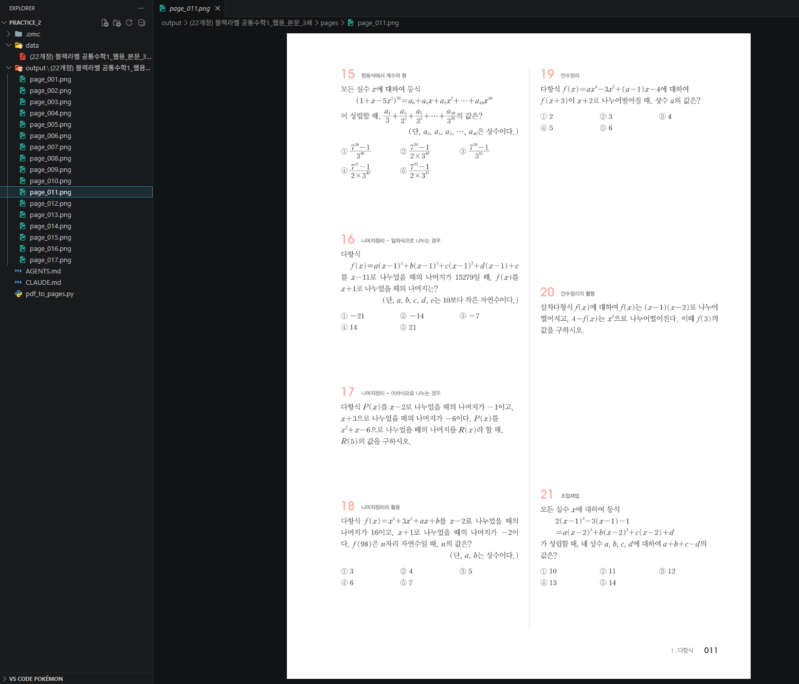
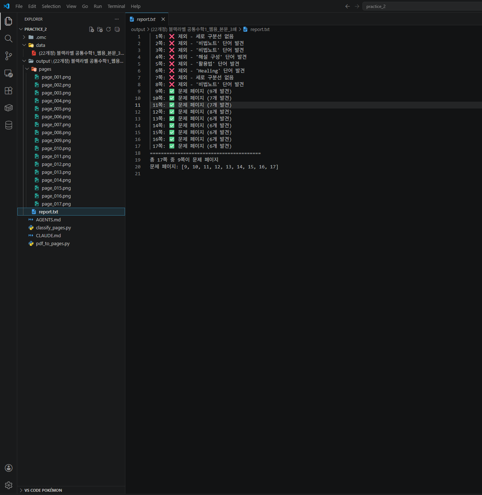

# Stage 1. PDF를 사진으로 만들고 문제 페이지 골라내기

<div class="stage-nav" markdown>
**← 이전:** [Stage 0. AI에게 상황 설명하기](stage0.md) &nbsp; | &nbsp; **다음 →** [Stage 2. 문제를 찾아서 한 장씩 잘라내기](stage2.md)
</div>

> PDF 안에서 직접 작업하는 건 어려워요. 대신 **각 페이지를 큰 사진으로 떠놓으면**, 그 다음부터는 "사진 위에 네모 그리기", "사진 자르기" 같은 쉬운 작업으로 바뀝니다. 그리고 문제집엔 목차, 학습법 안내 같은 페이지도 있으니까, **진짜 문제 페이지만 골라내는 것**까지 함께 합니다.

| ⏱️ 예상 소요 | 🧩 핵심 산출물 | ⭐ 난이도 |
|:---:|:---:|:---:|
| 15분 | 페이지별 PNG + 판정 리포트 | 낮음 |

!!! abstract "이 단계의 목적"
    - PDF의 각 페이지를 고해상도 PNG 사진으로 변환합니다
    - 목차, 안내, 해설 페이지를 걸러내고 진짜 문제 페이지만 골라냅니다
    - 판정 결과를 리포트로 남겨서 내가 확인할 수 있게 합니다

---

## 1-1. PDF의 모든 페이지를 사진으로 만들기

!!! quote "AI에게 이렇게 말해보세요"
    ```text
    `data/` 폴더에 있는 PDF 파일을 읽어서, **각 페이지를 한 장씩 PNG 사진으로 저장**하는 파이썬 스크립트를 만들어줘.

    저장 위치는 `output/책이름/pages/page_001.png`, `page_002.png`... 이런 식으로. 책 이름은 PDF 파일 이름에서 자동으로 따와줘.

    **중요한 팁:** 인쇄 품질 정도로 깨끗하게 떠야 나중에 글자가 또렷하게 보여. 그래서 **원본보다 약 4배 정도 확대해서** 렌더링해줘. (나중에 이 배율을 다른 계산에도 써야 하니까 변수로 빼놓줘.)

    시간이 좀 걸릴 수 있으니 진행 상황이 보이는 진행률 바도 띄워줘.
    ```

!!! success "이런 결과가 보이면 정상입니다"
    - `output/책이름/pages/` 폴더가 생겼습니다
    - 폴더 안에 `page_001.png`, `page_002.png`... 사진들이 있습니다
    - 사진을 열어보면 **글자가 또렷하게** 보입니다

!!! tip "이상하면?"
    "글자가 너무 흐려", "사진이 너무 커/작아" 이런 식으로 AI한테 그대로 말해요. 배율을 조정해줄 겁니다.



---

## 1-2. 진짜 문제 페이지만 골라내기

!!! info "pdfplumber가 뭘 하는 건지"
    PDF 파일 안에는 우리 눈에 보이지 않는 정보가 숨어 있습니다. 각 글자가 페이지의 어디에, 어떤 크기로 놓여 있는지, 어디에 선이 그려져 있는지 같은 것들입니다.
    
    `pdfplumber`는 이 숨겨진 정보를 숫자로 꺼내주는 도구입니다.
    
    우리가 "가운데에 세로선이 있는 페이지만 골라줘"라고 말하면, AI는 pdfplumber로 선의 위치를 숫자로 읽고, 조건에 맞는 페이지를 걸러내는 코드를 만듭니다.
    
    **우리는 pdfplumber를 직접 쓸 필요가 없습니다.** "이런 도구가 있다"는 것만 알면 됩니다.

!!! info "왜 이 단계가 필요해요?"
    문제집 앞쪽엔 표지, 목차, 학습법 안내, 단원 소개 같은 페이지가 많습니다. 뒤에는 해설, 부록도 있죠. 이런 페이지까지 건드리면 엉뚱한 걸 문제라고 착각해서 결과가 엉망이 됩니다.

내가 문제집을 직접 넘겨보면서 발견한 규칙을 AI에게 알려줍니다:

1. **진짜 문제 페이지에는 가운데에 세로로 긴 구분선**이 그려져 있습니다 (두 칸으로 나뉘어 있으니까)
2. **목차나 안내 페이지**에는 `Contents`, `활용법`, `해설 구성`, `비법노트` 같은 단어가 보입니다
3. 진짜 문제 페이지엔 **한 페이지에 문제가 4~10개 정도** 있습니다

!!! quote "AI에게 이렇게 말해보세요"
    ```text
    이번엔 PDF에서 **진짜 문제 페이지만 골라내는** 기능을 만들어줘.

    PDF 안에 있는 글자와 선의 위치를 숫자로 읽어올 수 있는 도구가 있어 — `pdfplumber`라고 해. 이걸 쓰면 "이 글자가 페이지의 어디에 있고 얼마나 큰지", "어디에 어떤 선이 그려져 있는지"를 전부 알 수 있어. 이걸로 아래 규칙을 코드로 옮겨줘:

    **규칙 1 — 가운데 구분선이 있어야 해.**
    진짜 문제 페이지는 가운데를 세로로 가르는 긴 선이 인쇄되어 있어. pdfplumber로 페이지의 선들을 읽은 다음, **세로 방향으로 아주 길쭉한 선**(위아래로 페이지 거의 절반 높이 이상)이 **페이지 가로 중앙 근처**에 있는지 확인해줘. 없으면 그 페이지는 문제 페이지가 아니야.

    **규칙 2 — 안내 페이지 키워드가 있으면 탈락.**
    페이지의 글자를 다 읽어서 `Contents`, `활용법`, `해설 구성`, `비법노트`, `구성과 특징`, `핵심개념`, `이 책의 본문`, `Healing` 중 하나라도 나오면 그건 문제 페이지가 아니야. 제외.

    **규칙 3 — 한 페이지에 큼지막한 숫자(문제 번호로 보이는 것)가 4개에서 10개 사이**여야 해. 너무 적거나 너무 많으면 제외.

    그리고 **내가 확인할 수 있게** `output/책이름/report.txt` 파일에 이렇게 남겨줘:
    ```

    ```text
    5쪽: ❌ 제외 - Contents 단어 발견
    6쪽: ❌ 제외 - 세로 구분선 없음
    12쪽: ✅ 문제 페이지 (8개 발견)
    13쪽: ✅ 문제 페이지 (6개 발견)
    ```

    이렇게 해서 **어떤 페이지가 통과하고 어떤 페이지가 탈락했는지** 내가 한눈에 볼 수 있게.

!!! success "이런 결과가 보이면 정상입니다"
    - `output/책이름/report.txt` 파일이 생겼습니다
    - 파일을 열어보면 각 페이지가 ✅ 또는 ❌ 로 표시되어 있습니다
    - 내가 문제집을 직접 넘겨봤을 때 진짜 문제 페이지라고 생각한 쪽이 ✅ 로 잡혀 있습니다

!!! tip "이상하면?"
    "3쪽은 진짜 문제 페이지인데 탈락됐어" 또는 "25쪽은 목차인데 통과됐어" 이렇게 AI한테 말해줘요. 규칙을 조정해줄 겁니다.

!!! warning "이런 일이 생길 수 있다"

    **시나리오 1: 페이지 사진이 까맣게 나온다**
    ```
    page_003.png를 열어봤는데 화면이 까맣게/하얗게 나와. 
    PDF 렌더링에 문제가 있는 것 같아. 다른 방법으로 시도해줘.
    ```
    
    **시나리오 2: report.txt에서 진짜 문제 페이지가 ❌로 나온다**
    ```
    12쪽은 확실히 문제 페이지인데 ❌로 나왔어.
    12쪽에 세로 구분선이 있는지 다시 확인해줘.
    혹시 구분선 기준이 너무 엄격한 건 아닌지 봐줘.
    ```
    
    **시나리오 3: 목차 페이지가 ✅로 통과했다**
    ```
    5쪽은 목차인데 ✅로 나왔어. 
    키워드 필터에 빠진 단어가 있는 것 같아.
    5쪽에 어떤 텍스트가 있는지 보여줘.
    ```



---

## 체크포인트

- [ ] `output/책이름/pages/` 폴더에 페이지별 PNG 사진이 생겼습니다
- [ ] 사진을 열어보면 글자가 또렷하게 보입니다
- [ ] `output/책이름/report.txt` 파일이 생겼습니다
- [ ] 각 페이지가 ✅ 또는 ❌ 로 정확히 판정되었습니다

!!! info ""
    **다음 단계에서는** 이제 골라낸 문제 페이지 안에서 각 문제를 찾아서 한 장씩 잘라내는 작업을 합니다.

<div class="stage-nav" markdown>
**← 이전:** [Stage 0. AI에게 상황 설명하기](stage0.md) &nbsp; | &nbsp; **다음 →** [Stage 2. 문제를 찾아서 한 장씩 잘라내기](stage2.md)
</div>
