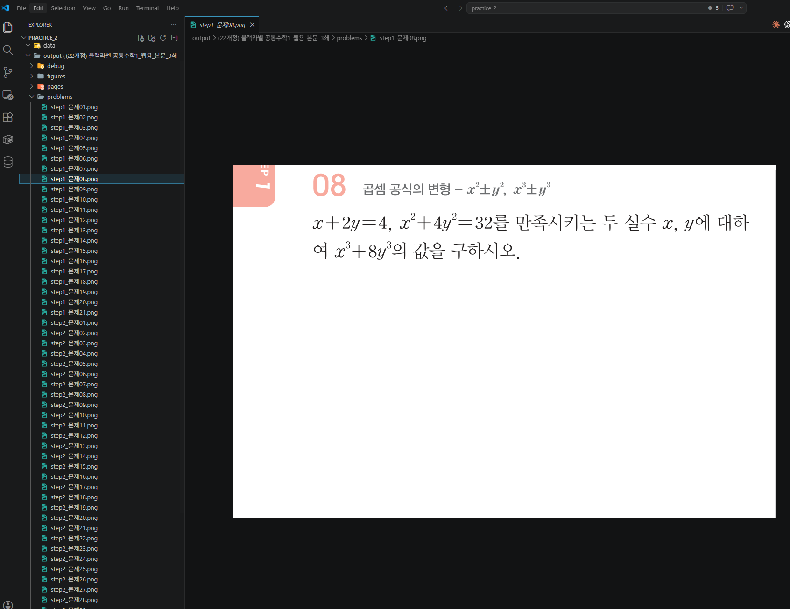
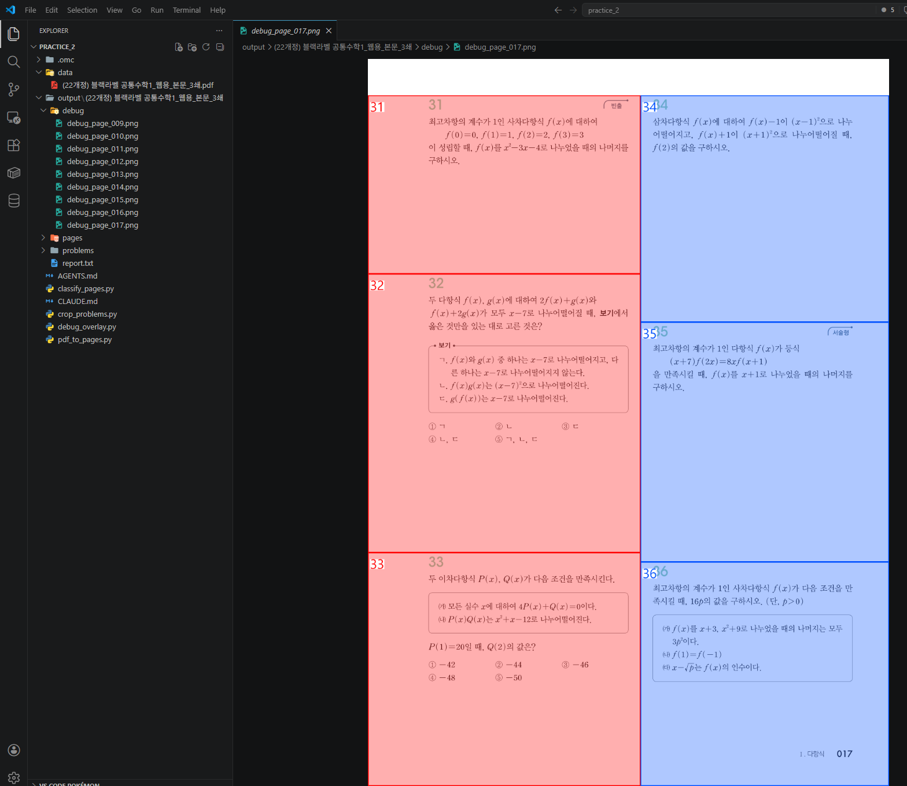
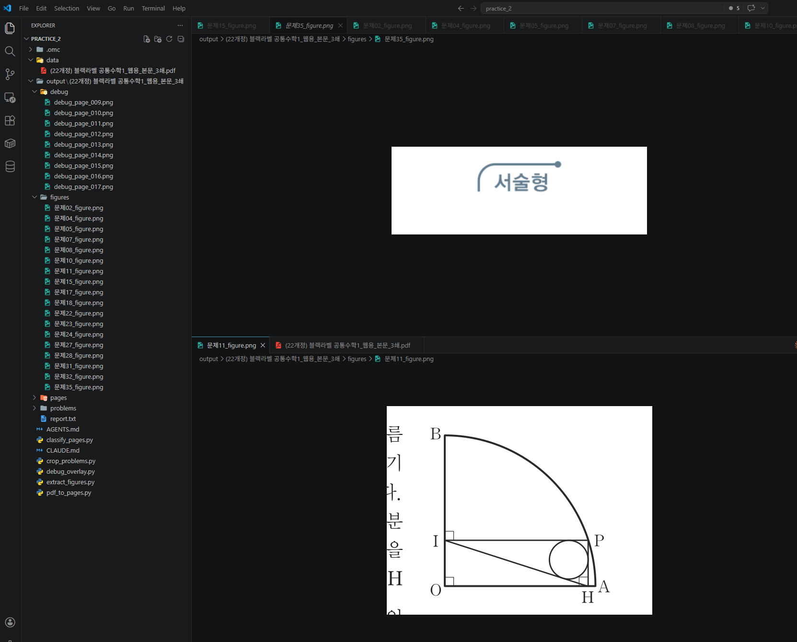

# Stage 2. 문제를 찾아서 한 장씩 잘라내기

<div class="stage-nav" markdown>
**← 이전:** [Stage 1. PDF → 사진 변환 & 문제 페이지 골라내기](stage1.md) &nbsp; | &nbsp; **다음 →** [Stage 3. 사람 확인 및 엑셀 정리](stage3.md)
</div>

> 이제 '진짜 문제 페이지'는 골라냈습니다. 이 페이지 안에 **문제가 여러 개** 있죠. 이걸 **한 문제씩** 잘라서 저장하고, 도형도 따로 추출하고, 내 눈으로 확인할 디버그 사진까지 만드는 단계입니다. **가장 중요한 단계입니다.**


!!! abstract "이 단계의 목적"
    - 문제 번호를 글자 크기로 찾아내서 각 문제의 영역을 계산합니다
    - 계산된 영역을 사진에서 잘라서 문제별 PNG로 저장합니다
    - 디버그 사진을 만들어 내 눈으로 확인합니다
    - 도형이 있는 문제는 도형만 따로 잘라 저장합니다

---

## 2-1. 각 문제가 어디 있는지 찾고 잘라 저장하기

!!! info "왜 이게 핵심이에요?"
    문제집에서 "이게 문제 번호다"라고 알려주는 건 **글자 크기**입니다. 문제 번호는 본문 글자보다 확실히 큽니다. 이 차이를 이용해서 문제 번호를 찾아내고, 문제 사이의 경계를 계산합니다.

!!! quote "AI에게 이렇게 말해보세요"
    ```text
    이제 가장 중요한 단계야. 문제 페이지 안에서 **각 문제가 차지하는 영역을 찾아서, 한 문제씩 잘라서 사진으로 저장**해줘.

    단계 2에서 쓴 pdfplumber — PDF 안의 글자 위치와 크기를 숫자로 떠오는 그 도구 — 를 여기서도 쓸 거야. 글자의 크기를 비교해서 문제 번호를 찾는 게 핵심이야.

    내가 문제집을 보면서 발견한 규칙이 있어:

    **규칙 1 — 문제 번호는 본문 글자보다 확실히 크다.**
    페이지 안에 있는 **모든 글자의 크기를 모아서 줄을 세워봐.** 거기서 "가운데 정도 크기"를 기준으로 잡고, **그것보다 눈에 띄게 큰 글자(대략 1.2배 이상)만** 후보로 남겨. 이게 제일 중요한 트릭이야. 본문 숫자들이랑 문제 번호를 구분하는 방법이 이것뿐이야.

    **규칙 2 — 딱 두 자리 숫자만 문제 번호로 인정.**
    `01`, `02`, ..., `99` 같은 정확히 두 자리 숫자 모양만 문제 번호로 쳐. 한 자리, 세 자리, 소수점 있는 건 다 탈락.

    **규칙 3 — 왼쪽 칸/오른쪽 칸 구분.**
    아까 찾은 **가운데 세로 구분선** 있잖아? 그 선을 기준으로 왼쪽에 있으면 왼쪽 칸 문제, 오른쪽이면 오른쪽 칸 문제로 구분해줘.

    **규칙 4 — 한 문제가 어디서 끝나는지 (이게 진짜 핵심).**
    한 문제의 끝은 **같은 페이지, 같은 칸에서 바로 다음 문제가 시작하는 바로 위**야. 예를 들어 왼쪽 칸에 03번이 위에 있고 04번이 더 아래에 있으면, 03번의 영역은 "03번 위치부터 04번 위치 바로 위까지"야. 같은 칸에 다음 문제가 없으면 그냥 페이지 바닥까지 가면 돼.

    이렇게 네 규칙으로 각 문제의 "네모 영역"을 계산한 다음, 단계 1에서 저장한 페이지 사진에서 그 네모 부분을 잘라서 `output/책이름/problems/` 폴더에 저장해줘. 파일 이름은 `문제01.png`, `문제02.png`... 같이 알아보기 쉽게.

    **조심할 점:** PDF 내부 좌표랑 사진 좌표가 스케일이 다르니까, 단계 1에서 썼던 그 배율(4배)을 곱해서 위치를 맞춰야 해.
    ```

!!! success "이런 결과가 보이면 정상입니다"
    - `output/책이름/problems/` 폴더에 문제 사진들이 저장됐습니다
    - 사진을 하나씩 열어보면 **문제 하나가 정확히 잘려 있습니다**
    - 앞 문제나 뒤 문제가 살짝 섞여 들어오지 않습니다

!!! tip "이상하면?"
    문제들을 몇 개 열어보고 AI한테 피드백해요:

    - "03번 문제 사진에 04번 문제의 첫 줄이 같이 잘렸어"
    - "문제 번호를 못 찾았는지 파일이 몇 개 비어있어"
    - "왼쪽/오른쪽 칸이 뒤섞였어"



---

## 2-2. 내 눈으로 확인할 수 있는 '디버그 사진' 만들기

!!! info "왜 이게 필요해요?"
    문제를 잘랐는데 결과가 이상해요. 근데 **왜** 이상한지 알아야 고칠 수 있잖아요? 그래서 **원본 페이지 사진 위에, AI가 찾아낸 문제 영역들을 네모로 그린 사진**을 만듭니다. 이걸 보면 "아, 03번 문제 네모가 너무 작게 잡혔네" 같은 걸 한눈에 알 수 있습니다.

!!! quote "AI에게 이렇게 말해보세요"
    ```text
    마지막으로 **디버그 모드**를 추가해줘. 아까 단계 1에서 저장한 페이지 사진 위에, 단계 3에서 찾은 문제 영역들을 네모로 그린 사진을 만들어줘.

    이렇게 해주면 좋겠어:
    - **왼쪽 칸 문제는 빨간 네모, 오른쪽 칸 문제는 파란 네모**로 그려줘 (구분 가능하게)
    - **네모 안에 문제 번호**를 크게 써줘 ("01", "02", ...)
    - 저장 위치는 `output/책이름/debug/debug_page_001.png` 이런 식으로
    - 문제 페이지마다 하나씩 만들어줘

    이 사진을 열어보면 내가 "아 이 부분을 이렇게 잡았구나" 하고 한눈에 볼 수 있게.
    ```

!!! success ""
    디버그 사진을 쭉 넘겨보면서 잘못 잡힌 부분이 있으면 AI한테 알려줘요. "5쪽 오른쪽 칸 마지막 문제의 네모가 너무 아래까지 내려갔어" 같이 말이에요. AI가 원인을 찾아 고쳐줄 겁니다.

!!! warning "이런 일이 생길 수 있다"

    **시나리오 1: 문제 번호를 하나도 못 찾았다**
    
    → 글자 크기 기준이 맞지 않을 수 있다.
    ```
    문제 번호가 하나도 안 잡혔어. 
    이 페이지에 있는 글자들의 크기 분포를 보여줘.
    가장 큰 글자부터 10개만 나열해줘.
    ```
    
    **시나리오 2: 디버그 사진에서 네모가 겹쳐 있다**
    ```
    debug_page_012.png를 봤는데 03번 네모와 04번 네모가 겹쳐있어.
    두 문제의 y좌표를 비교해서 보여줘. 
    경계가 왜 잘못 잡혔는지 확인해봐.
    ```
    
    **시나리오 3: 왼쪽/오른쪽 칸이 뒤섞여 있다**
    ```
    왼쪽 칸에 있는 문제가 오른쪽 칸까지 포함돼서 잘렸어.
    가운데 구분선의 x좌표가 정확한지 확인해줘.
    ```





---

---

!!! success "Stage 2 완료!"
    문제별 사진과 디버그 사진까지 확인했다면 이 Stage는 끝입니다.
    
    **도형이 있는 문제집이라면** → 다음 Stage 2b에서 도형 추출을 진행합니다.  
    **도형이 없거나 시간이 부족하면** → 바로 Stage 3으로 넘어가도 됩니다.

---

## 체크포인트

- [ ] `output/책이름/problems/` 폴더에 문제별 사진이 저장됐습니다
- [ ] 사진을 열어보면 문제 하나가 정확히 잘려 있습니다
- [ ] `output/책이름/debug/` 폴더에 빨간/파란 네모가 그려진 디버그 사진이 있습니다
- [ ] 디버그 사진을 보면서 잘못 잡힌 부분을 피드백했습니다

!!! info ""
    **다음 단계에서는** 잘라낸 문제 이미지를 텍스트로 읽어서 엑셀에 정리합니다.

<div class="stage-nav" markdown>
**← 이전:** [Stage 1. PDF → 사진 변환 & 문제 페이지 골라내기](stage1.md) &nbsp; | &nbsp; **다음 →** [Stage 3. 사람 확인 및 엑셀 정리](stage3.md)
</div>
