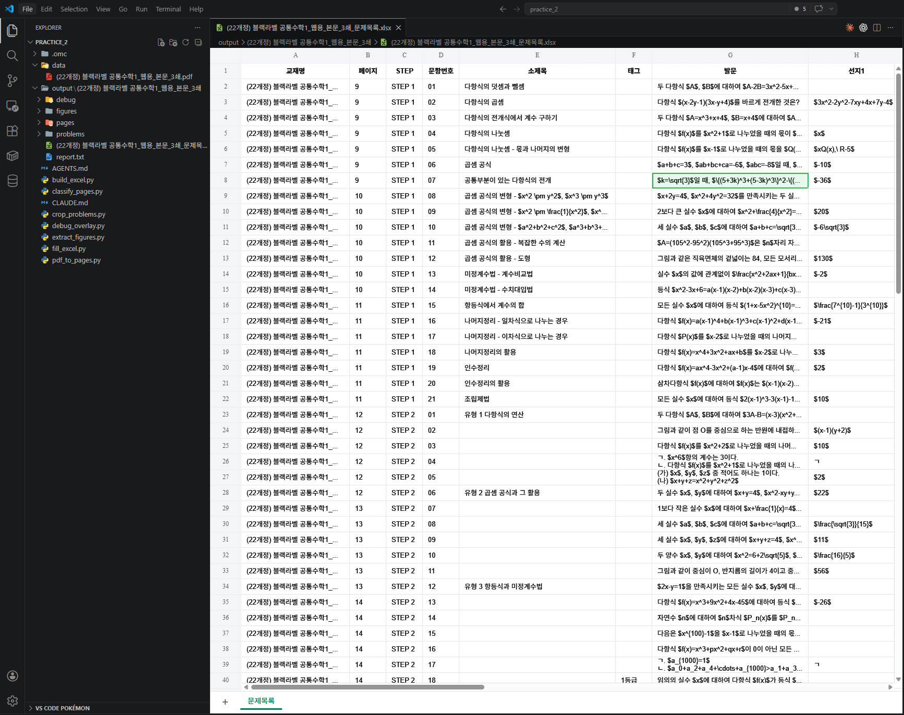

# Stage 3. 사람 확인 및 엑셀 정리

<div class="stage-nav" markdown>
**← 이전:** [Stage 2. 문제를 찾아서 한 장씩 잘라내기](stage2.md) &nbsp; | &nbsp; **다음 →** [Stage 4. Skill화](stage4.md)
</div>

> 여기까지 오면 문제별 이미지가 깔끔하게 잘려 있습니다. 이제 **AI한테 이 이미지를 보여주고 텍스트로 읽어달라고** 한 다음, 메타데이터와 함께 엑셀로 정리하면 끝입니다.

| ⏱️ 예상 소요 | 📄 핵심 산출물 | ⭐ 난이도 |
|:---:|:---:|:---:|
| 20분 | 최종 Excel 파일 | 보통 |

!!! abstract "이 단계의 목적"
    - 잘라낸 문제 이미지를 AI가 직접 보고 텍스트로 변환합니다
    - STEP, 문항번호, 소제목, 태그, 발문, 선지를 엑셀에 정리합니다
    - 수식은 LaTeX 형식으로 변환합니다

---

## 3-1. 엑셀 틀 만들기

!!! quote "AI에게 이렇게 말해보세요"
    ```text
    이제 최종 결과물인 **엑셀 파일을 만들** 거야.

    먼저 엑셀의 틀을 만들어줘. 한 행이 문제 하나에 대응되고, 열은 이렇게 구성해줘:

    | 열 이름 | 설명 |
    |---------|------|
    | 교재명 | 책 이름 |
    | 페이지 | 몇 쪽인지 |
    | STEP | STEP 1, 2, 3 중 하나 |
    | 문항번호 | 01, 02, ... |
    | 소제목 | 문제 옆에 적힌 카테고리명 (없으면 빈 칸) |
    | 태그 | 빈출, 서술형, 1등급 같은 표시 (없으면 빈 칸) |
    | 발문 | 문제 본문 텍스트 |
    | 선지1~선지5 | 객관식이면 5개 선지, 서술형이면 빈 칸 |
    | 그림유무 | O 또는 X |
    | 도형이미지경로 | figures/ 폴더의 파일 경로 (없으면 빈 칸) |
    | 문제이미지경로 | problems/ 폴더의 파일 경로 |

    이미 단계 2~3에서 잡아둔 정보(페이지, STEP, 문항번호, 소제목, 태그, 좌우 컨럼)가 있으니까, 그걸 먼저 엑셀에 채워줘. **발문이랑 선지는 아직 비워둘** — 다음에 채울 거야.

    파일 경로: `output/책이름/책이름_export.xlsx`
    ```

---

## 3-2. 문제 이미지를 텍스트로 변환하기

!!! quote "AI에게 이렇게 말해보세요"
    ```text
    이제 엑셀에서 비어 있는 "발문"과 "선지" 칸을 채울 거야.

    `output/책이름/problems/` 폴더에 있는 문제 이미지들을 **네가 직접 하나씩 봐줘.** 각 이미지를 보고 아래 정보를 읽어서 엑셀에 채워줘:

    1. **발문**: 문제 본문을 텍스트로 옮겨줘. 수식은 LaTeX 형식($...$)으로 써줘.
    2. **선지**: 객관식이면 ①~⑤ 선지를 각각 선지1~선지5 칸에 넣어줘. 서술형이면 빈 칸으로 둘.

    **중요한 규칙:**
    - 수식은 반드시 LaTeX로 써줘. 예: `$x^2 + 3x - 5 = 0$`
    - 한국어 텍스트는 그대로 옮겨줘
    - 이미지에서 읽기 어려운 부분이 있으면 `[불명확]`이라고 표시해줘
    - 한 문제 끝날 때마다 엑셀을 저장해줘 (중간에 멈춰도 날아가지 않게)

    문제가 많으니까 10개씩 끊어서 처리하고, 10개 끝날 때마다 진행 상황을 알려줘.
    전부 끝나면 엑셀 파일을 저장하고, **총 몇 문제를 처리했는지, 불명확 표시가 몇 개인지** 알려줘.
    ```

!!! danger "사람 확인은 필수입니다"
    AI가 패턴은 잘 찾지만, 의미가 미묘하게 다른 값이나 실제 업무상 중요한 차이는 사람이 더 잘 잡습니다. 엑셀을 열고 문제 이미지와 나란히 비교해보세요.

!!! tip "효율적인 사람 확인 프로토콜"

    **1단계: 처음 5문제 전수 확인 (5분)**
    
    - 문제 이미지와 엑셀의 발문을 나란히 비교
    - 수식이 LaTeX로 제대로 변환됐는지 확인
    - STEP과 문항번호가 맞는지 확인
    
    **2단계: 도형 있는 문제 3건 확인 (3분)**
    
    - 그림유무가 "O"인 행만 필터링
    - 도형이미지경로의 파일을 열어서 실제 도형과 비교
    - 도형이 잘렸거나 빠진 건 없는지 확인
    
    **3단계: [불명확] 표시 전수 확인 (2분)**
    
    - AI가 `[불명확]`이라고 표시한 곳을 검색
    - 원본 이미지를 보고 직접 입력하거나 재요청
    
    **4단계: 마지막 5문제 확인 (2분)**
    
    - 뒷부분에서 정확도가 떨어지는 경우가 많습니다
    - 마지막 5문제를 이미지와 대조

!!! tip "이상하면?"
    - "8번 문제 발문이 비어있어"
    - "수식이 LaTeX가 아니라 깨진 글자로 돼 있어"
    - "선지 순서가 뒤바뀐 것 같아 — 원본 이미지랑 비교해볼게"
    - "STEP 정보가 틀린 행이 있어"



---

## 체크포인트

- [ ] `output/책이름/책이름_export.xlsx` 파일이 생겼습니다
- [ ] 엑셀을 열면 문제 하나당 한 행으로 정리돼 있습니다
- [ ] STEP, 문항번호, 페이지 정보가 맞습니다
- [ ] 발문 칸에 문제 텍스트가 채워져 있습니다 (수식은 LaTeX 형태)
- [ ] 도형이 있는 문제는 그림유무가 "O"이고 도형이미지경로에 파일 경로가 있습니다

!!! info ""
    **다음 단계에서는** 지금까지의 과정을 Skill로 만들어 재사용 가능하게 포장합니다.

<div class="stage-nav" markdown>
**← 이전:** [Stage 2. 문제를 찾아서 한 장씩 잘라내기](stage2.md) &nbsp; | &nbsp; **다음 →** [Stage 4. Skill화](stage4.md)
</div>
