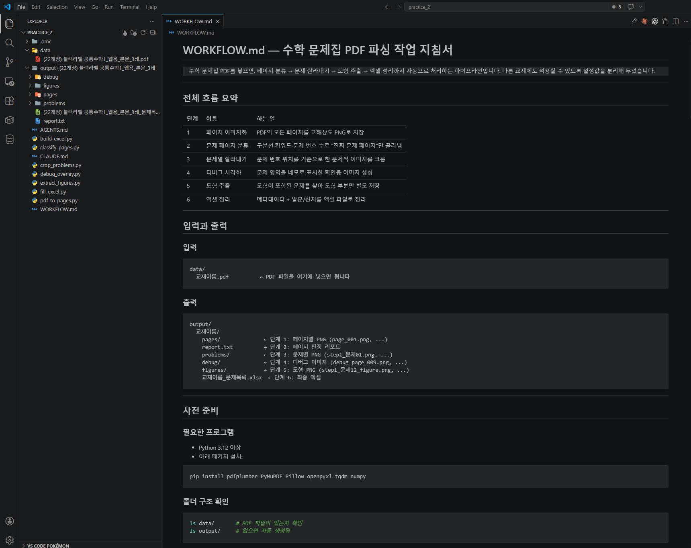
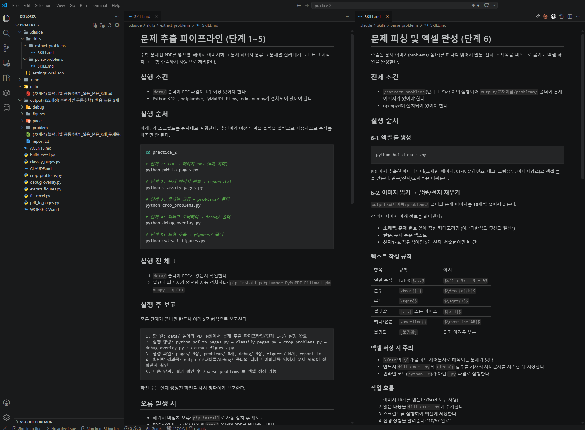

# Stage 4. Skill화

<div class="stage-nav" markdown>
**← 이전:** [Stage 3. 사람 확인 및 엑셀 정리](stage3.md) &nbsp; | &nbsp; **다음 →** [부록. 피드백 방법과 에러 대처](appendix.md)
</div>

> 지금까지의 대화와 절차를 하나의 **재사용 가능한 작업 지침서**로 묶는 단계입니다.


!!! info ""
    실습 1에서 Skill의 개념과 WORKFLOW.md를 체험했습니다. 이제 **실제로 쓸 수 있는 Skill**을 만들고, 다른 교재 PDF에 적용해서 범용성을 확인합니다.

!!! note "스킬(Skill)이란?"
    AI에게 특정 태스크를 수행하는 방법을 가르치는 **구조화된 지식 문서**입니다. 사람으로 치면 "이 일은 이런 순서로 하고, 이런 점을 조심하고, 이런 도구를 써라"라고 적어둔 매뉴얼과 같습니다.

    - 기본적으로 `.md` (마크다운) 문서 형태로 작성되며, 설명과 사용 조건, 작업 절차가 담겨 있습니다.
        - `name`, `description`을 바탕으로 AI가 어떤 스킬을 언제 사용할지 결정합니다.
        - 또는 사용자가 직접 사용을 요구할 수도 있습니다.
    - AI는 상황에 맞는 스킬을 읽고 그 지침에 따라 작업합니다.
    - 사용하고 있는 코딩 에이전트에 따라 스킬을 어디에 두고, 어떻게 연결하는지 조금씩 다를 수 있습니다.

    **Skill 저장 위치:**

    |  | A. 이 프로젝트에서만 사용 | B. 전체 프로젝트에서 사용 |
    |:---:|---|---|
    | **클로드 코드** | `{폴더명}/.claude/skills/` | `~/.claude/skills/` |
    | **코덱스** | `{폴더명}/.agents/skills/` | `~/.codex/` |
    | **안티그래비티** | `{폴더명}/.agent/skills/` | `~/.gemini/antigravity/skills/` |

    !!! warning ""
        "프로젝트"는 결국 작업 중인 폴더를 의미합니다. 만일 이 폴더 뿐 아니라 다른 폴더에서 작업 중인 프로젝트에서도 동일한 스킬을 사용하고 싶다면, B 위치에 Skill 폴더를 넣어두어야 합니다.

    **Skill 없이 vs Skill 있으면:**

    - **Skill 없이:** 매번 "PDF 열어줘, 표 찾아줘, 추출해줘, 검증해줘"를 처음부터 다시 설명
    - **Skill 있으면:** "이 PDF를 모집요강 파싱 Skill로 처리해줘" 한 마디로 시작 가능

---

## 4-1. 작업 과정 문서화

!!! quote "AI에게 이렇게 말해보세요 — 작업 과정 문서화"
    ```text
    지금까지 우리가 한 단계 1~6의 과정을 **재사용 가능한 작업 지침서로 정리해줘.**

    프로젝트 루트에 `WORKFLOW.md` 파일을 만들고, 아래 내용을 포함해줘:

    1. **전체 흐름 요약**: 단계 1~6이 각각 뭘 하는지 한 줄씩
    2. **단계별 상세 지침**: 각 단계에서 실행해야 할 명령, 사용하는 파일, 생성되는 결과물
    3. **입력과 출력**: `data/` 폴더에 PDF를 넣으면 → `output/` 폴더에 뭐가 나오는지
    4. **설정 가능한 것들**: DPI, 키워드 목록, 도형 판별 기준 같이 교재마다 바꿀 수 있는 값
    5. **문제 해결 가이드**: 자주 발생하는 문제와 해결법 (예: "문제 번호가 안 잡힐 때는 폰트 크기 기준을 낮춰봐")

    이 문서는 **다른 사람이 처음 보고도 따라할 수 있을 정도**로 써줘.
    단, 코드 설명은 최소화하고, **"어떤 명령을 치면 뭐가 나온다"** 위주로 써줘.
    ```



---

## 4-2. Skill로 변환하기

!!! quote "AI에게 이렇게 말해보세요 — Skill 생성"

    === "Claude Code"

        ```text
        /skill-creator 방금 만든 WORKFLOW.md를 기반으로 이 도구의 재사용 가능한 Skill(명령어)을 2개 만들어줘.

        Skill 1: /문제추출 (또는 /extract-problems)

        data/ 폴더의 PDF를 자동으로 찾아서 단계 1~5를 한 번에 실행
        페이지 렌더링 → 문제 페이지 판별 → 문제 잘라내기 → 디버그 이미지 → 도형 추출
        끝나면 5줄 보고 형식으로 결과 알려주기

        Skill 2: /문제파싱 (또는 /parse-problems)

        잘라낸 문제 이미지들을 텍스트로 변환해서 엑셀을 완성 (단계 6)
        추출과 파싱을 나눈 이유: 추출은 한 번만 하면 되는데, 파싱은 결과 보고 다시 돌릴 수 있으니까

        Skill 파일은 이 도구의 표준 위치와 형식에 맞춰서 저장해줘. 잘 모르겠으면 이 도구의 Skill 만드는 내장 기능을 사용해줘.
        ```

    === "Codex"

        ```text
        @Skill Creator 방금 만든 WORKFLOW.md를 기반으로 이 도구의 재사용 가능한 Skill(명령어)을 2개 만들어줘.

        Skill 1: /문제추출 (또는 /extract-problems)

        data/ 폴더의 PDF를 자동으로 찾아서 단계 1~5를 한 번에 실행
        페이지 렌더링 → 문제 페이지 판별 → 문제 잘라내기 → 디버그 이미지 → 도형 추출
        끝나면 5줄 보고 형식으로 결과 알려주기

        Skill 2: /문제파싱 (또는 /parse-problems)

        잘라낸 문제 이미지들을 텍스트로 변환해서 엑셀을 완성 (단계 6)
        추출과 파싱을 나눈 이유: 추출은 한 번만 하면 되는데, 파싱은 결과 보고 다시 돌릴 수 있으니까

        Skill 파일은 이 도구의 표준 위치와 형식에 맞춰서 저장해줘. 잘 모르겠으면 이 도구의 Skill 만드는 내장 기능을 사용해줘.
        ```

    === "Antigravity"

        ```text
        @skill-creator 방금 만든 WORKFLOW.md를 기반으로 이 도구의 재사용 가능한 Skill(명령어)을 2개 만들어줘.

        Skill 1: /문제추출 (또는 /extract-problems)

        data/ 폴더의 PDF를 자동으로 찾아서 단계 1~5를 한 번에 실행
        페이지 렌더링 → 문제 페이지 판별 → 문제 잘라내기 → 디버그 이미지 → 도형 추출
        끝나면 5줄 보고 형식으로 결과 알려주기

        Skill 2: /문제파싱 (또는 /parse-problems)

        잘라낸 문제 이미지들을 텍스트로 변환해서 엑셀을 완성 (단계 6)
        추출과 파싱을 나눈 이유: 추출은 한 번만 하면 되는데, 파싱은 결과 보고 다시 돌릴 수 있으니까

        Skill 파일은 이 도구의 표준 위치와 형식에 맞춰서 저장해줘. 잘 모르겠으면 이 도구의 Skill 만드는 내장 기능을 사용해줘.
        ```



---

## 4-3. 다시 써볼 수 있어야 진짜 완성

!!! tip "판단 팁"
    - 지금 PDF 하나에서만 잘 되면 아직 Skill이 아닙니다.
    - 다른 교재 PDF에서 어디가 깨지는지 봐야 진짜 범용성이 드러납니다.
    - 실제 업무에서는 안 되는 부분이 나오면 Skill 수정 → 다시 테스트를 반복하세요.

??? question "왜 Skill화가 중요한가요?"
    자동화는 한 번 잘 되는 것보다, 다음에도 더 빨리 다시 할 수 있게 만드는 것이 중요합니다. Skill은 사람의 경험과 AI 협업 방식을 함께 저장하는 가장 실용적인 포장 방식입니다.

---

## 체크포인트

- [ ] 프로젝트 루트에 `WORKFLOW.md`가 있고, 다른 사람이 읽어도 이해할 수 있습니다
- [ ] Skill 파일이 도구에 맞는 위치에 저장돼 있습니다

!!! success "실습 완료!"
    이 단계까지 끝났으면 실습 완료입니다! 하단의 부록을 참고해서 실습 중 막히는 순간에 활용하세요.

<div class="stage-nav" markdown>
**← 이전:** [Stage 3. 사람 확인 및 엑셀 정리](stage3.md) &nbsp; | &nbsp; **다음 →** [부록. 피드백 방법과 에러 대처](appendix.md)
</div>
