# 부록. 자동 허가 모드 설정

<div class="stage-nav" markdown>
**← 메인으로** [실습 3 개요](index.md)
</div>

> 코딩 에이전트는 기본적으로 안전을 위해 액션 실행 전 사용자에게 먼저 확인을 요청합니다. *"이 파일을 수정해도 될까요?", "이 명령어를 실행해도 괜찮을까요?"*  
> 이번 실습에서는 **매번 승인하는 번거로움을 줄이기 위해**, 에이전트가 스스로 판단하고 자율적으로 행동할 수 있도록 설정을 변경합니다.

!!! warning "시작 전에 이것만 기억하세요"
    이 설정은 실습 환경(바탕화면의 `practice_3` 폴더)에서만 편의를 위해 사용합니다. **실제 업무 환경**이나 **민감한 파일이 있는 폴더**에서는 기본 승인 모드로 돌아가 사용하시는 것을 권장합니다.

사용하시는 도구에 따라 아래 섹션 중 **하나만** 따라가시면 됩니다.

---

## 👾 Claude Code

Claude Code는 자유도에 따라 **두 단계**로 설정할 수 있습니다. 실습 3처럼 백엔드/프론트엔드까지 자동으로 켜고 반복 테스트해야 하는 상황에서는 **자유도 上(Bypass Permissions)** 쪽이 훨씬 덜 번거롭습니다.

| 단계 | 동작 | 추천 상황 |
|------|------|-----------|
| 자유도 中 — **Edit Automatically** | 파일 편집만 자동 승인 | 코드만 고쳐보는 실습 |
| 자유도 上 — **Bypass Permissions** | 편집 + 명령어 실행까지 자동 승인 | 서버 실행·설치·테스트까지 자동화 ⭐ 실습 3 권장 |

### 자유도 中. Edit Automatically

Claude Code 패널 **하단 모드 드롭다운**에서 `Edit automatically` 를 선택합니다.

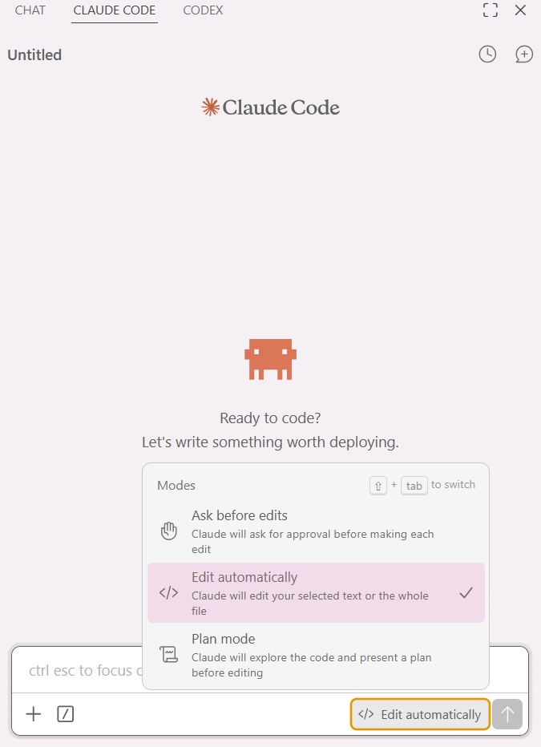

!!! tip "모드별 차이"
    - **Ask before edits** — 수정할 때마다 묻습니다 (기본값)
    - **Edit automatically** — 파일 편집은 자동, 터미널 명령은 여전히 확인 ⭐ 자유도 中
    - **Plan mode** — 수정 전에 계획을 먼저 보여줍니다

선택하면 입력창 오른쪽 하단에 `</> Edit automatically` 라벨이 표시됩니다.

### 자유도 上. Bypass Permissions

파일 편집뿐 아니라 **터미널 명령 실행까지 확인 없이** 진행합니다. 먼저 VSCode 설정에서 이 모드를 **허용**한 뒤, Claude Code 하단에서 모드를 켜야 합니다.

**1단계. VSCode 설정 열기** — 좌측 하단 톱니바퀴(⚙️) → `Settings` (단축키 `Ctrl + ,`)

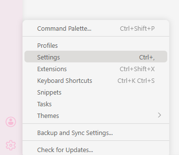

**2단계. Extensions → Claude Code** — 왼쪽 트리에서 `Extensions` 를 펼쳐 `Claude Code` 를 클릭합니다.

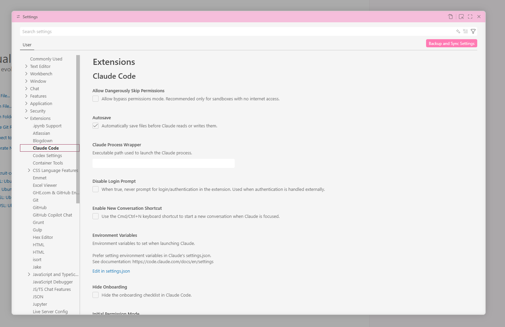

**3단계. Allow Dangerously Skip Permissions 체크** — 최상단 `Allow Dangerously Skip Permissions` 체크박스를 켭니다.

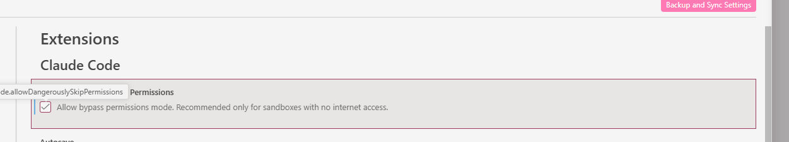

!!! warning "이 옵션이 무엇을 허용하나요"
    이 옵션을 활성화하면 **Claude Code가 사용자의 별도 승인 없이 코드 수정과 명령어 실행을 직접 수행**할 수 있게 됩니다. 보안이 중요한 프로젝트나 민감한 정보를 다루는 작업에서는 사용에 주의가 필요하며, **실습이 끝난 후에는 안전을 위해 설정을 비활성화**하는 것을 권장합니다.

**4단계. Claude Code 하단에서 Bypass permissions 선택** — 모드 드롭다운 맨 아래 `Bypass permissions` 항목을 선택합니다.

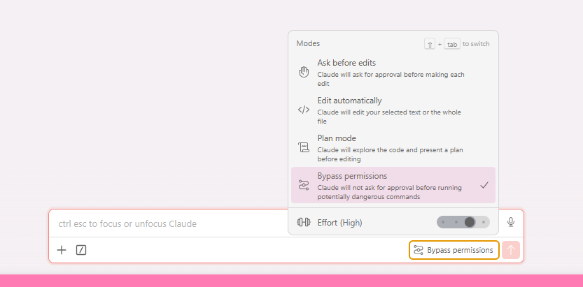

!!! success "완료"
    입력창 오른쪽 하단에 `Bypass permissions` 라벨이 뜨면 적용된 것입니다. 이제 백엔드 실행·파일 편집·패키지 설치 같은 명령이 모두 자동으로 진행됩니다.

---

## 🛰️ Antigravity

### 1단계. 설정 메뉴 열기

Antigravity 상단의 설정(⚙️) 버튼 → **Open Antigravity User Settings** 를 클릭합니다. (단축키 `Ctrl + ,`)

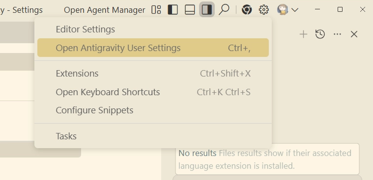

### 2단계. Agent 탭에서 3가지 항목 변경

왼쪽의 **Agent** 탭으로 이동한 뒤, 아래 세 가지를 그대로 맞춰줍니다.

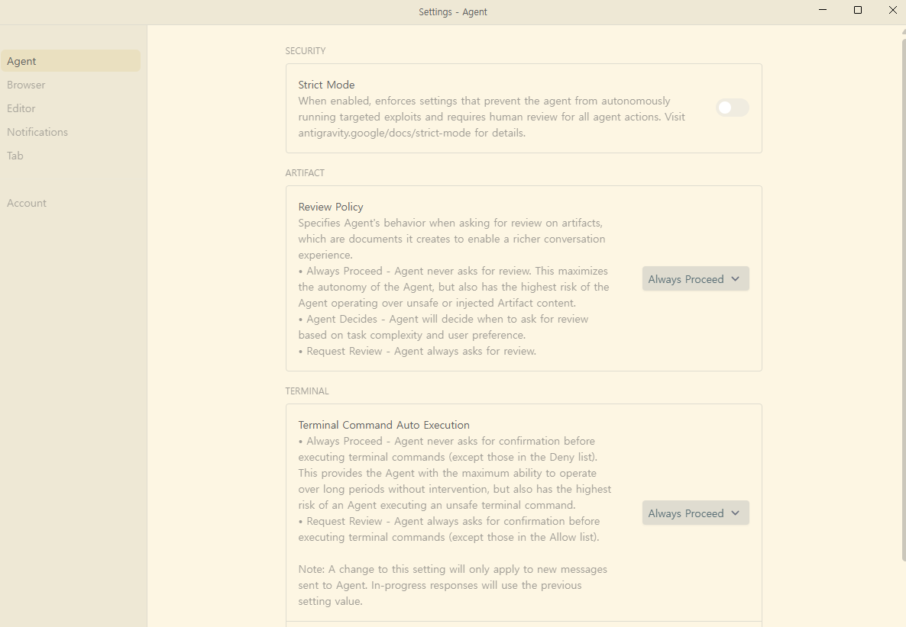

| 항목 | 변경할 값 |
|------|-----------|
| **Strict Mode** | `Off` |
| **Review Policy** | `Always Proceed` |
| **Terminal Command Auto Execution** | `Always Proceed` |

!!! success "완료"
    세 항목이 모두 맞게 설정됐으면 창을 닫아도 자동으로 저장됩니다.

---

## 🤖 Codex

Codex는 **두 가지 방법** 중 편한 쪽을 고르시면 됩니다. 방법 1이 훨씬 간단합니다.

### 방법 1. 하단 설정 버튼에서 바로 (권장)

Codex 하단의 설정 버튼을 누르고 **Full access** 를 선택합니다.

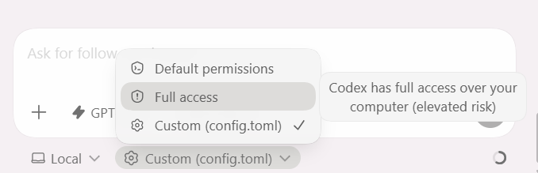

!!! tip ""
    "Codex has full access over your computer (elevated risk)" 라는 경고가 뜨는데, 이번 실습 폴더 안에서만 쓰는 거니 괜찮습니다. 실습이 끝난 뒤 `Default permissions` 로 돌려두시면 됩니다.

### 방법 2. `config.toml` 직접 편집

세밀한 제어를 원하면 설정 파일을 직접 바꿀 수 있습니다.

**① 상단 설정 → Codex Settings**

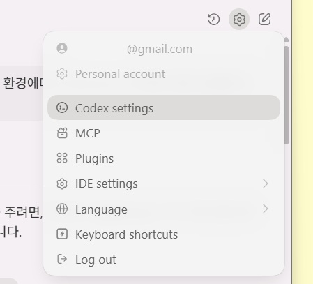

**② Configuration → Open config.toml**

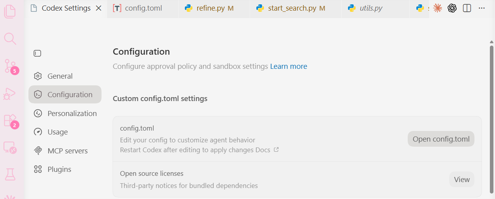

**③ 파일 상단에 아래 두 줄 추가**

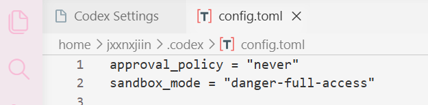

```toml
approval_policy = "never"
sandbox_mode = "danger-full-access"
```

!!! warning "저장 후 Codex 재시작 필수"
    파일을 저장한 다음 **Codex를 한 번 껐다가 다시 켜야** 설정이 반영됩니다.

---

## 되돌리는 방법

실습이 끝나고 평소대로 쓰고 싶을 때:

| 도구 | 되돌리는 방법 |
|------|--------------|
| Claude Code | 모드 드롭다운에서 `Ask before edits` 로 변경 + (자유도 上을 썼다면) Settings → Extensions → Claude Code → `Allow Dangerously Skip Permissions` 체크 해제 |
| Antigravity | Agent 탭의 세 항목을 기본값(`On`, `Ask`, `Ask`)으로 복귀 |
| Codex | 하단 설정에서 `Default permissions` 선택, 또는 `config.toml`의 두 줄 삭제 |

<div class="stage-nav" markdown>
**← 메인으로** [실습 3 개요](index.md)
</div>
