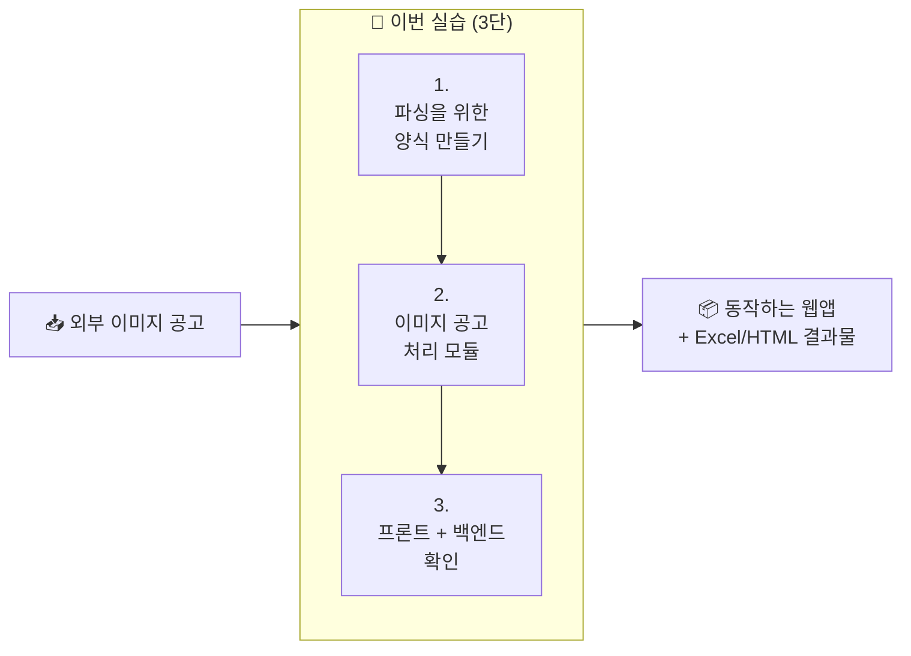

# 🌐 실습 교육 3 | 이미지 공고 → 캐치 폼 자동 변환 웹앱 만들기

> 비개발자가 코딩 에이전트와 대화하며, 이미지 형태의 외부 채용공고를 캐치 공고 등록 폼 양식의 Excel + HTML로 변환하는 작은 웹앱을 직접 만들어보는 실습 가이드입니다.

!!! success "실습 목표"
    - **빈 양식 → 자동 채우기 → 화면 검수**의 3단 자동화 패턴 학습
    - Gemini Vision으로 긴 이미지 공고를 청크 분할 + 멀티 포지션 분리해 처리
    - AI 코딩 에이전트에게 모듈·백엔드·프론트엔드까지 한 흐름으로 맡기는 경험

!!! abstract "핵심 관점"
    - 실습 1·2가 입력 → Excel 한 방향이었다면, 실습 3은 **웹앱**으로 한 단계 확장합니다
    - 코드 골격을 일부러 안 줍니다. AGENTS.md만 가이드로 깔아두고, 나머지는 학습자가 자유롭게 만듭니다
    - **실제 바이브코딩 환경**에 가까운 자유도 — Skill 포장 대신 진짜 동작하는 웹앱이 결과물

---

## 업무 배경

!!! note "배경"
    캐치 채용서비스팀은 외부에서 받은 채용공고 이미지를 캐치 사이트에 등록하기 위해 매일 폼의 50여 개 항목을 수기로 채워 넣고 있습니다. 공고 1건당 평균 10~30분, 채용서비스팀 전체로는 일 6시간 이상이 이 작업에 들어갑니다.

이 작업의 특징:

- 외부 공고는 대부분 **세로로 긴 이미지** 형태 (한화 공고는 4000px)
- 캐치 폼은 정해진 **선택지 카탈로그**(학력·고용형태·전형유형·복리후생 등)가 있습니다
- 한 공고에 **여러 모집부문**이 섞여 있는 경우가 많습니다 (한화 공채는 직군 3개 × 직무 11개)
- 폼만 채우면 시스템이 **자동으로 HTML을 렌더링**해서 사이트에 게시합니다

**이 실습에서는** 이 작업을 작은 웹앱으로 자동화합니다. 매니저가 외부 공고 이미지를 화면에 올리면, 우측에 추출 결과가 Excel 표 + HTML 미리보기로 뜨고 다운로드할 수 있는 형태입니다.

---

## 입력 자료 — 이미지 채용공고 4건

메인 샘플은 한화 공채(긴 이미지 + 멀티 포지션)이고, 2번 페이지에서 짧은 이미지·중간 길이·매우 긴 이미지 3건도 같은 모듈로 돌려봅니다. 모듈이 특정 형태에 맞춰지지 않고 범용적으로 동작함을 확인하는 흐름입니다.

| 파일 | 크기 | 특징 |
|---|---|---|
| `data/hanwha_2026.jpg` | 1000 × 4038 | **메인 샘플**. 긴 이미지, 사업부문 3개 |
| `data/hanmi_2026.jpg` | 900 × 8667 | 매우 긴 이미지, 여러 조각으로 분할 |
| `data/dongaoshuca_2026.png` | 973 × 3531 | 중간 길이 |
| `data/codeit_2026.png` | 785 × 1425 | 짧은 이미지, 단일 포지션 |

---

## 목표 결과물 — 좌(원본) ↔ 우(결과 탭) 비교 화면

| 좌측 (사이드바) | 메인 좌 | 메인 우 |
|---|---|---|
| `+ 이미지 공고 추가` | 업로드한 원본 이미지 | `[Excel 형식]` `[HTML 형식]` `[원본 JSON]` 탭 |
| 업로드 항목 리스트 | (스크롤·확대 가능) | 사업부문·직무별 카드, 편집 가능 표, Excel 다운로드 |

매니저 워크플로 시뮬레이션:

> **외부 공고 이미지 받음 → 사이드바에 추가 → 우측 결과 검수 → Excel 다운로드 → 캐치 폼에 옮김**

---

## 기술 스택

| 계층 | 도구 |
|---|---|
| LLM | Gemini 3 Flash Preview (`google-genai` SDK, 모델 ID `gemini-3-flash-preview`) |
| 이미지 처리 | Pillow + numpy (OpenCV 사용 금지) |
| 백엔드 | FastAPI + Python 3.11+ + `uv` |
| 프론트 | Next.js 15 App Router + TypeScript + Tailwind |
| 출력 | `openpyxl` (Excel), `Jinja2` (HTML 미리보기) |

위 결정 사항은 스타터 zip의 `AGENTS.md`에 박제되어 있어 코딩 에이전트가 일관되게 따릅니다. 학습자는 폴더 구조·함수 분리·UI 디테일 등 나머지를 자유롭게 결정합니다.

---

## 실습 전 준비

!!! info "준비물"
    - AI 코딩 에이전트 (Claude Code, Codex, Antigravity 중 택1) 설치
    - Node.js 20+, Python 3.11+, `uv` 또는 `pip`, `pnpm` 또는 `npm`
    - 공용 Gemini API Key (강사가 팀즈에 비공개로 전달)
    - `practice_3.zip` 압축 해제

```
practice_3/
├── AGENTS.md          ← 기술 스택·SDK 가이드·결과 폴더 위치 박제
├── .env.example       ← GEMINI_API_KEY 위치
└── data/              ← 레퍼런스 자료
    ├── hanwha_2026.jpg            ← 메인 샘플 공고 (긴 이미지, 멀티 포지션)
    ├── codeit_2026.png            ← 짧은 이미지 샘플 (2번에서 추가 시도)
    ├── dongaoshuca_2026.png       ← 중간 길이 샘플 (2번에서 추가 시도)
    ├── hanmi_2026.jpg             ← 매우 긴 이미지 샘플 (2번에서 추가 시도)
    └── sample_catch_html.html     ← 캐치 사이트 자동 생성 HTML 예시 (few-shot)
```

코드 골격(`backend/`, `frontend/`)은 **일부러 들어있지 않습니다.** 실제 바이브코딩 환경에 가깝게 학습자가 직접 만듭니다. AGENTS.md가 가드레일 역할을 합니다.

!!! tip "사용량 절약을 위한 모델 선택"
    [홈 가이드](../index.md)에 정리된 IDE별 모델 선택 권장사항을 그대로 따르세요. 이번 실습은 백엔드·프론트 코드를 둘 다 만들기 때문에 사용량 소진이 빠를 수 있습니다.

---

## 지금 뭘 하는 건가요? (한눈에 보기)



## 페이지별 로드맵

| 페이지 | 무엇을 하나 | 소요 | 프롬프트 수 |
|:-----:|------------|:---:|:---:|
| 1 | 캐치 폼 카탈로그 + 결과를 담을 빈 Excel·HTML 양식 만들기 (가짜 데이터로 한 번 채워 확인) | 20분 | 2개 |
| 2 | 긴 이미지 자르기 + Gemini Vision + 멀티 포지션 분리 + 다른 공고로 재검증 | 40분 | 3개 |
| 3 | FastAPI 백엔드 + Next.js 프론트로 좌·우 비교 화면 만들기 | 30분 | 2개 |

총 예상 시간: **90분**

!!! tip "왜 Skill 포장이 아닌가요?"
    실습 1·2는 마지막에 Skill로 포장해서 재사용 가능한 매뉴얼을 남겼습니다. 실습 3은 한 단계 더 나아가, **실제로 동작하는 웹앱**을 결과물로 남깁니다. 매니저가 매일 들여다볼 수 있는 화면이 곧 자동화의 가장 실전적인 형태이기 때문입니다.

---

**다음 →** [1. 파싱을 위한 양식 만들기](stage1.md)
