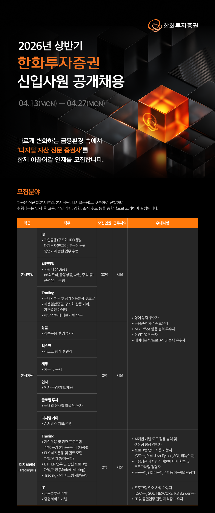
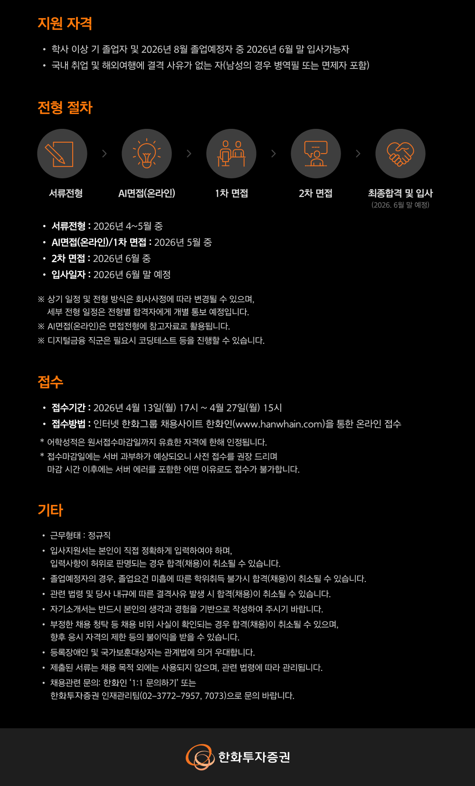
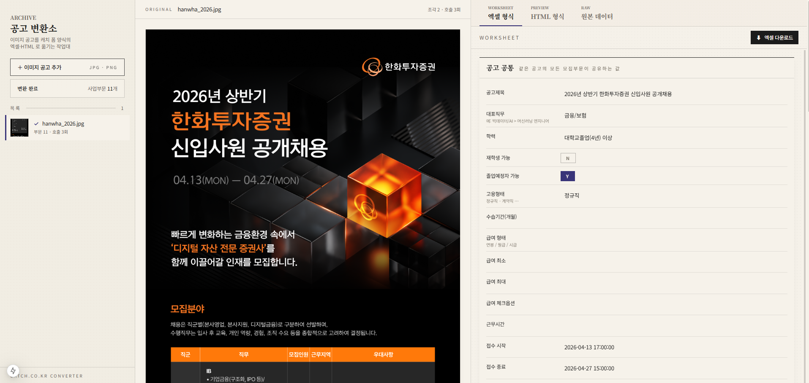
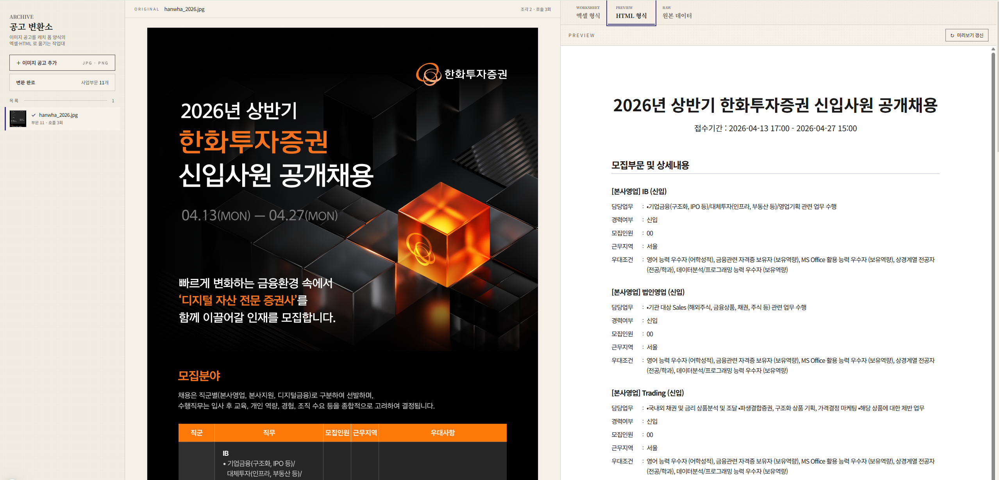
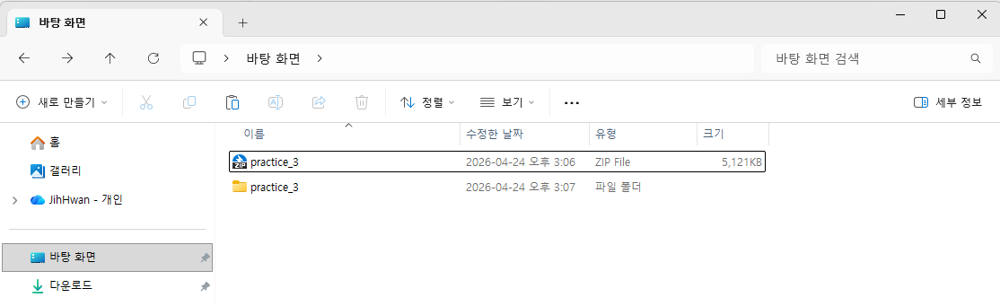
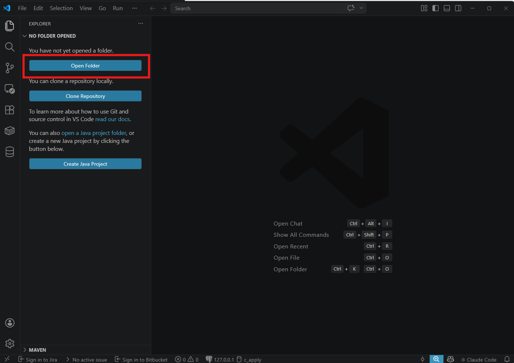
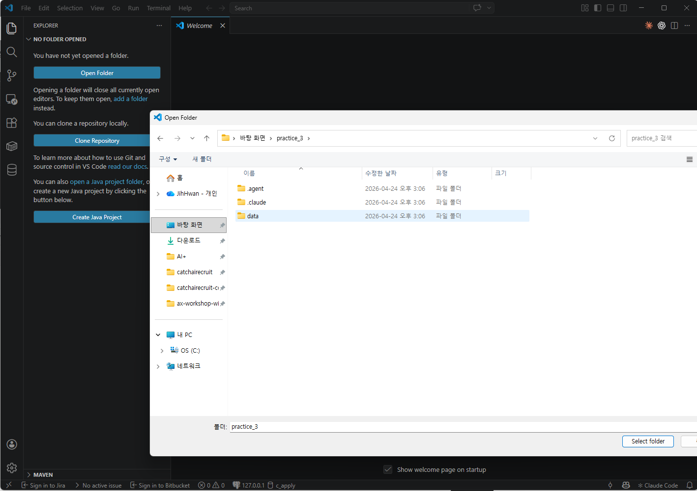
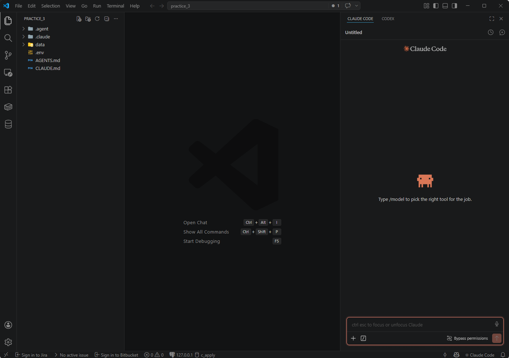
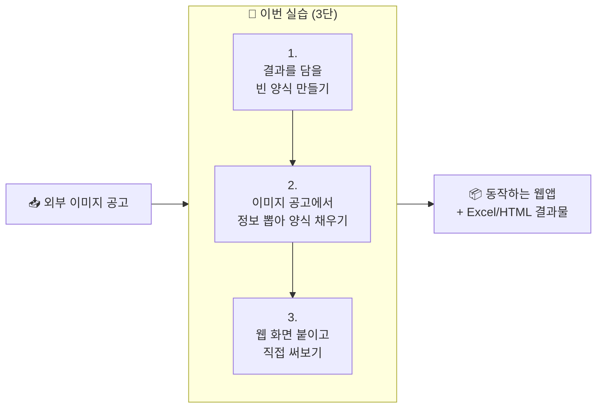

# 🌐 실습 교육 3 | 이미지 공고 → 캐치 폼 자동 변환 웹앱 만들기

> 비개발자가 코딩 에이전트와 대화하며, 이미지 형태의 외부 채용공고를 캐치 공고 등록 폼 양식의 Excel + HTML로 변환하는 작은 웹앱을 직접 만들어보는 실습 가이드입니다.

---

## 이번 실습은 무엇을 만드나요?

이미지에 담긴 내용을 읽어서 정해진 양식에 맞게 정리해야 하는 일은 사무실 곳곳에 흔히 있습니다. 이번 실습에서는 이런 종류의 작업을 **사람이 매번 손으로 옮겨 적는 대신, 작은 웹앱으로 풀어내는 흐름**을 한 번 통째로 만들어봅니다.

소재는 **외부에서 받은 이미지 형태의 채용공고를 자사 채용 사이트의 등록 폼 양식에 맞춰 변환하는 작업**입니다. 이미지를 화면에 올리면 우측에 추출 결과가 Excel 표 + HTML 미리보기로 뜨고, 사람이 바로 검수·편집·다운로드할 수 있는 형태입니다.

### 다루는 자료의 특성

단순해 보이지만 자료를 직접 들여다보면 결이 다른 어려움이 한꺼번에 등장합니다. 다음 네 가지를 모두 풀어내야 비로소 쓸 만한 결과물이 됩니다.

- 입력이 **세로로 긴 이미지** (메인 샘플은 4000px) — 한 번에 모델에 못 넣으니 적당히 잘라 보내고 다시 이어 붙여야 합니다
- 한 이미지에 **여러 사업부문·포지션이 섞여 있음** (예: 공채. 메인 샘플은 직군 3 × 직무 11 = 11개 모집부문) — 그 갯수가 공고마다 달라, 미리 정해두지 않고 들어오는 자료에 맞춰 동적으로 분리·반복 처리해야 합니다
- 출력 폼에 정해진 **선택지 카탈로그**(학력·고용형태·전형유형·복리후생 등) — 자유 텍스트가 아니라 정해진 분류 안으로 떨어뜨려야 합니다
- 결과는 사람이 **바로 눈으로 확인하고 손볼 수 있어야** 의미가 있습니다 — 그래서 단순 스크립트가 아니라 작은 웹 화면까지 함께 만듭니다

---

## 입력 자료 — 이미지 채용공고 4건

메인 샘플은 한화 공채(긴 이미지 + 멀티 포지션)이고, 2번 페이지에서 짧은 이미지·중간 길이·매우 긴 이미지 3건도 같은 모듈로 돌려봅니다. 모듈이 특정 형태에 맞춰지지 않고 범용적으로 동작함을 확인하는 흐름입니다.

| 파일 | 크기 | 특징 |
|---|---|---|
| `data/hanwha_2026.jpg` | 1000 × 4038 | **메인 샘플**. 긴 이미지, 직군 3 × 직무 11 = 모집부문 11 |
| `data/hanmi_2026.jpg` | 900 × 8667 | 매우 긴 이미지, 여러 조각으로 분할 |
| `data/dongaoshuca_2026.png` | 973 × 3531 | 중간 길이 |
| `data/codeit_2026.png` | 785 × 1425 | 짧은 이미지, 단일 포지션 |

메인 샘플 한화 공고는 세로로 너무 길어서 한 장에 담기 어려워, **상·하 반으로 잘라 좌우로 나란히** 보여줍니다.

<div style="display:grid; grid-template-columns:1fr 1fr; gap:12px; align-items:start;" markdown>
<figure style="margin:0;" markdown>
{ style="width:100%; display:block;" }
<figcaption style="text-align:center; font-size:0.85em; color:#888; margin-top:4px;">한화 공고 — 상반부</figcaption>
</figure>
<figure style="margin:0;" markdown>
{ style="width:100%; display:block;" }
<figcaption style="text-align:center; font-size:0.85em; color:#888; margin-top:4px;">한화 공고 — 하반부</figcaption>
</figure>
</div>

---

## 목표 결과물 — 좌(원본) ↔ 우(결과 탭) 비교 화면

| 좌측 (사이드바) | 메인 좌 | 메인 우 |
|---|---|---|
| `+ 이미지 공고 추가` | 업로드한 원본 이미지 | `[Excel 형식]` `[HTML 형식]` `[원본 JSON]` 탭 |
| 업로드 항목 리스트 | (스크롤·확대 가능) | 사업부문·직무별 카드, 편집 가능 표, Excel 다운로드 |

워크플로 시뮬레이션:

> **외부 공고 이미지 받음 → 사이드바에 추가 → 우측 결과 검수 → Excel 다운로드 → 캐치 폼에 옮김**

**중간 결과물 예시** — 이미지 자르기·파싱까지 완료된 상태

<div style="display:grid; grid-template-columns:1fr 1fr; gap:12px; align-items:start;" markdown>
<figure style="margin:0;" markdown>
{ style="width:100%; display:block;" }
<figcaption style="text-align:center; font-size:0.85em; color:#888; margin-top:4px;">이미지 자른 결과 (2번 페이지 자르기 단계)</figcaption>
</figure>
<figure style="margin:0;" markdown>
{ style="width:100%; display:block;" }
<figcaption style="text-align:center; font-size:0.85em; color:#888; margin-top:4px;">엑셀로 바꾼 결과 (2번 페이지 파싱·병합 단계)</figcaption>
</figure>
</div>

**최종 웹앱 동작 모습** — 3번 페이지까지 완료된 상태

<figure style="margin:0 0 16px 0;" markdown>
{ style="width:100%; display:block;" }
<figcaption style="text-align:center; font-size:0.85em; color:#888; margin-top:4px;">변환 결과 화면</figcaption>
</figure>

<figure style="margin:0;" markdown>
{ style="width:100%; display:block;" }
<figcaption style="text-align:center; font-size:0.85em; color:#888; margin-top:4px;">HTML 탭 미리보기</figcaption>
</figure>

---

## 기술 스택

| 계층 | 도구 |
|---|---|
| LLM | Gemini 3.1 Flash Lite Preview (`google-genai` SDK, 모델 ID `gemini-3.1-flash-lite-preview`) |
| 이미지 처리 | Pillow + numpy |
| 백엔드 | FastAPI + Python 3.11+ + `uv` |
| 프론트 | Next.js 15 App Router + TypeScript + Tailwind |
| 출력 | `openpyxl` (Excel), `Jinja2` (HTML 미리보기) |

---

## 실습 전 준비

!!! info "준비물"
    - AI 코딩 에이전트 (Claude Code, Codex, Antigravity 중 택1) 설치
    - Node.js 20+, Python 3.11+, `uv` 또는 `pip`, `pnpm` 또는 `npm`
    - 공용 Gemini API Key
    - `practice_3.zip` 압축 해제

```
practice_3/
├── AGENTS.md          ← 기술 스택·SDK 가이드·결과 폴더 위치 박제
├── .env.example       ← GEMINI_API_KEY 위치
└── data/              ← 레퍼런스 자료
    ├── hanwha_2026.jpg            ← 메인 샘플 공고 (긴 이미지, 멀티 포지션)
    ├── codeit_2026.png            ← 짧은 이미지 샘플 (2번에서 추가 시도)
    ├── dongaoshuca_2026.png       ← 중간 길이 샘플 (2번에서 추가 시도)
    ├── hanmi_2026.jpg             ← 매우 긴 이미지 샘플 (2번에서 추가 시도)
    └── sample_catch_html.html     ← 캐치 사이트 자동 생성 HTML 예시 (few-shot)
```

### 🗂️ 실습 파일 준비하기

AI 코딩 에이전트가 이 폴더 안의 자료(공고 이미지·샘플 HTML)를 볼 수 있도록 **`practice_3` 폴더를 VSCode로 열어둬야** 합니다.

#### 1️⃣ `practice_3.zip` 을 바탕화면에서 압축 해제

전달받은 `practice_3.zip` 을 **바탕화면에 두고 더블클릭**해서 풀어줍니다. zip 파일 옆에 `practice_3` 폴더가 새로 생기면 성공입니다.



#### 2️⃣ VSCode를 열고 **Open Folder** 클릭

VSCode 시작 화면에서 **Open Folder** 버튼을 누릅니다 (단축키 `Ctrl + K` → `Ctrl + O`).



#### 3️⃣ 방금 압축 해제한 `practice_3` 폴더 선택

폴더 선택창에서 **바탕화면 → practice_3** 을 고르고 오른쪽 아래 **Select folder** 를 누릅니다.



!!! warning "주의 — `practice_3` 폴더 자체를 선택"
    실수로 `data` 폴더나 바탕화면을 선택하지 않도록 주의하세요. 반드시 `AGENTS.md`, `.env.example`, `data` 등이 **안에 보이는** `practice_3` 폴더를 선택해야 합니다.

#### 4️⃣ 프로젝트가 열리면 AI 코딩 에이전트 패널 확인

왼쪽 탐색기에 `data` 폴더와 `AGENTS.md` 가 보이고 오른쪽에 코딩 에이전트 패널이 있으면 준비 완료입니다.



!!! info "🚦 자동 허가 모드 설정"
    에이전트가 매번 "이 파일 수정해도 될까요?" 물으면 실습 흐름이 끊깁니다. 시작 전에 **자동 허가 모드** 로 바꿔두세요.

    👉 [**자동 허가 모드 설정 가이드 열기**](autoapprove.md) (Claude Code / Antigravity / Codex)

!!! tip "사용량 절약을 위한 모델 선택"
    [홈 가이드](../index.md)에 정리된 IDE별 모델 선택 권장사항을 그대로 따르세요. 이번 실습은 백엔드·프론트 코드를 둘 다 만들기 때문에 사용량 소진이 빠를 수 있습니다.

---

## 지금 뭘 하는 건가요? (한눈에 보기)



## 페이지별 로드맵

| 페이지 | 무엇을 하나 | 소요 | 프롬프트 수 |
|:-----:|------------|:---:|:---:|
| 1 | 캐치 폼 카탈로그 + 결과를 담을 빈 Excel·HTML 양식 만들기 (가짜 데이터로 한 번 채워 확인) | 20분 | 2개 |
| 2 | 긴 이미지를 알맞게 잘라 AI에 보내고, 여러 직무가 섞인 공고를 자동 분리해 양식에 채우기 | 40분 | 2개 |
| 3 | 지금까지 만든 걸 웹 화면으로 감싸고 브라우저에서 직접 써보기 | 30분 | 2개 |

총 예상 시간: **90분**

!!! tip "왜 Skill 포장이 아닌가요?"
    실습 1·2는 마지막에 Skill로 포장해서 재사용 가능한 매뉴얼을 남겼습니다. 실습 3은 한 단계 더 나아가, **실제로 동작하는 웹앱**을 결과물로 남깁니다. 매일 들여다볼 수 있는 화면이 곧 자동화의 가장 실전적인 형태이기 때문입니다.

---

**다음 →** [1. 결과를 담을 빈 양식 만들기](stage1.md)
