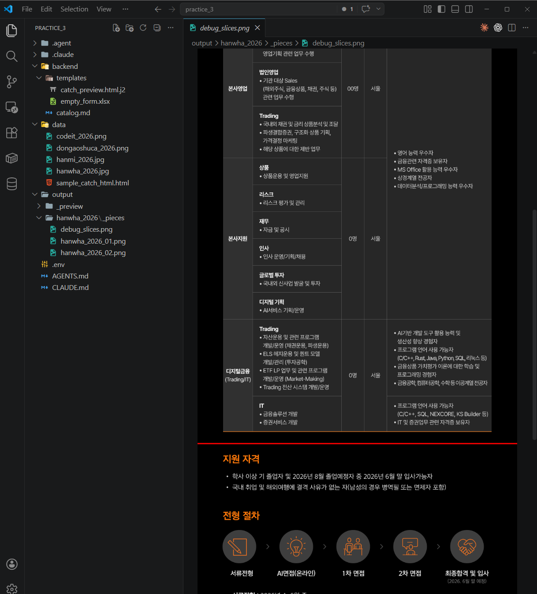
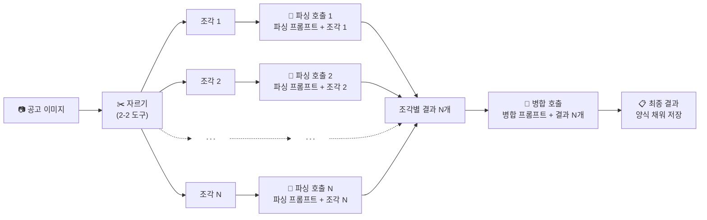
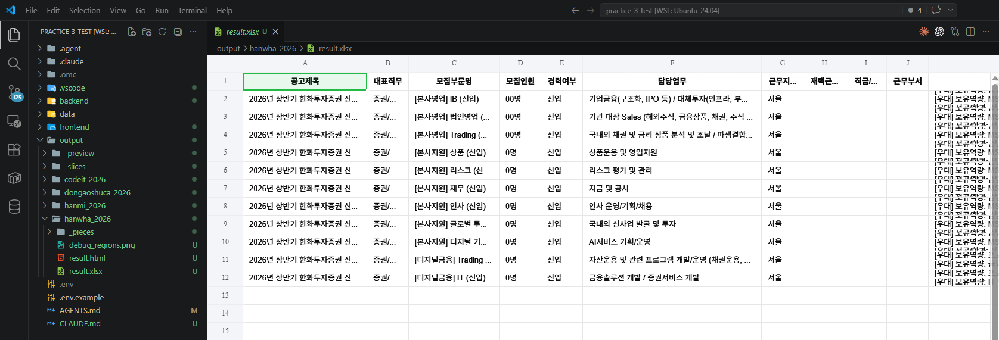

# 2. 이미지 공고에서 정보 뽑아 양식 채우기

<div class="stage-nav" markdown>
**← 이전:** [1. 결과를 담을 빈 양식 만들기](stage1.md) &nbsp; | &nbsp; **다음 →** [3. 웹 화면 붙이고 직접 써보기](stage3.md)
</div>

> 특정 공고 전용이 아니라 **어떤 형태의 채용공고든 받아 처리하는 일반화된 도구**를 만듭니다. 실제 텍스트 인식은 **`gemini-3.1-flash-lite-preview` 모델에 이미지를 첨부해서 보내는 방식**으로 하고, 이 단계에서 설계하는 건 그 앞뒤의 **전처리(자르기) → 텍스트 인식 → 후처리(분리·저장)** 세 레이어입니다.

!!! info "이번 단계에서 쓰는 AI 호출 방식"
    `gemini-3.1-flash-lite-preview` 는 **텍스트 프롬프트에 이미지 파일을 같이 첨부해서 보낼 수 있는** 모델입니다. 별도의 'Vision API' 가 따로 있는 게 아니라, 같은 모델에 "이 이미지를 보고 이렇게 정리해줘" 하고 이미지 첨부 + 지시문을 함께 넘기는 구조예요. 이 단계의 "Gemini 호출" 은 전부 이 **이미지 첨부 호출**을 의미합니다.

!!! tip "도구는 세 갈래로 — 전처리 · 텍스트 인식 · 후처리"
    - **전처리** — 이미지가 너무 길면 안전한 위치에서 조각내기 + 확인용 사진
    - **텍스트 인식** — 조각들을 이미지로 첨부해 Gemini에 한 번에 보내 내용 뽑기
    - **후처리** — 사업부문 자동 분리 + 양식 채워 저장 + 사업부문 영역 확인용 사진

    한 함수에 몰아넣지 말고 세 갈래로 나눠야 일부만 바꿔 끼우기 쉽습니다.

!!! info "다룰 공고 4건 — 길이·포지션 수가 제각각이라 일반화 검증에 딱"
    | 파일 | 크기 | 특징 |
    |---|---|---|
    | `data/hanwha_2026.jpg` | 1000 × 4038 | **메인** — 긴 이미지, 직군 3 × 직무 11 = 모집부문 11 |
    | `data/hanmi_2026.jpg` | 900 × 8667 | 매우 긴 이미지 |
    | `data/dongaoshuca_2026.png` | 973 × 3531 | 중간 길이 |
    | `data/codeit_2026.png` | 785 × 1425 | 짧은 이미지, 단일 포지션 |

---

## 2-1. 텍스트 인식 전에 왜 자르나 — 기준과 공통 관찰

도구를 만들기 전에 **"왜 자르는가"** 와 **"어디서 자를 수 있는가"** 를 정리합니다. 이 단계에서 하는 자르기·확인용 사진 그리기는 전부 **Gemini에 이미지로 첨부해 보내기 전의 전처리**예요. 실제 글자 인식은 Gemini가 합니다.

### 왜 자르기가 필요한가 — 이미지를 그대로 첨부할 때 걸리는 두 가지 한계

공고 이미지를 원본 그대로 Gemini에 첨부해 보내면 이런 문제가 생깁니다.

1. **너무 길면 글자가 뭉개진다** — `gemini-3.1-flash-lite-preview` 는 첨부된 이미지의 한쪽 변이 **3000픽셀을 넘으면 내부적으로 강제 축소**해서 처리합니다. 한화(4038px)·한미(8667px) 처럼 긴 공고는 축소되는 순간 작은 글자가 픽셀 단위로 뭉개져 읽을 수 없게 돼요.
2. **한 번에 보는 정보량이 많으면 구조 파악을 놓친다** — 모델도 긴 자료를 한 번에 보면 사업부문 경계를 놓치거나 항목을 혼동합니다. 사람이 긴 문서를 대충 훑을 때와 비슷해요.

그래서 **너무 긴 이미지만** 안전한 위치에서 조각냅니다. 기준은 **세로 2500픽셀** — 모델 한계(3000)보다 여유를 둔 숫자. 2500 이하면 괜히 자르지 말고 원본 한 장 그대로 첨부합니다. 짧은 걸 억지로 자르면 사업부문이 조각 경계에 걸려 오히려 손해예요.

### 어떤 공고든 통하는 공통 관찰

자르는 위치·사업부문 경계를 잡는 규칙은 **특정 공고에 맞춘 땜질**이면 안 됩니다. 길든 짧든, 포지션이 하나든 여럿이든, 정보가 일부만 있든 전체 있든 — **모든 채용공고에 공통되는 구조**를 근거로 써야 일반화가 돼요.

채용 공고 이미지에서 거의 항상 보이는 것들:

- **위에서 아래로 흐르는 세로 레이아웃** → 가로로 자르면 안 되고 세로로만 자른다
- **"섹션"은 의미 단위 하나** → 지원자격·전형절차·접수기간·우대사항·담당업무·복리후생처럼 제목이 붙어있는 정보 덩어리 하나. **한 섹션이 두 조각으로 쪼개지면 내용이 깨지니까 절대 안 됨**
- **여백은 색이 아니라 "균일함"** → 공고 배경이 흰색일 수도 어두운 색(네이비·검정·회색)일 수도 있음. "흰 여백"만 찾으면 어두운 배경을 놓침. **"가로 한 줄의 픽셀이 거의 균일한 색인 가로 띠"** 를 여백으로 본다
- **섹션 경계 신호** → 큰/굵은 섹션 제목, 색깔 구분 띠, **단락 사이 여백보다 확연히 두꺼운 균일색 띠**. 섹션 내부의 얇은 여백(제목↔본문, 단락 사이)은 자르면 안 됨
- **포지션이 1개일 수도, 여러 개일 수도 있음** → 둘 다 대응 (억지로 나누지도, 억지로 합치지도 않기)
- **카탈로그 항목이 전부 있는 경우는 드묾** → 일부만 있어도 나머지는 빈 값 처리

이 여섯 가지는 한화든 한미든 코드잇이든 똑같이 적용됩니다. 2-2와 2-3 프롬프트에 이 전제가 그대로 들어갈 거예요.

!!! tip "본인 업무에 가져갈 때"
    매일 보는 자료가 있으면 딱 한 번만 이렇게 정리해두세요. "이 자료의 공통 구조는 무엇이고, 그 자료를 AI에 넘길 때 걸리는 한계가 무엇이며, 그 한계를 어떻게 돌아갈 것인가" — 이 세 줄이 일반화된 자동화의 설계도입니다.

---

## 2-2. 긴 이미지 자르기 (전처리)

Gemini에 이미지로 첨부해 보내기 전, **2500픽셀을 넘는 긴 이미지만** 안전한 위치에서 조각으로 나눠주는 도구를 먼저 만듭니다. 2-1에서 정리한 "공통 관찰" 과 "자르는 이유"를 그대로 프롬프트에 녹입니다. 어떤 공고가 들어와도 돌아가는 **일반화된** 전처리 도구가 목표입니다.

!!! quote "AI에게 이렇게 말해보세요 — 전처리용 이미지 자르기 도구"
    ```text
    채용공고 이미지를 gemini-3.1-flash-lite-preview 모델에 이미지로 첨부해
    보내기 전에 돌릴 전처리 도구를 만들고 싶어.
    위치는 backend/modules/image_slicer.py.
    특정 공고 전용이 아니라 어떤 형태의 채용공고든 받아 처리하는
    일반화된 도구여야 해.

    [왜 자르나 — 이미지를 원본 그대로 첨부할 때 걸리는 두 가지 한계]
    - gemini-3.1-flash-lite-preview 는 첨부된 이미지 한쪽 변이 3000픽셀을 넘으면
      내부적으로 강제 축소해서 처리해. 축소되면 작은 글자가 뭉개지니까,
      축소 전에 잘라서 각 조각이 축소 대상이 되지 않게 한다.
    - 한 번에 보는 정보량이 많으면 사업부문 경계를 놓치거나 항목을
      혼동해. 그래서 사람이 보기 좋은 덩어리로 나눠 첨부한다.

    [자를지 말지 기준]
    - 세로가 2500픽셀을 넘으면 자른다 (한계 3000보다 여유 있게).
    - 2500 이하면 자르지 말고 원본 한 장 그대로 반환. 짧은 걸 괜히
      자르면 사업부문이 조각 경계에 걸려 오히려 손해.
    - 조각 크기 목표도 세로 2500픽셀 안쪽.

    [자르는 위치 — 섹션 경계에서만. 섹션 내부에선 절대 자르지 말 것]
    - "섹션" 은 지원자격·전형절차·접수기간·우대사항·담당업무·복리후생
      같이 제목이 붙어있는 정보 덩어리 하나를 말해.
      한 섹션이 두 조각으로 쪼개지면 내용 의미가 깨지니까 절대 금지.
    - 공고는 세로 레이아웃이라 가로로는 자르지 않고 세로 방향으로만.

    [여백 찾기는 색에 상관없이]
    - 배경이 흰색이 아니라 네이비·검정·회색일 수도 있어. "흰색"만
      여백으로 찾으면 어두운 배경 공고를 통째로 놓쳐.
    - 가로 한 줄의 픽셀이 거의 균일한 색(흰이든 어두운 색이든)인
      가로 띠를 전부 여백 후보로 본다. 색 자체는 안 중요하고
      "줄 안에서 색이 균일함" 이 핵심.

    [어느 여백이 섹션 경계인가 — 자동 기준으로 걸러내기]
    - "몇 픽셀 이상" 같은 고정 숫자는 공고마다 디자인이 달라서
      잘 안 맞아. 고정 임계값 쓰지 마.
    - 대신: 찾아낸 모든 여백 띠의 높이(두께)를 재서 그 중 **중앙값**을
      구하고, **중앙값보다 두꺼운 띠만 "강한 여백(섹션 경계 후보)"**
      으로 남겨.
    - 이렇게 하면 제목↔본문 사이나 단락 사이의 얇은 여백은 자동으로
      걸러져서 섹션이 중간에서 쪼개지는 일이 사라져.
    - 자르는 위치는 "강한 여백" 중에서 **세로 2500픽셀 안쪽 가장
      아래쪽 띠의 한가운데**. 한 조각에 섹션을 최대한 많이 담으면서
      어떤 섹션도 쪼개지 않는 지점이야.

    [자르면 안 되는 위치]
    - 중앙값 이하의 얇은 여백 전부 (섹션 내부라서 쪼개짐)
    - 글자나 표 한가운데
    - 섹션 제목 한가운데, 색깔 띠 한가운데

    [예외 — 한 섹션이 통째로 2500픽셀을 넘는 드문 경우에만]
    섹션 내부에서 자르되, 조각끼리 위아래 300픽셀 정도 겹치게 만들어
    양쪽 조각 모두 섹션 앞뒤 맥락을 같이 갖고 있게 해.

    [결과물]
    - 잘린 조각들을 지정한 폴더에 저장 (자르지 않는 경우엔 원본 한 장만).
    - **원본 이미지 위에 자른 위치를 빨간 가로선으로 그린 확인용 사진
      (debug_slices.png)도 같은 폴더에 같이 만들어줘.** 자르지 않은
      경우엔 선 없는 원본을 그대로 저장.

    이미지 경로와 저장 폴더만 넘기면 돌아가는 형태로 만들어줘.
    다 만들었으면 data/ 안의 공고 4건을 전부 한 번씩 돌려서 결과
    파일 위치를 알려줘.

    - data/hanwha_2026.jpg       (긴 공고, 어두운 배경, 사업부문 여러 개)
    - data/hanmi_2026.jpg        (매우 긴 공고, 조각 여러 장 필요)
    - data/dongaoshuca_2026.png  (중간 길이)
    - data/codeit_2026.png       (짧은 공고 — 자르지 말고 원본 한 장)

    긴 공고들은 섹션 경계에서만 잘려야 하고, 짧은 공고는 원본 그대로
    나와야 해. 각 공고의 debug_slices.png 를 내가 직접 열어볼 거야.
    ```

!!! success "이런 결과가 보이면 정상입니다"
    - output/hanwha_2026 폴더에 `debug_slices.png` 가 생겼고, 열어보면 원본 공고 위에 **빨간 가로선**이 자른 위치마다 그어져 있습니다
    - 빨간 선이 **사업부문 제목이나 모집부문 표 한가운데**를 가로지르지 않습니다 — 모두 섹션 사이 흰 여백에 걸쳐있습니다
    - 각 조각을 열어봐도 글자나 표가 중간에서 잘리지 않고 깔끔하게 나뉘어 있습니다



!!! tip "이상하면?"
    - "**'지원자격' 같은 한 섹션이 두 조각에 쪼개졌어**" → "얇은 내부 여백에서 잘린 거야. 감지된 여백 높이의 중앙값을 구해서, 중앙값보다 두꺼운 '강한 여백' 에서만 자르도록 다시 해줘. 섹션이 너무 커서 불가피하면 위아래 300픽셀 겹치게"
    - "**어두운 배경 공고인데 여백을 아예 못 찾아**" → "흰색만 여백으로 보고 있어서 그래. 색 상관없이 '가로 한 줄이 거의 균일한 색인 띠' 를 여백으로 보도록 바꿔줘. 한화 공고(네이비 배경)에서도 동작해야 해"
    - "빨간 선이 사업부문 제목을 가로지르고 있어" → "색깔 구분 띠나 크고 굵은 제목 근처에선 자르지 말라고 했는데, 그 근처를 피해서 위쪽 섹션 경계를 다시 찾아줘"
    - "빨간 선이 모집부문 표 중간을 지나가고 있어" → "표는 한 덩어리니까 중간에 끊지 말고, 표가 시작하기 전이나 끝난 후의 여백에서 자르도록 해줘"
    - "조각 수가 너무 많아" → "각 조각의 세로 길이를 좀 더 키워도 돼. 2700픽셀 정도로 시도해줘"

---

## 2-3. Gemini에 이미지 첨부로 읽혀 양식에 채우기 (텍스트 인식 + 후처리)

자른 조각마다 **따로따로** Gemini를 호출해 내용을 뽑고, 마지막에 **한 번 더** 호출해서 조각별 결과를 하나의 공고로 합칩니다. 조각 N장이면 **N + 1 호출**. 프롬프트 템플릿도 두 종류로 분리합니다 — (1) 조각 하나를 카탈로그에 맞춰 읽어내는 **파싱 프롬프트**, (2) 조각별 결과를 하나로 합치는 **병합 프롬프트**.



!!! info "왜 N+1 호출인가요?"
    한 번에 모든 조각을 함께 첨부해도 되지만, **조각마다 따로 보내면** 모델이 각 조각에 더 집중해서 읽어요. 그리고 마지막 병합 호출에서 "이건 한 공고의 조각들이야. 사업부문별로 나눠서 하나로 합쳐줘" 라고 지시해 사업부문 분리·중복 제거·조각 경계에서 쪼개진 섹션 이어붙이기를 한 번에 처리합니다.

    **N개 파싱 호출은 한꺼번에 동시에** 돌려야 해요. 한 조각씩 차례차례 기다리면 조각 수만큼 오래 걸리지만, 동시에 돌리면 가장 느린 한 조각 시간이면 전부 끝납니다. 병합 호출은 파싱 결과가 모두 모인 뒤에 1번만.

    **조각이 한 장뿐인 짧은 공고**는 파싱 1번만 돌리고 병합 호출은 건너뜁니다 (합칠 게 없으니까).

!!! info "모집부문 단위 — 헷갈리기 쉬운 핵심"
    - **모집부문 = 직무(표의 한 행) 단위**. 직군(본사영업·본사지원·디지털금융 같은 큰 범주) 단위가 아님.
    - 예시: 한화 공고는 직군 3개 × 직무 총 11개 → **모집부문은 11개** (직군 3개로 묶으면 틀림)
    - 직군은 각 모집부문의 **"소속 그룹 태그"** 로만 유지 (UI 카드 그룹핑용)
    - 공고 전체에 걸린 공통 섹션(공통 우대사항·공통 전형절차 등)은 개별 모집부문에 흡수하지 말고 **공고 레벨 공통 영역**으로 따로 보존 — 흡수하면 다른 모집부문에선 그 정보가 빠져버림
    - 카탈로그 항목 중 공고에 **없는 항목** → 빈 값(null), 지어내지 않기

!!! quote "AI에게 이렇게 말해보세요 — 파싱·병합 호출 도구"
    ```text
    @backend/catalog.md @backend/schema.py
    @backend/templates/ @backend/modules/image_slicer.py 모두 참고해줘.

    이미지 공고를 받아 캐치 폼 양식에 맞게 정리해주는 도구를 만들어줘.
    어떤 형태의 채용공고든 (길이·포지션 수·정보 충실도 상관없이)
    같은 코드로 돌아가는 일반화된 도구여야 해.

    [전체 순서 — 조각별 파싱 N번 + 병합 1번 = 총 N+1번]
    1. 이미지를 받으면 image_slicer 로 전처리 → 조각 N장.
    2. 각 조각마다 gemini-3.1-flash-lite-preview 를 따로 호출. 근데 한
       조각씩 차례차례 기다리며 돌리면 조각 수만큼 오래 걸리니까,
       **여러 조각이면 한꺼번에 동시에 돌려줘**. 그래야 가장 느린 한
       조각 시간이면 전부 끝나. 각 호출엔 조각 이미지 한 장 + 아래
       [파싱 프롬프트] 를 첨부.
    3. 파싱 결과가 모두 모이면 **한 번 더 Gemini를 호출** — 이번엔
       이미지 없이 조각별 결과 N개를 모두 첨부하고 아래 [병합 프롬프트]
       로 하나의 공고로 합침.
    4. 조각이 1장뿐이면 병합 호출은 건너뛰고 파싱 결과를 그대로 사용.
    5. 최종 결과를 1번 단계의 빈 엑셀·HTML 템플릿에 채워
       output/<공고이름>/ 폴더에 result.xlsx, result.html 로 저장.
    6. **원본 이미지 위에 사업부문 영역을 색깔 네모 + 이름 라벨로 그린
       확인용 사진 debug_regions.png 도 같은 폴더에 저장** (사업부문이
       여러 개면 각각 다른 색, 하나뿐이면 네모도 하나).

    [프롬프트 템플릿은 두 종류로 분리 — 코드 안에 각각 상수/파일로]

    1) 파싱 프롬프트 (조각 한 장에 적용):

       역할: 조각 이미지를 카탈로그(@backend/catalog.md) 기준으로 읽어
       schema.py 구조로 돌려주기.

       핵심 규칙:
       - 카탈로그 옵션만 사용. 조각에 안 보이는 항목은 null, 카탈로그에
         없는 새 정보는 "기타 보관함". 지어내지 말 것.
       - **모집부문 = 직무(표의 한 행)**. 직군(본사영업 같은 큰 범주)은
         각 직무의 "소속 직군" 태그로만 저장. 직군 단위로 합치지 말 것
         (한화 직군 3개 × 직무 11개 → 모집부문 11개).
       - 공고 전체에 걸린 공통 섹션(공통 우대사항·전형절차 등)은 **별도
         "공통_영역" 필드**로 분리. 개별 직무에 흡수 금지 (흡수하면 병합
         후 다른 직무엔 정보가 빠짐).
       - 직군 이름은 **헤더의 정확한 단어 하나만** (예: "평택제조본부" O,
         "평택제조본부 : 플랜트" X). 부제·콜론/대시·괄호 뒤 내용 금지.
         조각마다 다르게 쓰면 debug_regions 에 중복 네모로 나와.
       - 직군 배너·직무 행의 위치·순서도 같이 돌려줘 (병합 단서).

    2) 병합 프롬프트 (조각별 결과 N개에 적용):

       역할: N개 조각 결과를 한 공고로 합치기. 이미지 없이 결과 텍스트만.

       [모집부문 병합 — 실수하기 쉬운 부분]
       - **직무 단위 모집부문은 전부 보존.** 직군 단위로 합치지 말 것.
       - 조각 A에 직무 5개, 조각 B에 직무 6개면 → 합친 결과는 모집부문 11개.
         같은 직군(예: 본사지원)이 양쪽 조각에 걸쳐 있어도 모집부문 개수를
         줄이지 않는다. 직군은 각 모집부문의 그룹 태그로만 유지.
       - 조각 경계에서 같은 직무가 양쪽에 쪼개져 있으면 그것만 한 직무로
         이어 붙임.

       [공통 영역 보존 — 삭제 절대 금지]
       - 파싱 결과의 "공통_영역"(공통 우대사항 등)은 공고 레벨 필드로 유지.
       - 어떤 조각에선 개별 직무에만 우대사항이 들어있고 공통_영역엔 빠져
         있는 경우, 그 값을 공통_영역으로 올리고 개별 모집부문에도 그대로
         남겨 어느 쪽에서도 정보가 손실되지 않게 해.
       - "기타 보관함" 에 담긴 공통 성격의 항목(예: AI면접, 코딩테스트)도
         공고 전체에 걸린 거면 공고 레벨 "기타 보관함"으로 옮겨.

       [직군 이름 중복 정리]
       - 조각별 결과에 같은 직군이 조금씩 다른 글자로 들어있으면
         (예: "평택제조본부" vs "평택제조본부 : 플랜트" vs "평택제조본부(중복)")
         **하나로 묶어.**
       - 판단 기준: 공백·콜론(:) 뒤 부분·대시(-) 뒤 부분·괄호 내용을
         떼어내고 남은 핵심 이름이 같으면 같은 직군으로 간주.
       - 직군 이름을 묶은 뒤엔 각 모집부문의 "소속 직군" 태그도 정리된
         이름으로 통일. debug_regions.png 용 직군 목록도 이 정리된 이름
         기준으로 만들어 **같은 자리에 네모가 두 번 그려지지 않게** 해.

       [나머지 규칙]
       - 같은 정보가 여러 조각에 중복되면 하나만 남김.
       - 한 조각에만 있고 다른 조각엔 없는 정보는 그 값을 그대로 채택.
       - 여전히 빈 값인 항목은 null. 지어내지 말 것.

    [테스트]
    이미지 경로 하나만 넘기면 자르기 → 파싱 N번 → 병합 1번 → 저장까지
    다 도는 형태로 만들어줘. 각 단계에서 몇 번 호출됐는지도 한 줄씩
    출력해줘 (예: "파싱 3번, 병합 1번, 총 4번 호출").

    먼저 data/hanwha_2026.jpg 로 돌려봐. 한화 공고는 **직군 3개
    (본사영업·본사지원·디지털금융) × 직무 총 11개**야. 확인할 것:
    - 엑셀 행 수 = **모집부문 11개** (직군 3개로 줄지 않았는지)
    - **HTML 카드 수도 동일하게 11개** — 엑셀 행 수와 반드시 일치.
      카드끼리 시각적으로 명확히 구분돼 보여야 함 (한 뭉치로 이어지면 버그)
    - debug_regions.png 에 직군 3개 네모가 맞게 쳐졌는지
    - 공통 우대사항이 공고 레벨 공통 영역으로 살아있는지
    - 호출 횟수가 조각 수 + 1 로 맞는지
    ```

!!! success "이런 결과가 보이면 정상입니다"
    - `output/hanwha_2026/` 에 `result.xlsx`, `result.html`, `debug_regions.png` 3종이 생겼습니다
    - **엑셀 행 수 = HTML 카드 수** 일치 (한화는 둘 다 **11** — 직군 3개로 묶이면 틀림). HTML 카드끼리 테두리·여백으로 명확히 분리돼 보입니다
    - `debug_regions.png` 의 직군 3개 네모가 자리에 맞게 쳐져 있고 **중복 네모 없음**
    - **공통 우대사항** 이 공고 레벨에 살아있습니다 (개별 모집부문에 흡수되거나 사라지지 않음)
    - 호출 횟수가 **조각 수 + 1** (조각 1장이면 1번)



!!! tip "이상하면?"
    - "**엑셀은 11행인데 HTML은 한 뭉치로 보여**" → HTML 데이터는 11개 다 있을 거야. Stage 1 의 `catch_preview.html.j2` 를 고쳐서 각 모집부문을 **카드 박스(테두리·여백)** 로 감싸줘. 엑셀 행 수와 HTML 카드 수는 반드시 일치
    - "**직군 3개로만 묶였어 (직무 11개여야 하는데)**" → 모집부문 단위는 **직무(표의 한 행)**, 직군 아님. 파싱·병합 양쪽 프롬프트에 "직군은 그룹 태그일 뿐, 직군 단위 병합 금지"를 최우선으로 못박아줘
    - "**공통 우대사항이 흡수되거나 사라졌어**" → 파싱에서 '공통_영역'으로 따로 분리, 병합에서 공고 레벨로 유지. 양쪽 프롬프트에 추가. 삭제 금지
    - "**debug_regions.png 에 같은 직군이 중복 네모로 나와**" → 조각마다 이름이 달라서 그래("평택제조본부" vs "평택제조본부 : 플랜트"). 파싱에 "직군 이름은 헤더 그대로, 부제·수식어 금지" / 병합에 "콜론·대시·괄호 뒤 떼고 같으면 한 직군으로" 추가
    - "**호출이 N+1번이 아니라 1번만 찍혀**" → 조각마다 따로 파싱 N번 + 마지막 병합 1번으로 분리. 한 번에 다 처리하지 말고
    - "**전체 처리 시간이 조각 수에 비례해서 늘어나 (5조각이면 5배 느림)**" → 파싱 호출을 한 조각씩 차례차례 기다리며 돌리고 있어. 여러 조각을 **한꺼번에 동시에** 돌리도록 고쳐줘. 그래야 가장 느린 한 조각 시간이면 전부 끝나

!!! warning "이런 일이 생길 수 있다"

    **시나리오 1: 결과 형식이 매번 다르게 나온다**
    ```
    AI가 같은 이미지를 줘도 결과 형식이 매번 달라.
    schema.py 에 정해둔 양식 그대로 돌려주도록 AI 호출 쪽을 다시 확인해줘.
    ```

    **시나리오 2: 조각 여러 장을 한 번에 못 보낸다**
    ```
    잘린 조각들을 한 번의 호출에 한꺼번에 보내야 해.
    조각마다 따로따로 AI를 부르면 사업부문 분리가 깨져.
    ```

---

## 체크포인트

- [ ] 왜 자르는지(Gemini 한계 2가지)와 자르는 기준(2500px)의 근거를 내 말로 설명할 수 있습니다
- [ ] 채용공고 공통 구조(세로 흐름·섹션 여백·색 불문 균일 띠·경계 신호·포지션 1~N·부분 정보)가 프롬프트에 녹아있는 걸 확인했습니다
- [ ] `backend/modules/image_slicer.py` 가 만들어지고 공고 4건 전부에서 **긴 공고는 섹션 경계에서만 잘리고 짧은 공고는 원본 그대로** 나오는 걸 확인했습니다
- [ ] `debug_slices.png` 의 빨간 선이 사업부문 제목·표·섹션 내부를 가로지르지 않는 걸 눈으로 확인했습니다
- [ ] 파싱·병합 **두 종류의 프롬프트 템플릿**이 코드 안에 분리돼 있고, 조각 N장일 때 호출이 **N + 1번** (조각 1장이면 1번)으로 찍히는 걸 확인했습니다
- [ ] `output/hanwha_2026/` 의 엑셀 모집부문 행 수가 **직군 3개가 아닌 직무 11개**로 나온 걸 확인했고, **HTML을 브라우저로 열었을 때도 11개 카드가 시각적으로 각각 구분돼** 보이는 걸 확인했으며, 공통 우대사항이 공고 레벨에 살아있는 걸 확인했습니다

!!! info ""
    **다음 단계에서는** 이 모듈들을 웹 화면으로 감싸 코드 없이 사용할 수 있게 만듭니다.

<div class="stage-nav" markdown>
**← 이전:** [1. 결과를 담을 빈 양식 만들기](stage1.md) &nbsp; | &nbsp; **다음 →** [3. 웹 화면 붙이고 직접 써보기](stage3.md)
</div>
