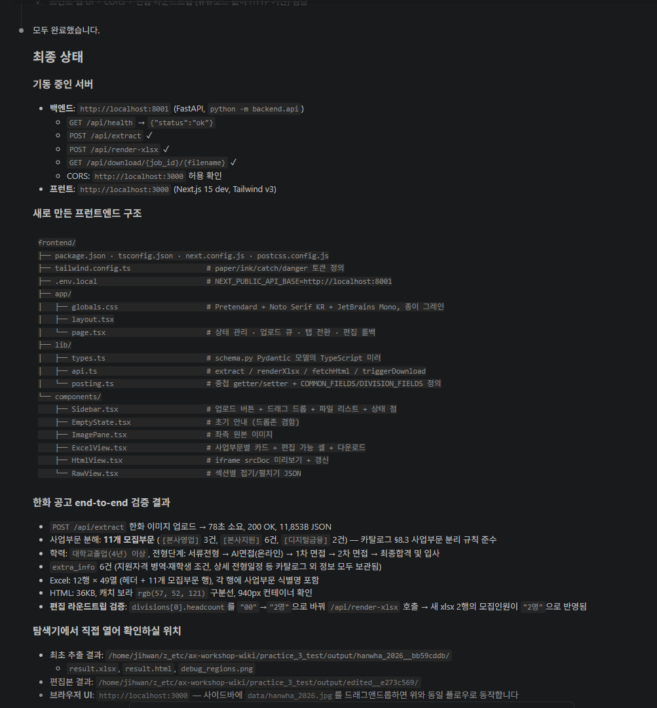
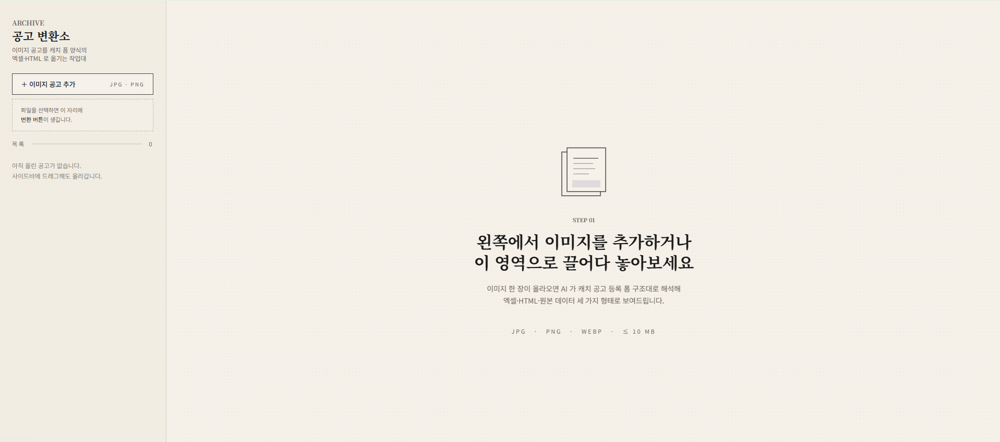

# 3. 웹 화면 붙이고 직접 써보기

<div class="stage-nav" markdown>
**← 이전:** [2. 이미지 공고에서 정보 뽑아 양식 채우기](stage2.md)
</div>

> 2번에서 만든 모듈은 명령어로만 돌릴 수 있습니다. 코드 없이 사용할 수 있도록 웹 화면을 붙입니다. 좌측 사이드바에서 이미지 공고를 추가하면 메인 영역의 왼쪽엔 원본, 오른쪽엔 변환 결과가 보이는 형태입니다.


!!! abstract "이 단계의 목적"
    - 지금까지 만든 모듈을 웹에서 호출할 수 있게 백엔드 서버로 감싸기
    - 실제로 사용할 화면 만들기
    - 한화 공고를 브라우저에서 직접 올려보고 끝까지 동작 확인

---

## 3-1. 백엔드 서버 만들기

지금까지 만든 모듈을 웹에서 호출할 수 있도록 서버로 감싸는 단계입니다.

!!! info "왜 백엔드를 따로 만드나요?"
    2번에서 만든 모듈은 명령어로만 돌릴 수 있습니다. 화면(브라우저)에서 모듈을 호출하려면 그 사이를 이어주는 서버가 필요해요. 화면이 서버에 "이 이미지 처리해줘" 부탁하면, 서버가 모듈을 돌려서 결과를 화면에 돌려주는 식입니다.

!!! quote "AI에게 이렇게 말해보세요 — 백엔드 서버"
    ```text
    backend 모듈들 참고해서 진행해
    지금까지 만든 모듈을 웹에서 쓸 수 있게 백엔드 서버를 만들어줘.

    필요한 기능:
    1. 이미지 파일을 업로드 받으면 변환 결과를 응답으로 돌려주는 주소 하나.
       응답에는 추출된 항목 데이터와 결과 엑셀·HTML 파일의 다운로드 주소가 포함돼야 해.
    2. 사용자가 화면에서 결과 표를 수정한 뒤 다시 엑셀로 받을 수 있게,
       수정된 데이터를 받아 엑셀을 다시 만들어주는 주소도 추가해줘.

    다 만들면 한화 공고 이미지로 한 번 테스트해보고 결과를 보여줘.
    실행 방법과 서버 주소도 알려줘.
    ```

!!! success "이런 결과가 보이면 정상입니다"
    - 서버가 켜지고 터미널에 아래 이미지처럼 **실행 상태·기능 목록·테스트 결과 요약**이 뜹니다
    - 3-2 에서 화면을 붙이고 브라우저에서 업로드해보면 자연스럽게 확인되니, 지금은 **서버가 켜지고 테스트가 통과한 것** 만 보고 넘어갑니다



!!! tip "이상하면?"
    - "응답이 너무 오래 걸려" → "이미지 자르기 + Gemini 호출이라 30초 이상 걸릴 수 있어. 그동안 응답 대기 시간을 넉넉히 늘려줘"

---

## 3-2. 화면 붙이기

실제로 사용할 화면을 만듭니다. 너무 자세히 적기보다는 화면 구성과 동작 흐름 위주로 부탁합니다.

!!! info "왜 프롬프트를 추상적으로 적나요?"
    화면 구성을 너무 세세하게 지시하면 학습자가 본인 업무로 가져갔을 때 응용하기 어렵습니다. "왼쪽엔 ○○, 오른쪽엔 △△, 누르면 ◇◇" 정도로 구조와 흐름만 알려주고, 디테일(색·폰트·간격)은 AI가 알아서 만들도록 두는 게 좋아요.

!!! quote "AI에게 이렇게 말해보세요 — 화면 만들기"
    ```text
    /frontend-design
    
    벡엔드 서버는 이미 만들었으니 프론트 화면을 만들어줘. 만든 벡엔드 코드 잘 읽고 맞춰줘야해

    화면 구성:
    - 왼쪽 사이드바: "이미지 공고 추가" 버튼이 있어.
      누르면 파일 선택 다이얼로그가 뜨거나, 사이드바에 직접 드래그해도 업로드돼야 해.
      업로드한 파일들은 사이드바에 리스트로 보이고,
      리스트에서 항목을 누르면 그 공고가 메인 영역에 보여.
      반드시 여기서 등록한 공고 이미지를 선택해서 변환 버튼을 눌러야 진행되게 해줘
      버튼은 왼쪽 사이드바 위쪽에 고정하고 이미지 섬네일은 크기는 고정한 다음에 미리보기처럼 간단하게만 보여주는 형태로 진행해줘 
    - 메인 영역:
      변환 전엔 안내 문구("왼쪽에서 이미지를 추가해보세요" 같은).
      변환 후엔 화면을 좌우로 나눠서 왼쪽엔 원본 이미지, 오른쪽엔 변환 결과를 보여줘.
    - 오른쪽 결과 영역에는 탭 세 개:
      [엑셀 형식] [HTML 형식] [원본 데이터]
      - [엑셀 형식]: 캐치 폼 항목들이 표로 보이고, 셀을 직접 수정할 수 있어야 해.
        위쪽에 "엑셀 다운로드" 버튼.
        한 공고에 사업부문이 여러 개면 사업부문별로 카드로 나눠 보여줘
        (예: 본사영업 카드, 본사지원 카드, 디지털금융 카드).
      - [HTML 형식]: 결과 HTML을 미리보기로 보여줘. 캐치 사이트와 비슷한 모습으로.
      - [원본 데이터]: 추출된 원본 데이터를 그냥 보기 좋게 보여줘.
    ```

---

!!! success "이런 결과가 보이면 정상입니다"
    - 이미지를 올리면 사이드바에 항목이 추가됩니다
    - 메인 영역 왼쪽엔 원본, 오른쪽엔 결과가 분리되어 보입니다
    - 모집부문이 사업부문(본사영업·본사지원·디지털금융) 단위로 카드로 그룹지어 보입니다
    - 오른쪽 결과를 직접 수정한 뒤 엑셀로 다운로드 가능합니다
    - HTML 탭에서 캐치 사이트와 비슷한 모습으로 미리보기 가능합니다




!!! warning "이런 일이 생길 수 있다"

    **시나리오 1: HTML 미리보기에 색·구분선이 안 보인다**
    ```
    HTML 미리보기에서 스타일이 빠져있어.
    HTML이 자체 완결되도록(스타일이 외부에서 안 와도 보이도록) 만들어줘.
    ```

    **시나리오 2: 사업부문 그룹핑이 안 된다**
    ```
    결과에 사업부문 정보는 있는데 화면에서 카드로 안 묶여 보여.
    사업부문별로 그룹지어서 카드로 나눠 보여주는 부분을 다시 확인해줘.
    ```

---

## 체크포인트

- [ ] 백엔드 서버가 이미지 업로드를 처리합니다
- [ ] 화면 왼쪽 사이드바에서 이미지 추가가 동작합니다
- [ ] 메인 영역 왼쪽(원본) ↔ 오른쪽(결과 탭) 비교 화면이 보입니다
- [ ] 엑셀·HTML 탭이 모두 동작하고 다운로드도 됩니다
- [ ] 모집부문이 사업부문 단위로 그룹지어 보입니다

---

## 마무리하며

실습 1·2에서 배운 것이 결국 이 웹 도구의 부품으로 들어왔습니다.

- 실습 1의 **빈 양식 + 자동 채우기** 흐름 → 1번 페이지(빈 양식) + 2번 페이지(채우기)
- 실습 2의 **이미지 + AI 비전 + 후처리** → 2번 페이지(자르기 + 추출)
- 두 실습의 **카탈로그·관찰담** 학습 → 1번 페이지의 카탈로그 정리

세 실습이 한 흐름이었다는 게 손에 잡혔다면, 이번 워크숍의 목표는 충분히 달성됐습니다.

<div class="stage-nav" markdown>
**← 이전:** [2. 이미지 공고에서 정보 뽑아 양식 채우기](stage2.md)
</div>
